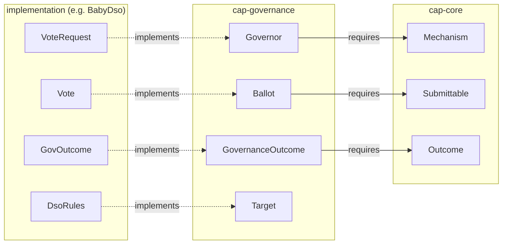

<!-- Copyright (c) 2026 Unlockit. All rights reserved. -->
<!-- SPDX-License-Identifier: Apache-2.0 -->

# CAP — the design, and the proof it is reusable

CAP is a two-tier Daml interface library for [mechanisms](GLOSSARY.md#mechanism) that collect (private)
submissions, [resolve](GLOSSARY.md#resolve) them into an outcome, and [execute](GLOSSARY.md#execute) that outcome with
pre-committed authority. **cap-core** fixes the shape every such [mechanism](GLOSSARY.md#mechanism)
shares; a domain standard (**cap-governance** , **cap-auctions** )
instantiates it. One principle divides the design: every *guarantee* lives in a
fixed interface choice body no implementation can override; every *freedom* is
an interface method the implementation supplies.

This document shows the interfaces,
the proof they are reusable — including what Splice could reuse — the
trade-offs, and what is enforced versus trusted. Terms link to the [glossary](GLOSSARY.md).

## 1. The interfaces, exemplified with BabyDso

| Interface | One line | Fixed choices | Source |
| --- | --- | --- | --- |
| `Mechanism` | Anything awaiting [resolution](GLOSSARY.md#resolution): [authority](GLOSSARY.md#authority) set, submission window, [completeness](GLOSSARY.md#completeness) flag, timing hooks | — | [`MechanismV1.daml`](cap-core/Interfaces/mechanism/daml/Cap/Core/MechanismV1.daml) |
| `Submittable` | One live [submission](GLOSSARY.md#submission) [slot](GLOSSARY.md#slot), bound to its [mechanism](GLOSSARY.md#mechanism) by contract group | — | [`SubmittableV1.daml`](cap-core/Interfaces/submittable/daml/Cap/Core/SubmittableV1.daml) |
| `Outcome` | Pre-committed authority, executable at most once inside a window | `Outcome_Expire` | [`OutcomeV1.daml`](cap-core/Interfaces/outcome/daml/Cap/Core/OutcomeV1.daml) |
| `Governor` | A proposal [resolved](GLOSSARY.md#resolution) with ballots through a single fixed choice | `Governor_Resolve`, `_Withdraw`, `_Expire` | [`GovernorV1.daml`](cap-governance/Interfaces/governor/daml/Cap/Governance/GovernorV1.daml) |
| `Ballot` | A re-castable submittable carrying [opaque](GLOSSARY.md#opaque) votes; per-voter or container format | `Ballot_Cast`, `_Withdraw`, `_Consume`, `_Expire` | [`BallotV1.daml`](cap-governance/Interfaces/ballot/daml/Cap/Governance/BallotV1.daml) |
| `Target` | A [standing](GLOSSARY.md#standing) contract an approved outcome acts on, identified by key, not cid | — | [`TargetV1.daml`](cap-governance/Interfaces/target/daml/Cap/Governance/TargetV1.daml) |
| `GovernanceOutcome` | The approved action; carries governance's single [execute](GLOSSARY.md#execute) choice | `GovernanceOutcome_Execute` | [`OutcomeV1.daml`](cap-governance/Interfaces/outcome/daml/Cap/Governance/OutcomeV1.daml) |

The lifecycle passes through four fixed choices: [cast](GLOSSARY.md#cast) →
[resolve](GLOSSARY.md#resolution) → [execute](GLOSSARY.md#execute) → [expire](GLOSSARY.md#expiry). Each
choice's checks run in its fixed body; the implementation supplies the format.

## 2. The proof of reusability: Splice's DSO governance, rebuilt on CAP

To provide the proof point that the primitives are reusable, we show that SV governance can be expressed with these libraries.
That is the Milestone 1 prototype, [`DEMOS.md`](examples/BabyDso/DEMOS.md).

Splice's DSO runs three approval [mechanisms](GLOSSARY.md#mechanism) of deliberately different shapes —
`VoteRequest` (per-decision vote with a lifecycle), `Confirmation` (a quorum
assembled asynchronously, no shared contract), `AmuletPriceVote` (standing
votes re-read every round for a median). BabyDso implements all three twice:
`original/` is a plain-Daml Splice reproduction; `cap-version/` implements the
same [mechanisms](GLOSSARY.md#mechanism) on the CAP interfaces. Every demo runs in both packages with
the same parties, action, and step order — **the diff between the two packages
is exactly what CAP adds**, and the demo assertions are the behavioural match.

What the diff contains is the code Splice could reuse. In `original/`, time windows,
eligibility, threshold, and [execution](GLOSSARY.md#execute) are re-implemented
per [mechanism](GLOSSARY.md#mechanism) inside `DsoRules`, and the package defines for itself what
`cap-version/` imports: the checked-fetch [admission](GLOSSARY.md#admission)
[tools](GLOSSARY.md#tool), `require`, the `Patchable` [merge](GLOSSARY.md#merge),
the median. On CAP, those lifecycle checks — window and eligibility, ballot
[admission](GLOSSARY.md#admission), [verdict](GLOSSARY.md#verdict) handling,
[execution](GLOSSARY.md#execute) at most once — come from the fixed bodies of
`Ballot_Cast`, `Governor_Resolve`, and `GovernanceOutcome_Execute` instead of
being rewritten three times; the vote tally itself is one library call
(`quorateMajorityAll`); a [mechanism](GLOSSARY.md#mechanism) definition shrinks to its format — a
`tally`, an eligibility source, an effect
([one `ActionSpec` record per action](examples/BabyDso/DEMOS.md#the-actions)).
And the reuse compounds *inside* Splice: all three [mechanisms](GLOSSARY.md#mechanism) share the same
cast, withdraw, and admission code, where the plain version carries a separate
copy per [mechanism](GLOSSARY.md#mechanism).

What the rebuild concretely improves over the plain version, demo-assertable:

- **Decisions stay inside their institution.** In the plain reproduction,
  org1's approved action *[executes](GLOSSARY.md#execute) on org2's state* when one party hosts two
  organizations (demo 4, `original`). The cap version refuses both replays:
  outcomes bind their [target](GLOSSARY.md#target) by key, ballots bind their
  governor by identity.
- **Concurrent approvals are handled, not raced.** State-[pinned](GLOSSARY.md#pin)
  actions detect [drift](GLOSSARY.md#drift) between approval and [execution](GLOSSARY.md#execute) and
  route it to a declared policy — abort, merge, or a bounded tolerance
  (demos 1–2). Splice has the merge case — `Splice.Util.patch` field-merges
  concurrent config changes in `AmuletRules_SetConfig` and `DsoRules_SetConfig`
  — but only on the config record, and it falls back to last-write-wins when a
  proposer omits `baseConfig`; CAP generalizes the same detection to any
  [pinned](GLOSSARY.md#pin) [target](GLOSSARY.md#target), and makes the response
  the declared policy above rather than a hardcoded merge.
- **Per-voter ballots dissolve the vote-map contention** that forces Splice's
  cast cooldown; the container format remains available where Splice's shape
  is wanted (demo 0).

The point of the rebuild is that Splice *could* reuse it, [mechanism](GLOSSARY.md#mechanism) by
[mechanism](GLOSSARY.md#mechanism), without changing observable behaviour. The catalogue of what each
demo proves is [`DEMOS.md`](examples/BabyDso/DEMOS.md); how to run them and
the expected output is
[`README.md#running-the-demos`](README.md#running-the-demos).

## 3. Interface design decisions and trade-offs

Each row is a decision fixed in the interfaces — the chosen shape, the
alternative it rejects, and what that alternative would have cost. (Where each
decision lives in code: [`DESIGN_old.md` §6](DESIGN_old.md#6-where-each-design-decision-lives).)

| Decision | Rejected alternative — and its cost |
| --- | --- |
| The [authority](GLOSSARY.md#authority) is a **set of parties, all of whom must sign** (`authorities : Set Party`) a singleton whose one party is decentralized party, and explicit multi-party sets, are all instantiations | A single `Party` field — locks out explicit multi-party authorities |
| [Completeness](GLOSSARY.md#completeness) is **opt-in, and a count** (`size : Optional Int`): `Some n` proves exact [cover](GLOSSARY.md#cover) of slots `0..n-1` at resolution (the interface does not block a party *list*)  | Mandatory completeness — forces slot enrollment on formats that resolve by [quorum](GLOSSARY.md#quorum); a party *list* instead of a count — ties slots to identities, locking out secret ballots and identity-free formats |
| The **vote is [opaque](GLOSSARY.md#opaque)** (`AnyValue` at cast; no view field, method result, or choice return carries its content) | A typed vote field — fixes one encoding for every format and leaks content sealed formats must hide |
| The submission **window is on the `MechanismView`** — mandatory open, optional close — and the timing hooks can **only tighten** it | Timing left wholly to implementations — no cross-implementation guarantee survives; a mandatory close — locks out [standing](GLOSSARY.md#standing) [mechanisms](GLOSSARY.md#mechanism) with no fixed close |
| cap-core's `Outcome` **declares no [execute](GLOSSARY.md#execute) choice** — identity, window, [expiry](GLOSSARY.md#expiry) only; the [execute](GLOSSARY.md#execute) choice is each domain's own, layered via `requires` | One generic [execute](GLOSSARY.md#execute) choice in the core — forces a single [execution](GLOSSARY.md#execute) shape (arguments, target model) on every domain forever |
| A [target](GLOSSARY.md#target) is **bound by key** (`ForTarget`: authority + `id`), with an optional state token for [pinning](GLOSSARY.md#pin) | Binding by contract id — breaks the moment standing state is archived-and-recreated, so every concurrent change would invalidate every approval |
| Serialized result and state types carry **`Ext…` extension constructors** | Closed types — any grown result forces a new interface major |

## 4. What is enforced, and what is trusted

Fixed bodies **enforce**, on-ledger, at every resolution and [execution](GLOSSARY.md#execute):

- the submission **window** at cast and the floor at resolve;
- **eligibility** against `voters` when the format declares it;
- the **authority signature** on the [mechanism](GLOSSARY.md#mechanism) and on every presented
  submittable ([`ChecksV1.daml`](cap-core/internal/checks/daml/Cap/Core/ChecksV1.daml));
- **binding**: every actor-supplied cid is admitted through its contract group
  — a ballot from another governor, an outcome from another [mechanism](GLOSSARY.md#mechanism), a
  target under the wrong key all abort;
- **distinctness** of the presented set, or **exact slot cover** under
  declared completeness;
- the **[execute](GLOSSARY.md#execute) window, executor set, target-key check, and drift routing**
  before any effect runs; consuming choices make double resolution and double
  [execution](GLOSSARY.md#execute) impossible by construction.

Everything else is a documented implementation obligation (RFC 2119 in the
interface comments): `S_Full` exactly when a submission is carried, successor
preservation on cast/withdraw, the `governor_issueOutcome` field obligations,
[escrow](GLOSSARY.md#escrow) release on consume. Implementations are trusted; the fixed layer
carries only what makes artifacts trustworthy *across* implementations.

What this buys against a malicious actor, and where it is exercised:

| A malicious … cannot … | Enforced by | Exercised in |
| --- | --- | --- |
| outsider — cast into a ballot | eligibility + implementation check | demo 1 |
| resolver — double-count a submission | distinctness of the presented set (exact [cover](GLOSSARY.md#cover) under declared completeness) | demo 3 (duplicate vote refused) |
| resolver — resolve below threshold | the format's `tally` (three-way: lapse ≠ reject) | demo 2 |
| executor — replay a spent approval | consuming choices, `fetchAndArchive` | demo 2 |
| executor — [execute](GLOSSARY.md#execute) on state the approvers did not see | state pin + drift policy | demos 1, 2 |
| executor — redirect an outcome to another target or organization | `ForTarget` key binding | demo 4 |
| resolver — resolve governor A with governor B's ballots | `ForMechanism` group admission | demo 4 |

## 5. Ecosystem alignment

CAP follows the Token Standard's interface idioms rather than inventing its
own: the `actors : [Party]` pattern on [execute](GLOSSARY.md#execute)/settle choices, `ExtraArgs` /
`ChoiceContext` for off-ledger-supplied contracts, `Ext…` extension
constructors on serialized result and state types, and DA's official
`splice-api-token-metadata-v1` package (vendored binary, no mirror) for all
shared value types. The checked-fetch admission discipline is Splice's own
`Splice.Util`, re-exported. The [`cap-auctions`](cap-auctions/) domain
will compose settlement with Token
Standard V2 holdings and allocations and versions in lockstep with it.

## 6. Scope and evolution

What the first release contains, milestone by milestone, with the artifact
that proves each capability: [`SCOPE.md`](SCOPE.md). How the library is
extended after release — new formats, new domain standards on cap-core:
[`POST-RELEASE.md`](POST-RELEASE.md). Interface packages are versioned
`-v1`; a breaking change is a new package, and the extension constructors let
result types grow without one.
