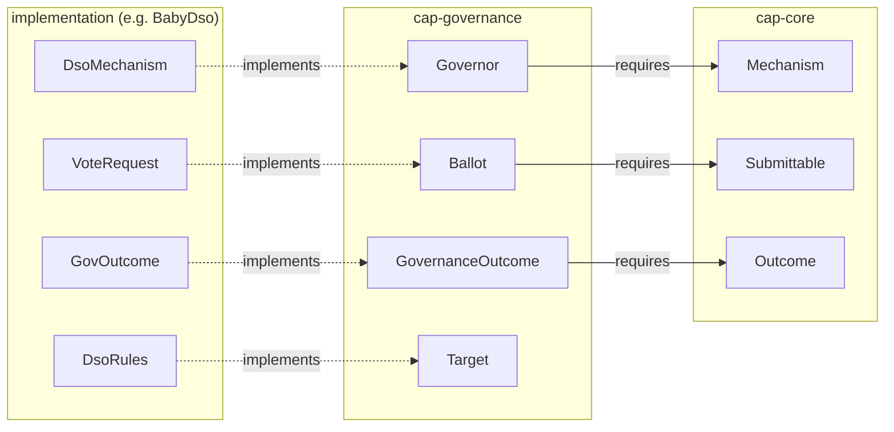

<!-- Copyright (c) 2026 Unlockit. All rights reserved. -->
<!-- SPDX-License-Identifier: Apache-2.0 -->

# CAP — the design, and the proof it is reusable

CAP is a two-tier Daml interface library for [mechanisms](GLOSSARY.md#mechanism) that collect (private)
[submissions](GLOSSARY.md#submission), [resolve](GLOSSARY.md#resolve) them into an [outcome](GLOSSARY.md#outcome), and [execute](GLOSSARY.md#execute) that [outcome](GLOSSARY.md#outcome) with
pre-committed [authority](GLOSSARY.md#authority). **cap-core** fixes the shape every such [mechanism](GLOSSARY.md#mechanism)
shares; a domain standard (**cap-governance** , **cap-auctions** )
instantiates it. 

This document shows the interfaces, the proof they are reusable (with DSO as an example), the
trade-offs, and what is enforced versus trusted. Terms link to the [glossary](GLOSSARY.md).

## 1. The interfaces, exemplified with BabyDso

| Interface | One line | Fixed choices | Source |
| --- | --- | --- | --- |
| `Mechanism` | The shared frame that a set of [submittables](GLOSSARY.md#submittable) bind to and [resolve](GLOSSARY.md#resolution) against | — | [`MechanismV1.daml`](cap-core/Interfaces/mechanism/daml/Cap/Core/MechanismV1.daml) |
| `Submittable` | One live [submission](GLOSSARY.md#submission) [slot](GLOSSARY.md#slot), bound to its [mechanism](GLOSSARY.md#mechanism) by contract group | — | [`SubmittableV1.daml`](cap-core/Interfaces/submittable/daml/Cap/Core/SubmittableV1.daml) |
| `Outcome` | Pre-committed [authority](GLOSSARY.md#authority), executable at most once inside a time window | `Outcome_Expire` | [`OutcomeV1.daml`](cap-core/Interfaces/outcome/daml/Cap/Core/OutcomeV1.daml) |
| `Governor` | A proposal to be [resolved](GLOSSARY.md#resolution) with [ballots](GLOSSARY.md#ballot) as input | `Governor_Resolve`, `_Withdraw`, `_Expire` | [`GovernorV1.daml`](cap-governance/Interfaces/governor/daml/Cap/Governance/GovernorV1.daml) |
| `Ballot` | A re-castable [submittable](GLOSSARY.md#submittable) carrying [opaque](GLOSSARY.md#opaque) [votes](GLOSSARY.md#vote); per-voter or container format | `Ballot_Cast`, `_Withdraw`, `_Consume`, `_Expire` | [`BallotV1.daml`](cap-governance/Interfaces/ballot/daml/Cap/Governance/BallotV1.daml) |
| `Target` | A [standing](GLOSSARY.md#standing) contract an approved [outcome](GLOSSARY.md#outcome) acts on, identified by key, not cid | — | [`TargetV1.daml`](cap-governance/Interfaces/target/daml/Cap/Governance/TargetV1.daml) |
| `GovernanceOutcome` | The approved [action](GLOSSARY.md#action); carries governance's single [execute](GLOSSARY.md#execute) choice | `GovernanceOutcome_Execute` | [`OutcomeV1.daml`](cap-governance/Interfaces/outcome/daml/Cap/Governance/OutcomeV1.daml) |
| `Action` | An extension of an [action](GLOSSARY.md#action) not natively implemented (from another package), [opaque](GLOSSARY.md#opaque) to the [mechanism](GLOSSARY.md#mechanism) that carries it; approval issues an authority-signed [outcome](GLOSSARY.md#outcome) | `Action_buildRefs`, `Action_IssueOutcome` | [`ActionV1.daml`](cap-governance/Interfaces/action/daml/Cap/Governance/ActionV1.daml) |

The lifecycle passes through four fixed choices: [cast](GLOSSARY.md#cast) →
[resolve](GLOSSARY.md#resolution) → [execute](GLOSSARY.md#execute) → [expire](GLOSSARY.md#expiry).

### When each fixed choice is used

In lifecycle order. Every window is relative to the two events above:
[resolve](GLOSSARY.md#resolution) and [execute](GLOSSARY.md#execute).

| Choice | Who | When | Used to |
| --- | --- | --- | --- |
| `Ballot_Cast` | a voter | before [resolve](GLOSSARY.md#resolution) | [Cast](GLOSSARY.md#cast) or re-cast a [vote](GLOSSARY.md#vote) while [submissions](GLOSSARY.md#submission) are open |
| `Ballot_Withdraw` | a voter | before [resolve](GLOSSARY.md#resolution) | Decline an empty [slot](GLOSSARY.md#slot), or retract a [cast](GLOSSARY.md#cast) [vote](GLOSSARY.md#vote) |
| `Governor_Withdraw` | the [proposer](GLOSSARY.md#proposer) | before [resolve](GLOSSARY.md#resolution) | Retract the whole proposal, where the withdraw [policy](GLOSSARY.md#policy) allows |
| `Governor_Resolve` | a party the [decision](GLOSSARY.md#decision)'s `isResolver` accepts | the [resolve](GLOSSARY.md#resolution) itself | Admit every live [submittable](GLOSSARY.md#submittable), [tally](GLOSSARY.md#tally), and on approval issue the [outcomes](GLOSSARY.md#outcome) — one transaction |
| `Action_buildRefs` | the [mechanism](GLOSSARY.md#mechanism) | when a proposal is opened | Commit an extension [action](GLOSSARY.md#action)'s [targets](GLOSSARY.md#target): read the [target](GLOSSARY.md#target) keys from its view and record any [state token](GLOSSARY.md#state-token) on-ledger. Read-only |
| `Action_IssueOutcome` | the [resolution](GLOSSARY.md#resolution)'s `issue` step | inside `Governor_Resolve` | Mint a foreign [action](GLOSSARY.md#action)'s [outcome](GLOSSARY.md#outcome) — only when the [outcome](GLOSSARY.md#outcome) template lives in a package the [governor](GLOSSARY.md#governor) cannot create from (§2) |
| `GovernanceOutcome_Execute` | an [executor](GLOSSARY.md#executor) set | after [resolve](GLOSSARY.md#resolution), inside the [execute](GLOSSARY.md#execute) window | Run the approved effect on the live [targets](GLOSSARY.md#target) |
| `Outcome_Expire` | anyone | after [resolve](GLOSSARY.md#resolution), once the [execute](GLOSSARY.md#execute) window closed | Archive an [outcome](GLOSSARY.md#outcome) that was never [executed](GLOSSARY.md#execute) |
| `Governor_Expire` | anyone | instead of [resolve](GLOSSARY.md#resolution), past `expiresAt` | Archive a [governor](GLOSSARY.md#governor) that was never [resolved](GLOSSARY.md#resolution) |
| `Ballot_Expire` | anyone | past the [ballot](GLOSSARY.md#ballot)'s `expiresAt` | Garbage-collect a leftover [ballot](GLOSSARY.md#ballot) |
| `Ballot_Consume` | the [authority](GLOSSARY.md#authority) | any time | Tear down a stale [slot](GLOSSARY.md#slot) (e.g. an offboarded voter's [standing](GLOSSARY.md#standing) [ballot](GLOSSARY.md#ballot)) and release its [escrow](GLOSSARY.md#escrow) |

After [execute](GLOSSARY.md#execute) nothing remains exercisable: [execution](GLOSSARY.md#execute)
consumes the [outcome](GLOSSARY.md#outcome), [cast](GLOSSARY.md#cast) [ballots](GLOSSARY.md#ballot) were consumed at
[resolve](GLOSSARY.md#resolution), and only the mutated [targets](GLOSSARY.md#target) survive.

### What each hook is for

[Hooks](GLOSSARY.md#hook) are where implementations plug in. Each is called
from exactly one fixed choice, so its window is that choice's row above.

| [Hook](GLOSSARY.md#hook) | On | Called from | For |
| --- | --- | --- | --- |
| `submittableAllowed` | `Mechanism` | `Ballot_Cast` | more expressiveness in allowing [submittables](GLOSSARY.md#submittable) |
| `ballot_castImpl` | `Ballot` | `Ballot_Cast` | Build the [cast](GLOSSARY.md#cast) successor recording the [opaque](GLOSSARY.md#opaque) [vote](GLOSSARY.md#vote) |
| `ballot_withdrawImpl` | `Ballot` | `Ballot_Withdraw` | Build the withdrawn successor |
| `withdrawAllowed` | `Mechanism` | `Governor_Withdraw` | The withdraw [policy](GLOSSARY.md#policy) — abort to refuse |
| `isWithdrawer` | `Governor` | `Governor_Withdraw` | Who may withdraw the proposal |
| `governor_withdrawImpl` | `Governor` | `Governor_Withdraw` | Cleanup on [withdrawal](GLOSSARY.md#withdrawal) |
| `resolutionAllowed` | `Mechanism` | `Governor_Resolve` | Tighten when [resolution](GLOSSARY.md#resolution) may run (can never widen it) |
| `decisionOf` | `Governor` | `Governor_Resolve` | Which [decision](GLOSSARY.md#decision) a [submittable](GLOSSARY.md#submittable) belongs to, so the fixed body admits only this [decision](GLOSSARY.md#decision)'s |
| `resolutionFor` | `Governor` | `Governor_Resolve` | Select this which `Resolution` from the [action](GLOSSARY.md#action). One `Resolution` bundles the five steps below |
| `Resolution.isResolver` | `Governor` | `Governor_Resolve` | Who may trigger [resolution](GLOSSARY.md#resolution) |
| `Resolution.admit` | `Governor` | `Governor_Resolve` | Decision-scoped [admission](GLOSSARY.md#admission): check the presented [submittables](GLOSSARY.md#submittable) against live state |
| `Resolution.tally` | `Governor` | `Governor_Resolve` | The [decision](GLOSSARY.md#decision) rule: admitted [submittables](GLOSSARY.md#submittable) → [verdict](GLOSSARY.md#verdict), pure |
| `Resolution.issue` | `Governor` | `Governor_Resolve` | From the winning option, build the approved [outcomes](GLOSSARY.md#outcome) and their committed [targets](GLOSSARY.md#target) — own-package [actions](GLOSSARY.md#action) directly, foreign ones through `Action_IssueOutcome` |
| `Resolution.onResolved` | `Governor` | `Governor_Resolve` | Side effects atomic with [resolution](GLOSSARY.md#resolution) (e.g. [execute](GLOSSARY.md#execute) immediately) |
| `action_issueOutcomeImpl` | `Action` | `Action_IssueOutcome` | The foreign mint: create the [action](GLOSSARY.md#action)'s [outcomes](GLOSSARY.md#outcome); archive itself if single-use |
| `isExecutor` | `Outcome` | `GovernanceOutcome_Execute` | Which actor sets may trigger [execution](GLOSSARY.md#execute) |
| `governanceOutcome_executeImpl` | `GovernanceOutcome` | `GovernanceOutcome_Execute` | The approved effect on the committed [targets](GLOSSARY.md#target), run under the [outcome](GLOSSARY.md#outcome)'s [authority](GLOSSARY.md#authority); it also checks each [target](GLOSSARY.md#target) that recorded a [state token](GLOSSARY.md#state-token) for [drift](GLOSSARY.md#drift) and applies the [policy](GLOSSARY.md#policy) |
| `ballot_consumeImpl` | `Ballot` | `Ballot_Consume` | The teardown effect — release the [slot](GLOSSARY.md#slot)'s [escrow](GLOSSARY.md#escrow) |

## 2. The proof of reusability: Splice's DSO governance, rebuilt on CAP

To provide the proof point that the primitives are reusable, we show that SV governance can be expressed with these libraries.
That is the Milestone 1 prototype, [`DEMOS.md`](examples/BabyDso/DEMOS.md).

Splice's DSO runs three approval flows of deliberately different shapes, all resolved by one
[standing](GLOSSARY.md#standing) [governor](GLOSSARY.md#governor) (`DsoMechanism`) as three
[decisions](GLOSSARY.md#decision): a deliberate [vote](GLOSSARY.md#vote) (`VoteRequest`, a container
[ballot](GLOSSARY.md#ballot) carrying its [action](GLOSSARY.md#action)); a [quorum](GLOSSARY.md#quorum) of
`Confirmation`s assembled asynchronously with no shared contract; and [standing](GLOSSARY.md#standing)
`AmuletPriceVote`s re-read every round for a median. BabyDso implements all three twice:
`original/` is a plain-Daml Splice reproduction; `cap-version/` implements the
same [mechanisms](GLOSSARY.md#mechanism) on the CAP interfaces. Every demo runs in both packages with
the same parties, [action](GLOSSARY.md#action), and step order — **the diff between the two packages
is exactly what CAP adds**, and the demo assertions are the behavioural match.

What the diff contains is the code Splice could reuse. In `original/`, time windows,
eligibility, [threshold](GLOSSARY.md#threshold), and [execution](GLOSSARY.md#execute) are re-implemented
per [mechanism](GLOSSARY.md#mechanism) inside `DsoRules`, and the package defines for itself what
`cap-version/` imports: the checked-fetch [admission](GLOSSARY.md#admission)
[tools](GLOSSARY.md#tool), `require`, the `Patchable` [merge](GLOSSARY.md#merge),
the median. On CAP, those checks come from the fixed bodies of
`Ballot_Cast`, `Governor_Resolve`, and `GovernanceOutcome_Execute` instead of
being rewritten three times; the [vote](GLOSSARY.md#vote) [tally](GLOSSARY.md#tally) itself is one library call.
What the rebuild concretely improves over the plain version, demo-assertable:

- **[Decisions](GLOSSARY.md#decision) stay inside their institution.** In the plain reproduction,
  org1's approved [action](GLOSSARY.md#action) *[executes](GLOSSARY.md#execute) on org2's state* when one party hosts two
  organizations (demo 4, `original`). The cap version refuses both replays:
  [outcomes](GLOSSARY.md#outcome) bind their [target](GLOSSARY.md#target) by key, [ballots](GLOSSARY.md#ballot) bind their
  [governor](GLOSSARY.md#governor) by identity.
- **Concurrent approvals are handled, not raced.** [Actions](GLOSSARY.md#action) that
  recorded a [state token](GLOSSARY.md#state-token) detect [drift](GLOSSARY.md#drift) between approval and [execution](GLOSSARY.md#execute) and
  route it to a declared [policy](GLOSSARY.md#policy) — abort, [merge](GLOSSARY.md#merge), or a bounded tolerance
  (demos 1–2). Splice has the [merge](GLOSSARY.md#merge) case — `Splice.Util.patch` field-merges
  concurrent config changes in `AmuletRules_SetConfig` and `DsoRules_SetConfig`
  — but only on the config record, and it falls back to last-write-wins when a
  [proposer](GLOSSARY.md#proposer) omits `baseConfig`; CAP generalizes the same detection to any
  [target](GLOSSARY.md#target) that recorded a [state token](GLOSSARY.md#state-token), and makes the response
  the declared [policy](GLOSSARY.md#policy) above rather than a hardcoded [merge](GLOSSARY.md#merge).

The point of the rebuild is that Splice *could* reuse it, [mechanism](GLOSSARY.md#mechanism) by
[mechanism](GLOSSARY.md#mechanism), without changing observable behaviour. The catalogue of what each
demo proves is [`DEMOS.md`](examples/BabyDso/DEMOS.md); how to run them and
the expected output is
[`README.md#running-the-demos`](README.md#running-the-demos).

### Adding an action after deployment

A governance [action](GLOSSARY.md#action) can be added in a new package, with no change to the
deployed ones (demo 5). Two Daml facts force the shape of the seam:

- A deployed package cannot **create** a contract of a template it does not
  know — the only door to new code is exercising an interface choice on a
  contract that already exists.
- A contract can only be created with the signatures its creator holds — so a
  proposal starts with the [proposer](GLOSSARY.md#proposer)'s signature alone, and the
  [authority](GLOSSARY.md#authority)'s signature can only be added at a point
  where the [authority](GLOSSARY.md#authority) acts.

The `Action` interface is the door those two facts leave open. The [proposer](GLOSSARY.md#proposer)
creates the proposal; the [mechanism](GLOSSARY.md#mechanism) reads its
[target](GLOSSARY.md#target) [bindings](GLOSSARY.md#binding) from the view and records any
[state token](GLOSSARY.md#state-token) on-ledger. On
approval, `Action_IssueOutcome` archives the proposal and creates the [action](GLOSSARY.md#action)'s own
[outcome](GLOSSARY.md#outcome) under the [authority](GLOSSARY.md#authority) signature in scope at
[resolution](GLOSSARY.md#resolution). Until that moment the proposal is
the [proposer](GLOSSARY.md#proposer)'s, and withdrawing it is legitimate; a request whose [action](GLOSSARY.md#action) was
withdrawn mid-vote can only [expire](GLOSSARY.md#expiry).

## 3. Interface design decisions and trade-offs

Each row is a Design decision fixed in the interfaces — the chosen shape, the
alternative it rejects, and what that alternative would have cost. (Where each
[decision](GLOSSARY.md#decision) lives in code: [`DESIGN_old.md` §6](DESIGN_old.md#6-where-each-design-decision-lives).)

| Design decision | Rejected alternative |
| --- | --- |
| The [authority](GLOSSARY.md#authority) is a **set of parties, all of whom must sign**. A singleton whose one party is decentralized party, and explicit multi-party sets, are all instantiations | A single `Party` field — locks out explicit multi-party [authorities](GLOSSARY.md#authority) |
| [Completeness](GLOSSARY.md#completeness) is **opt-in, and a count**: it proves exact [cover](GLOSSARY.md#cover) of [slots](GLOSSARY.md#slot) `0..n-1` at [resolution](GLOSSARY.md#resolution) (the interface does not block a party *list*)  | Mandatory [completeness](GLOSSARY.md#completeness) — forces [slot](GLOSSARY.md#slot) enrollment on formats that [resolve](GLOSSARY.md#resolution) by [quorum](GLOSSARY.md#quorum); a party *list* instead of a count — ties [slots](GLOSSARY.md#slot) to identities, locking out secret [ballots](GLOSSARY.md#ballot) and identity-free formats |
| The **[vote](GLOSSARY.md#vote) is [opaque](GLOSSARY.md#opaque)** (`AnyValue` at [cast](GLOSSARY.md#cast); no view field, method result, or choice return carries its content) | A typed [vote](GLOSSARY.md#vote) field — fixes one encoding for every format and leaks content sealed formats must hide |
| The [submission](GLOSSARY.md#submission) **window is on the `MechanismView`** — mandatory open, optional close — and the timing [hooks](GLOSSARY.md#hook) can **only tighten** it | Timing left wholly to implementations — no cross-implementation guarantee survives; a mandatory close — locks out [standing](GLOSSARY.md#standing) [mechanisms](GLOSSARY.md#mechanism) with no fixed close |
| cap-core's `Outcome` **declares no [execute](GLOSSARY.md#execute) choice** — identity, window, [expiry](GLOSSARY.md#expiry) only; the [execute](GLOSSARY.md#execute) choice is each domain's own, layered via `requires` | One generic [execute](GLOSSARY.md#execute) choice in the core — forces a single [execution](GLOSSARY.md#execute) shape (arguments, [target](GLOSSARY.md#target) model) on every domain forever |
| A [target](GLOSSARY.md#target) is **bound by key** (`ForTarget`: [authority](GLOSSARY.md#authority) + `id`), with an optional [state token](GLOSSARY.md#state-token) recorded at approval | [Binding](GLOSSARY.md#binding) by contract id — breaks the moment [standing](GLOSSARY.md#standing) state is archived-and-recreated, so every concurrent change would invalidate every approval |
| An extension [action](GLOSSARY.md#action) **pairs a proposer-signed proposal (`Action`) with its own [outcome](GLOSSARY.md#outcome) template** carrying its effect and [drift](GLOSSARY.md#drift) [policy](GLOSSARY.md#policy) — each [action](GLOSSARY.md#action) keeps a bespoke [executor](GLOSSARY.md#executor) set, window, and record, and every contract type means one thing | An `apply` [hook](GLOSSARY.md#hook) on `Action` plus one stock bundle [outcome](GLOSSARY.md#outcome) — halves each extension and gives multi-action approvals, but freezes one effect signature into the interface forever, adds a lock obligation (a missed lock results in a [proposer](GLOSSARY.md#proposer) veto over an approved [decision](GLOSSARY.md#decision)), and moves [drift](GLOSSARY.md#drift) refusal from the fixed [execute](GLOSSARY.md#execute) [hook](GLOSSARY.md#hook) into trusted effect code |
| Serialized result and state types (`ResolutionOutcome`, `SubmittableState`) carry **extension constructors** so they can grow without a new interface major. `AnyAction` is closed on purpose — native and extension are exhaustive (an [action](GLOSSARY.md#action) is either data the format reads, or a foreign contract), so there is no third kind to reserve | Closing those result/state types — any grown result forces a new interface major; adding an extension constructor to `AnyAction` — reserves a third [action](GLOSSARY.md#action) kind that cannot exist |
| Which [targets](GLOSSARY.md#target) an approval commits to is produced by a **function of the winning option** (`Resolution.issue`, run at [resolution](GLOSSARY.md#resolution)). Nevertheless the approvers should see the state of the [targets](GLOSSARY.md#target) at the moment they [cast](GLOSSARY.md#cast) their [vote](GLOSSARY.md#vote), we leave it as an implementation obligation | A fixed committed-targets field on the [governor](GLOSSARY.md#governor) view. The only thing such a field buys over the function is a check the frozen `Governor_Resolve` body runs itself — that each issued [outcome](GLOSSARY.md#outcome)'s committedTargets matches the field — and that check forks badly. To read the field for the check the frozen layer needs a concrete type, so an `option → targets` model is baked into the interface — **frozen and unoverridable**, when the winning option was deliberately [opaque](GLOSSARY.md#opaque) `Text` to avoid exactly that. Keep the field [opaque](GLOSSARY.md#opaque) and the frozen layer cannot read it, so it enforces nothing over `Resolution.issue`; add a `decode` method so it can, and the check only compares the impl's [outcome](GLOSSARY.md#outcome) against the impl's own decode of its own field — trusted code against itself, guarding nobody, while turning one source of truth into two that must be kept in sync. Vote-time visibility, the real motive, is met without any of this: the impl exposes its [commitments](GLOSSARY.md#commitment) on its own template (as `VoteRequest` does). And a field is fixed at [governor](GLOSSARY.md#governor) creation, whereas the function runs at close and can read ledger state at [resolution](GLOSSARY.md#resolution) |

## 4. What is enforced, and what is trusted

Fixed bodies **enforce**, on-ledger, at every [resolution](GLOSSARY.md#resolution) and [execution](GLOSSARY.md#execute):

- the [submission](GLOSSARY.md#submission) **window** at [cast](GLOSSARY.md#cast) and the floor at [resolve](GLOSSARY.md#resolution);
- **eligibility** against `voters` when the format declares it;
- the **[authority](GLOSSARY.md#authority) signature** on the [mechanism](GLOSSARY.md#mechanism) and on every presented
  [submittable](GLOSSARY.md#submittable) ([`ChecksV1.daml`](cap-core/internal/checks/daml/Cap/Core/ChecksV1.daml));
- **[binding](GLOSSARY.md#binding)**: every actor-supplied cid is admitted through its contract group
  — a [ballot](GLOSSARY.md#ballot) from another [governor](GLOSSARY.md#governor), an [outcome](GLOSSARY.md#outcome) from another [mechanism](GLOSSARY.md#mechanism), a
  [target](GLOSSARY.md#target) under the wrong key all abort;
- **distinctness** of the presented set, or **exact [slot](GLOSSARY.md#slot) [cover](GLOSSARY.md#cover)** under
  declared [completeness](GLOSSARY.md#completeness);
- the **[execute](GLOSSARY.md#execute) window, [executor](GLOSSARY.md#executor) set, and target-key check**
  before any effect runs; consuming choices make double [resolution](GLOSSARY.md#resolution) and double
  [execution](GLOSSARY.md#execute) impossible by construction.

Everything else is a documented implementation obligation (RFC 2119 in the
interface comments): `S_Full` exactly when a [submission](GLOSSARY.md#submission) is carried, successor
preservation on [cast](GLOSSARY.md#cast)/withdraw, the `Resolution.issue` field obligations,
checking each [target](GLOSSARY.md#target) that recorded a [state token](GLOSSARY.md#state-token) for [drift](GLOSSARY.md#drift) and applying the [policy](GLOSSARY.md#policy),
[escrow](GLOSSARY.md#escrow) release on consume. Implementations are trusted; the fixed layer
carries only what makes artifacts trustworthy *across* implementations.

What this buys against a malicious actor, and where it is exercised:

| A malicious … cannot … | Enforced by | Exercised in |
| --- | --- | --- |
| outsider — [cast](GLOSSARY.md#cast) into a [ballot](GLOSSARY.md#ballot) | eligibility + implementation check | demo 1 |
| [resolver](GLOSSARY.md#resolver) — double-count a [submission](GLOSSARY.md#submission) | distinctness of the presented set (exact [cover](GLOSSARY.md#cover) under declared [completeness](GLOSSARY.md#completeness)) | demo 3 (duplicate [vote](GLOSSARY.md#vote) refused) |
| [resolver](GLOSSARY.md#resolver) — [resolve](GLOSSARY.md#resolution) below [threshold](GLOSSARY.md#threshold) | the format's `tally` | demo 2 |
| [executor](GLOSSARY.md#executor) — replay a spent approval | consuming choices, `fetchAndArchive` | demo 2 |
| [executor](GLOSSARY.md#executor) — [execute](GLOSSARY.md#execute) on state the approvers did not see | recorded [state token](GLOSSARY.md#state-token) + [drift](GLOSSARY.md#drift) [policy](GLOSSARY.md#policy) | demos 1, 2 |
| [executor](GLOSSARY.md#executor) — redirect an [outcome](GLOSSARY.md#outcome) to another [target](GLOSSARY.md#target) or organization | `ForTarget` key [binding](GLOSSARY.md#binding) | demo 4 |
| [resolver](GLOSSARY.md#resolver) — [resolve](GLOSSARY.md#resolution) [governor](GLOSSARY.md#governor) A with [governor](GLOSSARY.md#governor) B's [ballots](GLOSSARY.md#ballot) | `ForMechanism` group [admission](GLOSSARY.md#admission) | demo 4 |
| [proposer](GLOSSARY.md#proposer) — keep any power over an [action](GLOSSARY.md#action) once approved | `Action_IssueOutcome` archives the proposal; the [outcome](GLOSSARY.md#outcome) carries only the [authority](GLOSSARY.md#authority)'s signature | demo 5 |
| extension author — escape the [execute](GLOSSARY.md#execute) checks | window, [executor](GLOSSARY.md#executor), [binding](GLOSSARY.md#binding), and [drift](GLOSSARY.md#drift) routing run in the fixed `GovernanceOutcome_Execute` body, not in extension code | demo 5 |

## 5. Ecosystem alignment

CAP follows the Token Standard's interface idioms: `ExtraArgs` /
`ChoiceContext` for off-ledger-supplied contracts, and `Ext…` extension
constructors on serialized result and state types. From Splice directly we
reuse: `splice-api-token-metadata-v1` for shared value types, and `Splice.Util`  for
the checked-fetch [admission](GLOSSARY.md#admission) logic. The
[`cap-auctions`](cap-auctions/) domain composes [settlement](GLOSSARY.md#settlement)
with Token Standard V2 [holdings](GLOSSARY.md#holding) and
[allocations](GLOSSARY.md#allocation), versioned in lockstep with it.

## 6. Scope and evolution

What the first release contains, milestone by milestone, with the artifact
that proves each capability: [`SCOPE.md`](SCOPE.md). How the library is
extended after release — new formats, new domain standards on cap-core:
[`POST-RELEASE.md`](POST-RELEASE.md). Interface packages are versioned
`-v1`; a breaking change is a new package, and the extension constructors let
result types grow without one.
