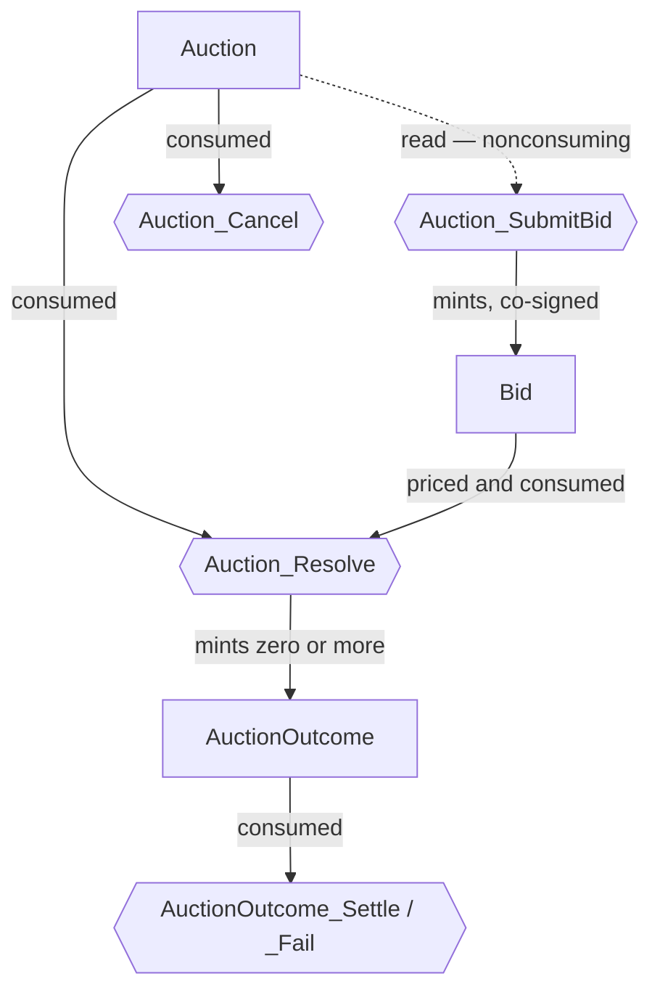
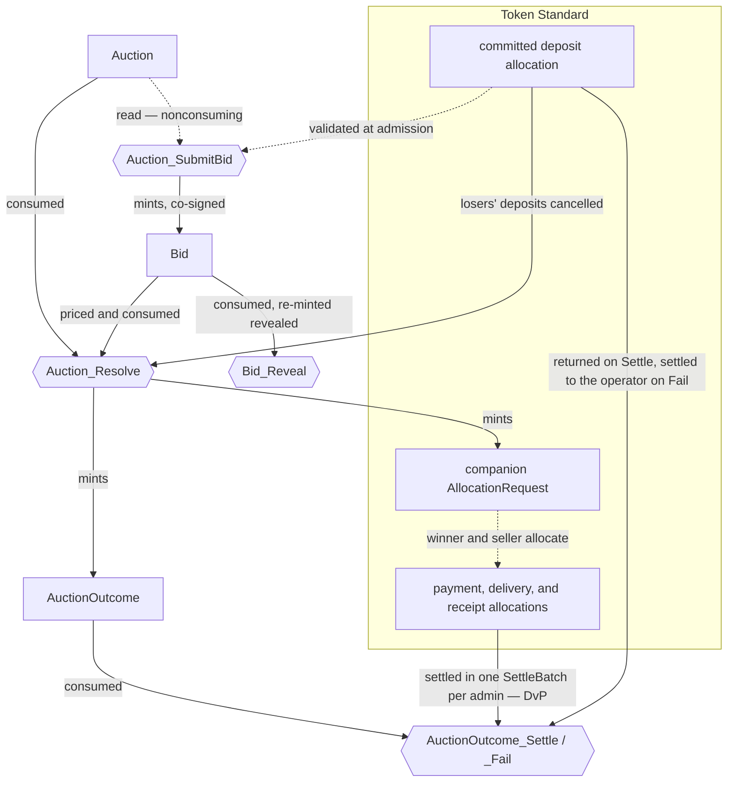

<!-- Copyright (c) 2026 Unlockit. All rights reserved. -->
<!-- SPDX-License-Identifier: Apache-2.0 -->

# cap-auctions architecture

## What this is

For an engineer implementing an auction format or integrating a wallet or
settlement bot: what the library fixes, and what implementations own.
cap-auctions is a Daml interface library for on-ledger auctions — bids
resolve under a pricing rule into outcomes, and outcomes settle as Token
Standard [settlements](glossary.md#settlement). It imports the Canton Token
Standard V2 (CIP-0112) directly and versions
in lockstep with it.
The running example is the [walkthrough](#walkthrough);
security claims live in the [threat model](#threat-model);
signatures live in the interface doc comments and `examples/`, never in prose.

## Format coverage

One interface family covers every format with a single discrete
resolution event over a set of opaque bids; format differences are policy
— methods and templates — never interface shape.

| In | Out |
|---|---|
| First- and second-price sealed (Vickrey); multi-unit (uniform-price, pay-as-bid); combinatorial (bundle bids) | Continuous double auctions / order books — no discrete resolution to give resolve semantics; that is an exchange standard |
| English (ascending) and Dutch (descending) | Bilateral negotiation / RFQ with counteroffers — no pricing rule over a fixed bid set; counteroffers mutate terms |
| Reverse (procurement — bidders compete to sell); call double auctions (periodic clearing, direct buyer→seller legs) | |

The interface names no seller — only an operator, a bidder, the executors
and a beneficiary. Sellers (one, many, or none in that role) are template
parties, which is what lets forward, reverse, and double formats share the
family.

## Security skeleton

Three facts do the security work; the threat model maps every attack onto them.

1. **Consumption is the state machine.** Resolve, cancel, settle, and fail
   are consuming choices, so an auction resolves and an outcome settles
   exactly once — existence of the auction contract means "not yet
   resolved". Two obligations complete the machine: resolution must
   consume every bid it prices, and the implementing template must keep
   the auction contract immutable, so its contract id stays a stable
   binding target.

2. **The interface never carries the bid value** — not in a view field, a
   method result, or a choice result, so sealed bids have no field to
   leak. Reading a value takes implementation code: the pricing rule
   downcasts to its concrete bid template, and open templates can also
   disclose it through their own fields and observers.

3. **Authority layers on the token standard.** Where a bid contract exists
   ([admission](#auction-admission) decides when), it is minted only
   inside `Auction_SubmitBid`, so it carries the auction signatories'
   co-signature: the unforgeable bid→auction binding, and what lets
   resolution consume bids without the bidder live. Traders authorize
   through the [allocations](glossary.md#allocation) they create; outcomes
   need only the executors' signature — a template may add the winner as
   signatory, but the interface never requires it.

## Auction admission

Admission has two surfaces; one question picks between them: can the
committed allocation completely represent the bid?

When it can — token-priced, single-unit, committed at bid — admission can be by
allocation alone. The app writes the `AllocationRequest`, signed by the
operator alone; the bidder's one authorizing action is
`AllocationFactory_Allocate` through any standard wallet; no bid contract
exists. Admission into the book is validation, not authorization — the
implementation must check the allocation matches what it requested
([admission validation](#residual-risks)); the
[registry](glossary.md#registry) may interpose a pending instruction before
the [escrow](glossary.md#escrow) completes.

Otherwise the bid is a contract, minted by `Auction_SubmitBid`. Three cases
force one: **sealed** bids — a commitment hash cannot ride the wallet flow;
**richer payloads** — demand schedules, bundles, conditional bids — that no
allocation field carries; and **deferred escrow** — no committed allocation
exists at bid time. A bid contract costs standard-wallet compatibility, so
a format should mint one only when a case forces it.

## The interfaces

Three interfaces — `Auction`, `Bid`, `AuctionOutcome` — one package each. `Auction` requires cap-core's
`Resolvable` and `Bid` requires `Submittable`: the Resolvable face carries the
operator as signature anchor, the bidding window (`submissionOpensAt` and
`submissionClosesAt`, a mandatory hard outer bound — the fixed floor in
`Auction_SubmitBid` enforces `now < submissionClosesAt`, and event-closed or
soft-close formats enforce their earlier or moving close in the admission
method, within it), and the completeness switch (`size = None` for open entry;
a registered format may declare `Some n` and get the
[completeness](glossary.md#completeness) gate in `Auction_Resolve` — then its
withdraw method must mint withdrawn-state successors, or a withdrawal
strands the slot). `Resolvable` has no choices, so `Auction_Resolve` stays
the one resolve door.

Two diagrams: first the choice surface the interfaces fix, then the same
interfaces with their fields and the Token Standard V2 composition around
them.

The choice surface: hexagons are interface choices, an edge into a choice
is a contract it consumes (dotted: reads), and an edge out of one is a
contract it mints.

The `Bid` node exists only where [admission](#auction-admission) puts a
bid contract; its own choices — `Bid_Withdraw` and `Bid_Reveal`, both
consuming, bidder-controlled — appear in the class diagram below, which
adds the view fields and how data flows to and from the token standard.

```mermaid
classDiagram
    direction LR

    class Auction {
        <<interface, requires Resolvable>>
        auctionId : AuctionId
        meta : Metadata
        operator as authority, window, size — from Resolvable face
        Auction_SubmitBid(bidData, extraArgs) [bidder, nonconsuming, fixed window floor → bid cid]
        Auction_Resolve(bidCids, evidence, extraArgs) [consuming; gate under completeness → outcome cids]
        Auction_Cancel(extraArgs) [consuming]
    }

    class Bid {
        <<interface, requires Submittable>>
        auctionId : AuctionId
        bidder : Party
        meta : Metadata
        Bid_Reveal(revealData, extraArgs) [bidder, consuming → revealed bid cid]
        Bid_Withdraw(extraArgs) [bidder, consuming]
    }

    class AuctionOutcome {
        <<interface>>
        settlement : SettlementInfo (executors, id, cid, meta)
        settleBefore : Time
        beneficiary : Party
        meta : Metadata
        AuctionOutcome_Settle(actors, extraArgs) [consuming, once]
        AuctionOutcome_Fail(actors, extraArgs) [consuming, after settleBefore]
    }

    class AllocationRequest {
        <<Token Standard V2>>
        settlement : SettlementInfo
        transferLegs — what wallets watch
    }

    class Allocation {
        <<Token Standard V2>>
        settlement : SettlementInfo
        committed : Bool
        Allocation_Settle / _Cancel / _Withdraw(actors) [registry-validated]
    }

    class SettlementFactory {
        <<Token Standard V2>>
        SettlementFactory_SettleBatch(settlement, legs, allocations, actors)
    }

    Bid --> Auction : bound by cid
    AuctionOutcome --> Auction : settlement.cid = the auction
    Allocation --> Auction : settlement.cid = the auction
    Auction ..> Bid : SubmitBid mints (co-signed)
    Auction ..> AuctionOutcome : Resolve mints zero or more
    Auction ..> AllocationRequest : admission and resolution mint requests
    AllocationRequest ..> Allocation : traders allocate through their wallets
    Auction ..> Allocation : Resolve cancels losers' escrows as executor
    AuctionOutcome ..> SettlementFactory : Settle / Fail — one SettleBatch per instrument admin
    SettlementFactory ..> Allocation : settles every leg atomically
```

Solid arrows are data — `ContractId` bindings the choice bodies assert;
dotted arrows are lifecycle — one contract's choice minting, consuming,
cancelling, or settling another. The `Token Standard V2` classes are the
standard's own interfaces, drawn with only what the composition touches;
whether each token-layer edge is forced or left to formats is stated in
[the settlement surface](#the-settlement-surface). The `Bid` view
deliberately carries no value field
([security skeleton](#security-skeleton)). The [walkthrough](#walkthrough)
below draws the same composition concretized to the sealed running example.

## Walkthrough

For an engineer following their first cap-auctions flow: one auction walked
end to end — a sealed second-price auction with a committed fixed deposit, the
running example the surrounding sections concretize. Sealed formats take the
bid-contract [admission](#auction-admission) path walked here; formats whose
allocation fully represents the bid admit by allocation alone.

The whole flow in one picture — hexagons are interface choices, an edge into a
choice is an input (consumed, read, or cancelled), an edge out is a contract it
mints, and dotted edges are token-layer steps the wallets drive:

### Creation

The operator creates the auction contract: the auction id, the bidding,
reveal, and settlement windows, and display metadata. How it agreed terms with
the seller is its business — the interface names no seller
([format coverage](#format-coverage)). The contract is immutable from creation
to resolution, and its existence means "not yet resolved"
([security skeleton](#security-skeleton)).

### Admission

The bidder commits to a value without disclosing it — a private, bidder-only
contract whose id commits to the value
([sealed bids](#sealed-bids-and-commitment-schemes)) — and through their wallet
creates a committed [allocation](glossary.md#allocation) for the format's fixed
deposit, naming the auction as its [settlement](glossary.md#settlement). They
then exercise `Auction_SubmitBid` with the value contract's id and the deposit
allocation; before the bid exists the implementation gates eligibility and the
bidding window on ledger time and validates the whole allocation
([auction admission](#auction-admission)). The bid it mints is co-signed by the
auction's signatories and the bidder, with the auction contract id baked in.
`Auction_SubmitBid` is nonconsuming on an immutable contract, so concurrent
bidders never contend.

### Reveal

Inside the reveal window the bidder discloses the value contract and exercises
`Bid_Reveal`. The implementation fetches it by the committed id, and the ledger
itself authenticates the payload against the cid
([reveal integrity](#residual-risks)) — no other value can pass.

### Resolution

After the reveal window closes, the operator exercises `Auction_Resolve` with
the bid contract ids. One transaction does all of it: it checks each bid's
provenance ([bid provenance](#residual-risks)), applies the pricing rule — the
highest revealed value wins and pays the second-highest — consumes every bid it
priced, cancels each loser's deposit inside the same transaction
([loser release](#residual-risks)), and mints the outcome plus a companion
`AllocationRequest` naming the settlement's legs (payment winner → seller, lot
seller → winner). The companion request is what standard wallets watch: winner
and seller see the legs they must allocate with no cap-auctions-specific
integration ([the settlement surface](#the-settlement-surface)).

### Settlement

Winner and seller answer the request through their wallets — the winner
allocates the payment leg at the clearing price, the seller the delivery leg,
and each an unfunded receipt allocation for the leg it receives. Those
allocations are their authorization; neither signs anything at settle time. The
executor exercises `AuctionOutcome_Settle`, which settles every leg in one Daml
transaction ([the settlement surface](#the-settlement-surface)) — payment
against delivery, DvP — and cancels the winner's deposit back to it in the same
transaction.

### Failure

The settlement window lapses with a leg unallocated. The executor exercises
`AuctionOutcome_Fail`: the committed deposit the bidder allocated at admission
settles to the operator, the lot stays with the seller, and the defaulter's
loss is bounded at the deposit ([escrow timing](#residual-risks)). `Settle` and
`Fail` are consuming, so an outcome settles or fails exactly once.

## The settlement surface

Every allocation names the settlement it funds, and that is the binding
the spec requires: `SettlementInfo`'s `cid` must be the auction contract
id, and the executors must keep `(id, cid, meta)` unique, so an allocation
funds one auction
([wrong-auction attacks](#killed-threats)).

At settlement the executors — `[operator]` by default, plural where
operator roles split — are the only live signers; unfunded receipt
allocations cover the incoming sides. The settle method must cover every
[leg](glossary.md#leg) of the outcome in one Daml transaction, one
`SettlementFactory_SettleBatch` per [instrument](glossary.md#instrument)
admin. Resolution should mint companion `AllocationRequest` contracts
naming the legs — they are what standard wallets watch, so post-award
allocation needs no bespoke integration; per-side requests and outcomes
are a double-auction privacy choice.

Escrow timing is per-format policy, a ladder trading liquidity for
certainty: unallocated → uncommitted (present but withdrawable) →
committed (guaranteed until the settlement deadline). Three placements on
the ladder are named here and used across these docs:

- **P1 — full escrow at bid.** A bid is admitted only with a committed
  allocation covering its full exposure.
- **P2 — fixed deposit at bid.** A format-constant committed deposit at
  admission, plus a post-award allocation at the clearing terms.
- **P0 — no on-ledger escrow.** Permitted; the payment guarantees are not
  claimed.

A format can sit anywhere on the ladder; each placement's exposure has its
[residual-risk entry](#residual-risks).

Display metadata travels under the reserved keys `format`, `lot`,
`clearing-price`, and `quantity`; registry contexts travel in the standard's
own extra arguments.

## Sealed bids and commitment schemes

Sealing is a template property; the two schemes — hash commitment and
cid-as-commitment — and the must-commit-before-close rule are
[cap-core's](cap-core-architecture.md#content-opacity-and-commit-reveal).
Auctions add darkness at the transaction level: stakeholder-only visibility
keeps a sealed bid dark to other bidders, and because `Auction_SubmitBid` is a
nonconsuming exercise it informs the auction contract's signatories, not its
observers, so bidders learn nothing of each other's submissions — not even
that one happened. A private bid with no pre-close commitment fails: nothing
proves the contract predates the deadline, and silence is a free option —
nothing to forfeit.

Validation is visibility: whoever resolves must see what it prices, so a
decentralized operator decentralizes authority, not confidentiality.
Confidentiality from the operator has three shapes: a blind platform
(operator = seller — no third party sees bids), the Dutch format
(equivalent to first-price sealed; losing bids never exist in plaintext),
and staged reveal (only commitments that could beat an announced
provisional high bid reveal). A value-sized allocation leaks the sealed
value whatever the escrow timing — sealed formats must pair deferral with a
fixed deposit ([sealed-value leakage](#residual-risks)).

## Packages

To be defined.

## What implementations own

The boundary rule: anything a generic consumer must do to any auction is an
interface choice; anything a format decides is a method; authority and
privacy are the template.
Templates and methods own the pricing rule (an empty outcome set is a valid
resolution — reserve prices), eligibility, windows, the `bidData` and
`revealData` encodings, the commitment scheme, escrow timing, withdrawal,
refund, and penalty policy, signatory and observer sets (privacy is allowed,
but never required), the seller role, and evolving state — price tickers,
high-bid registries — in companion contracts, never on the auction contract.
Templates may carry choices beyond the interface — a seller's
approve-before-resolve, a guardian cancel — the checks tolerate extra roles.

A conforming implementation declares its format tag, encodings, escrow
placement, withdrawal policy, and package id; clients should pin all five —
creating a look-alike auction is not forgery
([implementation trust](#residual-risks)); the
obligations that close threats each have a residual-risk entry there.

Craft notes: size windows against Canton's bounded ledger-time skew, and give
unrevealed bids a declared fate (forfeit or release); bound text sizes in
`bidData`, `revealData`, and metadata values; resolution is one O(bids)
transaction — pre-stage validation in companion contracts for very large bid
sets, where transaction size, not contention, binds.

## Ecosystem fit

Lending apps can liquidate collateral through Dutch auctions under
[P1](#the-settlement-surface) — resolve-on-accept composes the winner's
allocation and acceptance in one submission. Tokenization platforms can
issue through sealed multi-unit auctions (uniform-price or pay-as-bid)
under [P2](#the-settlement-surface).
Canton's differentiator is sealed bids without MEV — no mempool, no
front-running of commitments. Venue operators can plug into CIP-0047
featured-app economics — settlement through the venue is the rewarded
activity.

## Threat model

For implementers and auditors: where each attack on a conforming auction dies,
and what stays open. "By construction" marks a defense enforced by Daml
authorization or a fixed interface declaration — a controller derivation, a
consuming choice — with no participant's honesty assumed. "Implementation
obligation" marks a check the standard mandates but a method body carries, so
a non-conforming implementation could omit it. A check stays an obligation
wherever some legitimate format could not satisfy it as a fixed body —
[cap-core's enforcement boundary](cap-core-architecture.md#the-enforcement-boundary):
a wrongly forced check locks that format out until an interface major. Every
obligation row names its entry under [Residual risks](#residual-risks).

### Killed threats

| # | Attack | Killed where | Label |
|---|---|---|---|
| 1 | Counterfeit bid: an instance of the venue's bid template minted outside `Auction_SubmitBid` | A sealed bid is signed by the auction's signatories and the bidder; no subset can mint one alone, and `Auction_SubmitBid` on the target auction contract is the one place all of those authorities combine | by construction |
| 2 | Foreign or sibling-auction bid passed to `Auction_Resolve` | The resolve method downcasts every bid to its own bid template and asserts the bid's recorded auction contract id equals the contract being resolved | obligation — bid provenance |
| 3 | [Allocation](glossary.md#allocation) counted for the wrong auction (open admission) | The allocation names its [settlement](glossary.md#settlement): `SettlementInfo` `cid` is the auction contract id, the executors keep `(id, cid, meta)` unique across their settlements, and admission validates the match | obligation — admission validation |
| 4 | Bidding before the open, or after the hard close | The fixed floor in `Auction_SubmitBid`, on ledger time, against the Resolvable face's window — `submissionClosesAt` is a mandatory outer bound enforced by construction; a format's earlier or moving close (event-closed, soft-close) is the admission method's | by construction for the bound; obligation for the earlier close — admission gates |
| 4b | Ineligible bidder | A gate in the admission path, on ledger time, before the bid or book entry exists (the event or soft close is row 4's) | obligation — admission gates |
| 5 | Reading a sealed bid value through the interface | No view field, method result, or choice result carries a bid's economic content — there is no field to leak | by construction |
| 6 | Revealing a value other than the committed one | The reveal method verifies the value against the commitment — hash recomputation, or the ledger's cid authentication for cid commitments — and aborts on mismatch; row 5 leaves no interface path around it | obligation — reveal integrity |
| 7 | [Escrow](glossary.md#escrow) that cannot deliver: uncommitted (withdrawable at will), wrong [leg](glossary.md#leg) or [account](glossary.md#account) — `owner = None` is a burn destination — or `settlementDeadline` short of the auction's settle-by, or [registry](glossary.md#registry) `expiresAt` earlier still | Admission validates the whole allocation against the format's expectation, at bid time and again for post-award allocations | obligation — admission validation |
| 8 | Double resolution | `Auction_Resolve` and `Auction_Cancel` are consuming choices on a contract that exists exactly once | by construction |
| 9 | Priced bid replayed or left live | `Bid_Withdraw` and `Bid_Reveal` are consuming; resolution consumes every bid it prices through pre-agreed choices | obligation — bid consumption |
| 10 | Losers' funds retained after resolution | Executor `Allocation_Cancel` of every loser's escrow inside the resolution transaction | obligation — loser release |
| 11 | Double settlement of an outcome | `AuctionOutcome_Settle` and `AuctionOutcome_Fail` are consuming | by construction |
| 12 | Token-side double settlement; replay across settlement iterations | V2 allocation choices are nonconsuming with a MUST-consume body; each iteration mints a fresh allocation, and the funds at risk are bounded by what the authorizer funded | obligation — iterated settlement, registry conformance |
| 13 | Unauthorized settle or fail: a party names itself in `actors` | The implementation validates `actors` against the outcome's executors; the registry independently validates actors on every allocation choice | obligation — actor validation |
| 14 | Legs from another auction's settlement smuggled into one `SettleBatch` | The registry MUST check every allocation was created for the settlement being settled and that the legs are covered exactly, both sides | obligation — registry conformance |
| 15 | Partial settlement: payment taken, delivery withheld; or one outcome's legs settled under another | The settle method settles every leg of the outcome, and only its legs, in one Daml transaction | obligation — settlement atomicity |
| 16 | Resolving before reveals close (front-running); settling or failing outside the window | Ledger-time guards in the resolve, settle, and fail methods; the registry independently refuses settlement past `settlementDeadline` | obligation — windows |
| 17 | Forged operator or executor identity on an existing contract | Controllers derive only from view fields and choice arguments, and views are pinned by the implementing template's signatories | by construction |
| 18 | A sealed bid value read off its escrow amount | Sealed formats use format-constant deposits; value-sized allocations appear only after award | obligation — sealed-value leakage |

### Contained threats

These attacks have no on-ledger kill — no contract can force a party to act,
to include an input it lists, or to stay off the ledger. Containment bounds
the loss and makes the abuse detectable; the entries say who must do what.

| # | Attack | Contained how | Label |
|---|---|---|---|
| 19 | Winner reneges on payment | Bounded at the escrow placement: impossible under P1's full committed cover, the committed fixed deposit seized on `AuctionOutcome_Fail` under P2, the whole leg at risk when escrow is deferred | obligation — escrow timing |
| 20 | A fresh auction or a pricing rule naming the attacker | the [look-alike-is-not-forgery framework threat](cap-core-architecture.md#framework-threats), on auctions: anyone may create auctions and publish packages; clients pin the package ids they trust | obligation — implementation trust |
| 21 | Censorship: bids omitted from resolution, or the auction abandoned | the [censorship framework threat](cap-core-architecture.md#framework-threats): funds return through bidder-controlled withdrawal, so the cost is time, never funds, and the surviving bid is proof of exclusion | obligation — censorship and stalling |
| 22 | Committed funds allocated to a settlement that never admits them | Stranding is bounded to the settlement deadline: the executor cancels unmatched allocations at close; `Allocation_Withdraw` is the floor after the deadline | obligation — unmatched allocations |
| 23 | A look-alike settlement request luring bidders into allocating | the [spoofed-contract framework threat](cap-core-architecture.md#framework-threats): no implementation can prevent third-party contracts; wallets display each request's legs and executors, and the signatories give a fake away | obligation — spoofed settlement requests |
| 24 | Shill bidding, sniping, bidder collusion | the [mechanism-design framework threat](cap-core-architecture.md#framework-threats), out of interface scope; formats mitigate in their pricing rules and windows (Vickrey pricing, soft close) | out of scope |

### Residual risks

The attack the gap opens, who can mount it, what a conforming implementation does, 
and how an auditor detects one that didn't.

- **Bid provenance** ([row 2](#killed-threats)). The operator, who controls
  `Auction_Resolve`, passes a foreign template's contract or the venue's own
  bid bound to a sibling auction, and it gets priced. A conforming resolve
  method downcasts every bid to its own template and asserts the recorded
  auction cid equals the contract being resolved. Detect: a sibling
  auction's bid fails.
- **Admission gates** ([rows 4 and 4b](#killed-threats)). Any party submits
  while ineligible, or past a close the view does not declare — entry is open
  by design, so those gates are the method. A conforming implementation gates
  eligibility and any event or soft close on ledger time before the bid
  exists (sealed) or the allocation is admitted (open); a declared close it
  gets for free from the fixed floor. Detect: a late submission fails.
- **Admission validation** ([rows 3 and 7](#killed-threats)). A bidder crafts
  an allocation with any defect in row 7's list — one that reads as escrow
  but cannot deliver. A conforming implementation validates the whole match
  at every allocation intake: executors, id, and cid of the settlement;
  `committed = True` where the format claims escrow; each leg side and
  account owner, with the wrong [instrument](glossary.md#instrument) or
  amount rejected; `settlementDeadline` at or beyond the settle-by;
  `expiresAt` covering it. Detect: one mutated allocation per field, each
  rejected.
- **Reveal integrity** ([row 6](#killed-threats)). A bidder reveals a value
  that differs from the commitment. A conforming reveal method verifies the
  value against the commitment — recomputing the hash, or fetching the
  disclosed contract by the committed cid so the ledger authenticates the
  payload — and aborts on mismatch. Detect: a mismatched reveal fails.
- **Bid consumption** ([row 9](#killed-threats)). A priced bid left live
  lets its escrow's fate be decided twice — awarded, then later "withdrawn
  as stranded". Conforming resolution consumes every bid it prices (award,
  release, forfeit). Detect: no bid contract survives resolution.
- **Loser release** ([row 10](#killed-threats)). The operator releases
  losers late or never, leaving committed escrows locked until the deadline.
  Conforming release is executor `Allocation_Cancel` inside the resolution
  transaction. Detect: the cancels are subtransactions of the resolve; a
  follow-up job is non-conforming.
- **Iterated settlement** ([row 12](#killed-threats)). An iteration-enabled
  allocation settles repeatedly; a format that never meant to iterate is
  drained up to its funding. Conforming formats set
  `nextIterationFunding = None` (settle once, exact legs) except where the
  format uses it (P1), validating extra legs per iteration. Detect: a second
  settle fails.
- **Actor validation** ([row 13](#killed-threats)). Outcome settle and fail
  take `actors : [Party]` as controllers. A conforming implementation
  validates `actors` against the outcome's executors; the registry does the
  same on allocation choices (admin plus executors settle, executors cancel,
  the authorizer's account parties withdraw). Detect: a non-executor actor
  fails on every choice.
- **Settlement atomicity** ([row 15](#killed-threats)). The operator settles
  the payment leg and withholds delivery. A conforming settle method settles
  every leg of the outcome in one Daml transaction, batching per instrument
  admin — cross-admin atomicity rests on the executors alone (CIP-0112
  §4.3.1). Detect: a payment-only settle fails.
- **Windows** ([row 16](#killed-threats)). The operator resolves before
  reveals close, or settles or fails outside the window. Conforming methods
  guard on ledger time; the registry refuses settlement past
  `settlementDeadline`. Detect: boundary probes fail.
- **Sealed-value leakage** ([row 18](#killed-threats)). A value-sized
  allocation discloses the sealed bid to the allocation's observers — the
  registry and the account provider — whatever the escrow timing. Conforming
  sealed formats pair deferral with a format-constant deposit. Detect: the
  deposit amount is a template constant, not derived from the bid.
- **Escrow timing** ([row 19](#contained-threats)). Deferred escrow trades
  certainty for liquidity: an unbacked bidder reneges at no on-ledger cost; a
  deposit-backed one (P2) loses only the deposit. A conforming implementation
  declares its placement on
  [the ladder](#the-settlement-surface) — where
  P0, P1, and P2 are defined — and enforces what it declares. Detect: the
  admission checks match the declaration; a defaulting winner loses exactly
  what it says.
- **Implementation trust** ([row 20](#contained-threats)). Creating a fresh
  auction naming yourself operator is
  [not forgery](cap-core-architecture.md#framework-threats), and a pricing rule
  is deployed code like any other: the guarantees hold within an
  implementation, not across all. A conforming consumer pins trusted package
  ids and audits the pricing rule as the pure function slot it is. Detect: the
  package-id allowlist.
- **Censorship and stalling** ([row 21](#contained-threats)). The operator
  omits bids or abandons the auction. An omitted sealed bid stays live with
  bidder-controlled `Bid_Withdraw`; the escrow returns via
  `Allocation_Withdraw`, for committed allocations only after the settlement
  deadline. Detect: a bid outliving its auction contract is non-repudiable
  evidence of exclusion. Venues needing inclusion guarantees run a
  decentralized operator party.
- **Unmatched allocations** ([row 22](#contained-threats)). Open admission
  lets anyone commit funds against a visible settlement; an allocation never
  admitted strands its creator's money until the deadline. The conforming
  executor cancels allocations it will not settle at close, inside the
  resolve transaction where possible. Detect: an unadmitted allocation is
  cancelled at resolution.
- **Spoofed settlement requests** ([row 23](#contained-threats)). Admission
  by validation leaves the request surface open: anyone can publish a
  look-alike of the venue's allocation request and lure bidders into
  allocating — stranding funds, or worse if the fake names the attacker as
  executor. No implementation prevents third-party contracts; wallets display
  each request's legs and executors. Detect: the signatories give a fake
  away.
- **Registry conformance.** [Rows 12, 13, 14, and 16](#killed-threats) lean
  on the asset implementation's own MUSTs: consuming every nonconsuming
  allocation choice in its body, `SettleBatch`'s created-for-this-settlement
  and legs-covered-exactly checks, refusing settlement past the deadline, and
  actor validation. A registry can also pause settlement (CIP-0112 §4.3.7
  standardizes pause reporting, not the pause power) and may expire
  allocations at `expiresAt`; it is trusted for asset integrity regardless,
  since it administers the instrument. Conforming venues admit only
  registries passing the standard's validation suite and size windows
  against pause and expiry. Detect: registry package audit; the `paused`
  metadata.
