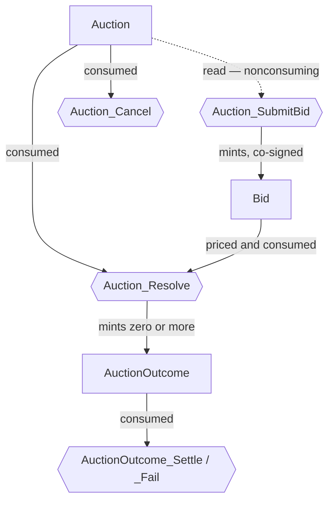
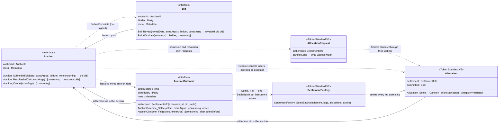

<!-- Copyright (c) 2026 Unlockit. All rights reserved. -->
<!-- SPDX-License-Identifier: Apache-2.0 -->

# cap-auctions architecture

For an engineer implementing an auction format or integrating a wallet or
settlement bot: what the library fixes, and what implementations own.
cap-auctions is a Daml interface library for on-ledger auctions — bids
resolve under a pricing rule into outcomes, and outcomes settle as Token
Standard [settlements](glossary.md#settlement). It imports the Canton Token
Standard V2 (CIP-0112) directly and versions
[in lockstep](design-decisions/token-standard-lockstep-v2-spine.md) with it.
The running example is the [walkthrough](cap-auctions-walkthrough.md);
security claims live in the [threat model](cap-auctions-threat-model.md);
signatures live in the interface doc comments and `examples/`, never in prose.

## Format coverage

One interface family covers every format with a single discrete
resolution event over a set of opaque bids; format differences are policy
— methods and templates — never interface shape.

| In | Out |
|---|---|
| First- and second-price sealed (Vickrey); multi-unit (uniform-price, pay-as-bid); combinatorial (bundle bids) | Continuous double auctions / order books — no discrete resolution to give resolve semantics; that is an exchange standard |
| English (ascending) and Dutch (descending) | Bilateral negotiation / RFQ with counteroffers — no pricing rule over a fixed bid set; counteroffers mutate terms |
| Reverse (procurement — bidders compete to sell); call double auctions (periodic clearing, direct buyer→seller legs) | |

The interface names no seller — only an operator, a bidder, the executors
and a beneficiary. Sellers (one, many, or none in that role) are template
parties, which is what lets forward, reverse, and double formats share the
family ([why](design-decisions/interface-boundary.md)).

## Security skeleton

Three facts do the security work; the threat model maps every attack onto them.

1. **Consumption is the state machine.** Resolve, cancel, settle, and fail
   are consuming choices, so an auction resolves and an outcome settles
   exactly once — existence of the auction contract means "not yet
   resolved". Two obligations complete the machine: resolution must
   consume every bid it prices, and the implementing template must keep
   the auction contract immutable, so its contract id stays a stable
   binding target.

2. **The interface never carries the bid value** — not in a view field, a
   method result, or a choice result, so sealed bids have no field to
   leak. Reading a value takes implementation code: the pricing rule
   downcasts to its concrete bid template, and open templates can also
   disclose it through their own fields and observers.

3. **Authority layers on the token standard.** Where a bid contract exists
   ([admission](#auction-admission) decides when), it is minted only
   inside `Auction_SubmitBid`, so it carries the auction signatories'
   co-signature: the unforgeable bid→auction binding, and what lets
   resolution consume bids without the bidder live. Traders authorize
   through the [allocations](glossary.md#allocation) they create; outcomes
   need only the executors' signature — a template may add the winner as
   signatory, but the interface never requires it
   ([derivation](design-decisions/token-standard-lockstep-v2-spine.md)).

## Auction admission

Admission has two surfaces; one question picks between them: can the
committed allocation completely represent the bid?

When it can — token-priced, single-unit, committed at bid — admission can be by
allocation alone. The app writes the `AllocationRequest`, signed by the
operator alone; the bidder's one authorizing action is
`AllocationFactory_Allocate` through any standard wallet; no bid contract
exists. Admission into the book is validation, not authorization — the
implementation must check the allocation matches what it requested
([admission validation](cap-auctions-threat-model.md#residual-risks)); the
[registry](glossary.md#registry) may interpose a pending instruction before
the [escrow](glossary.md#escrow) completes.

Otherwise the bid is a contract, minted by `Auction_SubmitBid`. Three cases
force one: **sealed** bids — a commitment hash cannot ride the wallet flow;
**richer payloads** — demand schedules, bundles, conditional bids — that no
allocation field carries; and **deferred escrow** — no committed allocation
exists at bid time. A bid contract costs standard-wallet compatibility, so
a format should mint one only when a case forces it.

## The interfaces

Three interfaces — `Auction`, `Bid`, `AuctionOutcome` — one package each
([why](design-decisions/interface-boundary.md)). Two diagrams: first the
choice surface the interfaces fix, then the same interfaces with their
fields and the Token Standard V2 composition around them.

The choice surface: hexagons are interface choices, an edge into a choice
is a contract it consumes (dotted: reads), and an edge out of one is a
contract it mints.

The `Bid` node exists only where [admission](#auction-admission) puts a
bid contract; its own choices — `Bid_Withdraw` and `Bid_Reveal`, both
consuming, bidder-controlled — appear in the class diagram below, which
adds the view fields and how data flows to and from the token standard.

Solid arrows are data — `ContractId` bindings the choice bodies assert;
dotted arrows are lifecycle — one contract's choice minting, consuming,
cancelling, or settling another. The `Token Standard V2` classes are the
standard's own interfaces, drawn with only what the composition touches;
whether each token-layer edge is forced or left to formats is stated in
[the settlement surface](#the-settlement-surface). The `Bid` view
deliberately carries no value field
([security skeleton](#security-skeleton)). The
[walkthrough](cap-auctions-walkthrough.md) draws the same composition
concretized to the sealed running example.

## The settlement surface

Every allocation names the settlement it funds, and that is the binding
the spec requires: `SettlementInfo`'s `cid` must be the auction contract
id, and the executors must keep `(id, cid, meta)` unique, so an allocation
funds one auction
([wrong-auction attacks](cap-auctions-threat-model.md#killed-threats)).

At settlement the executors — `[operator]` by default, plural where
operator roles split — are the only live signers; unfunded receipt
allocations cover the incoming sides. The settle method must cover every
[leg](glossary.md#leg) of the outcome in one Daml transaction, one
`SettlementFactory_SettleBatch` per [instrument](glossary.md#instrument)
admin. Resolution should mint companion `AllocationRequest` contracts
naming the legs — they are what standard wallets watch, so post-award
allocation needs no bespoke integration; per-side requests and outcomes
are a double-auction privacy choice.

Escrow timing is per-format policy, a ladder trading liquidity for
certainty: unallocated → uncommitted (present but withdrawable) →
committed (guaranteed until the settlement deadline). Three placements on
the ladder are named here and used across these docs:

- **P1 — full escrow at bid.** A bid is admitted only with a committed
  allocation covering its full exposure.
- **P2 — fixed deposit at bid.** A format-constant committed deposit at
  admission, plus a post-award allocation at the clearing terms.
- **P0 — no on-ledger escrow.** Permitted; the payment guarantees are not
  claimed.

A format can sit anywhere on the ladder; each placement's exposure has its
[residual-risk entry](cap-auctions-threat-model.md#residual-risks).

Display metadata travels under the reserved keys `format`, `lot`,
`clearing-price`, and `quantity`; registry contexts travel in the standard's
own extra arguments.

## Sealed bids and commitment schemes

Sealing is a template property. Two conforming schemes: hash commitment —
the bid stores the salted hash; reveal recomputes it and aborts on mismatch
— and cid-as-commitment — the bidder submits the contract id of a private,
bidder-only value contract (a Canton contract id is a salted, authenticated
hash of the contents, so reveal is disclosure of the contract). Either way
stakeholder-only visibility keeps a sealed bid dark to other bidders.
Submission is dark at the transaction level too: a nonconsuming exercise
informs the auction contract's signatories, not its observers, so bidders
learn nothing of each other's submissions — not even that one happened. A
private bid with no pre-close commitment fails: nothing proves the contract
predates the deadline, and silence is a free option — nothing to forfeit.

Validation is visibility: whoever resolves must see what it prices, so a
decentralized operator decentralizes authority, not confidentiality.
Confidentiality from the operator has three shapes: a blind platform
(operator = seller — no third party sees bids), the Dutch format
(equivalent to first-price sealed; losing bids never exist in plaintext),
and staged reveal (only commitments that could beat an announced
provisional high bid reveal). A value-sized allocation leaks the sealed
value whatever the escrow timing — sealed formats must pair deferral with a
fixed deposit ([sealed-value leakage](cap-auctions-threat-model.md#residual-risks)).

## Packages

| Package | Contains | Depends on |
|---|---|---|
| `cap-auctions-types-v1` | `AuctionId`, the reserved display keys | splice |
| `cap-auctions-bid-v1` | `Bid` | types-v1, splice |
| `cap-auctions-outcome-v1` | `AuctionOutcome` | types-v1, splice |
| `cap-auctions-auction-v1` | `Auction` | types-v1, bid-v1, outcome-v1, splice |

The splice token-standard packages are `data-dependencies`, pinned to one
release across the repo; `Splice.Api.Token.MetadataV1` is imported, not
mirrored. `types-v1` cannot fold into `auction-v1` (a dependency cycle) nor
into `bid-v1`: a settlement-only consumer must not pull in the bid package.
Versioning is lockstep with the token standard
([decision](design-decisions/token-standard-lockstep-v2-spine.md)).

## What implementations own

The boundary rule: anything a generic consumer must do to any auction is an
interface choice; anything a format decides is a method; authority and
privacy are the template ([arguments](design-decisions/interface-boundary.md)).
Templates and methods own the pricing rule (an empty outcome set is a valid
resolution — reserve prices), eligibility, windows, the `bidData` and
`revealData` encodings, the commitment scheme, escrow timing, withdrawal,
refund, and penalty policy, signatory and observer sets (privacy is allowed,
but never required), the seller role, and evolving state — price tickers,
high-bid registries — in companion contracts, never on the auction contract.
Templates may carry choices beyond the interface — a seller's
approve-before-resolve, a guardian cancel — the checks tolerate extra roles.

A conforming implementation declares its format tag, encodings, escrow
placement, withdrawal policy, and package id; clients should pin all five —
creating a look-alike auction is not forgery
([implementation trust](cap-auctions-threat-model.md#residual-risks)); the
obligations that close threats each have a residual-risk entry there.

Craft notes: size windows against Canton's bounded ledger-time skew, and give
unrevealed bids a declared fate (forfeit or release); bound text sizes in
`bidData`, `revealData`, and metadata values; resolution is one O(bids)
transaction — pre-stage validation in companion contracts for very large bid
sets, where transaction size, not contention, binds.

## Ecosystem fit

Lending apps can liquidate collateral through Dutch auctions under
[P1](#the-settlement-surface) — resolve-on-accept composes the winner's
allocation and acceptance in one submission. Tokenization platforms can
issue through sealed multi-unit auctions (uniform-price or pay-as-bid)
under [P2](#the-settlement-surface).
Canton's differentiator is sealed bids without MEV — no mempool, no
front-running of commitments. Venue operators can plug into CIP-0047
featured-app economics — settlement through the venue is the rewarded
activity.
