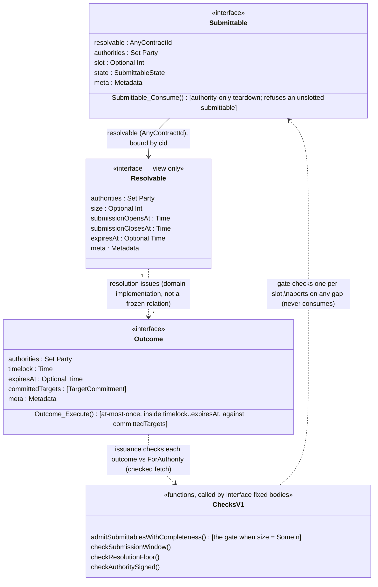
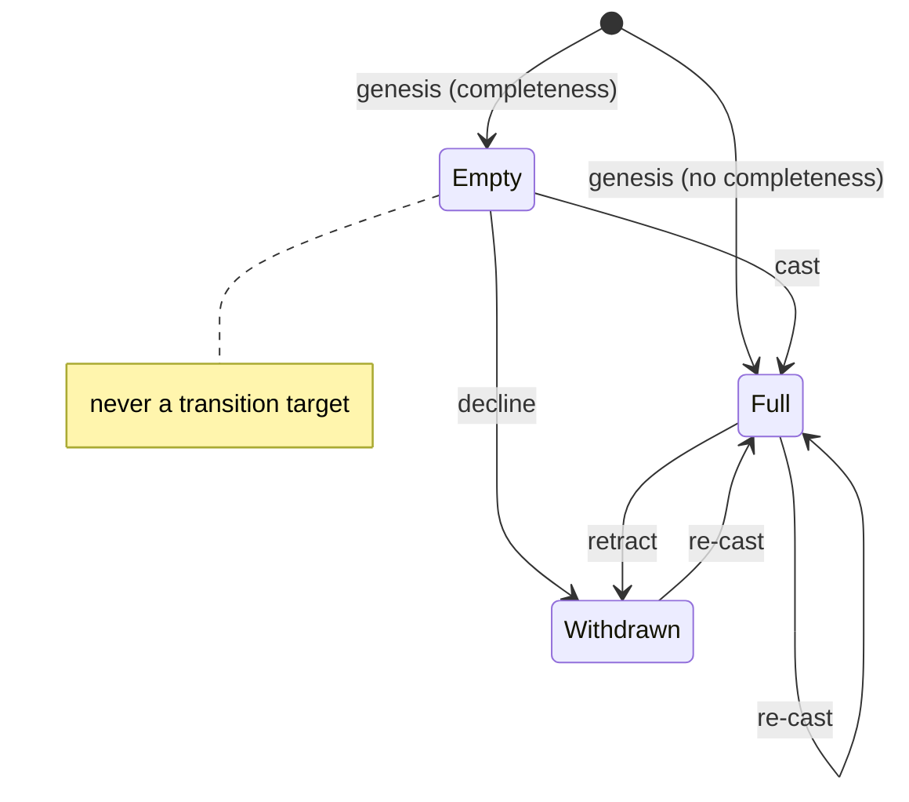
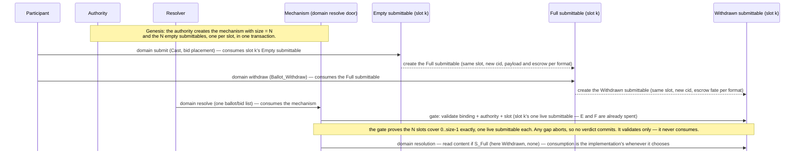

<!-- Copyright (c) 2026 Unlockit. All rights reserved. -->
<!-- SPDX-License-Identifier: Apache-2.0 -->

# cap-core architecture

## What this is

Domain-agnostic primitives for [mechanisms](glossary.md#mechanism) (Daml 3.x,
LF 2.1). Cap-core forces only what is universal, and the
core check set is maximally permissive minus the unsafe class.
Six interface packages: shared value types (`cap-core-metadata-v1`),
the [submittable](glossary.md#submittable) face (`cap-core-submittable-v1`), the
mechanism face (`cap-core-resolvable-v1`), the shared checks
(`cap-core-checks-v1`), the target face (`cap-core-target-v1`), and the
outcome face (`cap-core-outcome-v1`) — plus `cap-core-util`, optional helpers for
implementations that no fixed body ever calls. Domain interfaces `requires`
the faces: a bid and a ballot are submittables; an auction and a proposal are
resolvables. Governance and auctions are instantiations.

This document is in four moves. **The base model** — the interfaces and how
data flows between them, plus content privacy — is what every mechanism uses.
**The enforcement boundary** is the design lens: where each check is allowed
to live. **Completeness** — an opt-in proof at resolution that no
[submittable](glossary.md#submittable) was omitted, against a fixed set of
participants — told motivation first: its claim, its invariant, the resolve
door and the checks it runs, the state machine, and the lifecycle. **The
target binding** — how an approved outcome stays bound to the standing
contract, and optionally the state, its approvers saw. Packages, obligations,
and threats close the document.

Status: implementing.

## Authority anchor vs. decision rule

The **authority anchor** (`authorities`, a set) is
*who must sign* (e.g. for the proposal, ballots, and executables to be legitimate).
Unanimity is the only acceptance rule among the authorities set, because a Daml
signatory set is a conjunction (AND). A non-unanimous anchor can only come from a
member being a Canton **decentralized party**, which contributes a *flat* k-of-n
threshold over its own hosting nodes/keys (k = 1 is OR, k = n is AND, general k is
at-least-k) — transparent to the frozen check, which still just verifies that the
one party signed. Making each member a flat k-of-n, the anchor can reach
AND-of-thresholds. The
**decision rule** (`tally`) — *how ballots decide the outcome* — is a pure
function with no such limit (majority, quorum, weighted, quadratic, …). The
k-of-n ceiling caps whose signatures legitimize the mechanism, not what it decides.

## Interfaces Architecture

Solid arrows are data (unforgeable `ContractId` bindings in the views); dotted
arrows are lifecycle, a `requires` relation, or a fixed body calling a check.

- **`Submittable`** — the completeness face of a contract: which mechanism,
  which slot (`Optional`: `Some` under completeness, `None` outside it), whose
  signature makes it real. Domain resolution downcasts full submittables to
  the implementation's own template for content; an empty or withdrawn
  submittable carries none. It names no registrant and no content, so the face
  stays pseudonymous
  ([content opacity](#content-opacity-and-commit-reveal)). No expiry:
  discipline is owed at mint, not checked at the gate.
  Its `Consume` refuses an unslotted submittable, so this face offers the
  authority no destruction path outside completeness — a domain face may still
  carry its own (governance's `Ballot_Consume` does), with its own documented
  residual.
- **`Resolvable`** — the mechanism and the binding target for everything
  else. Its view carries the signature anchor, the window, the expiry, and
  `size`: `Some n` declares completeness, frozen at creation before any
  submission exists, so no rival total can ever be minted
  — a view field, not a resolver argument, so a resolver cannot skip the gate
  by presenting nothing. Every `Optional` field is an opt-in guarantee
  switch; `None` declares the format makes no such promise, never a
  placeholder.
- **`Outcome`** — the execution face: an outcome carrying pre-committed
  [authority](glossary.md#authority), enactable at most once inside its window
  (`timelock`..`expiresAt`) and bound to the targets its approvers saw
  (`committedTargets`, [the target binding](#the-target-binding)). Governance's
  approved actions and auctions' settlement obligations both `requires` it.
  `Outcome_Execute`'s fixed body checks the window, that the actors are an
  executor set, and the target binding, then hands the checked targets to the
  implementation's `executeImpl` — the effect runs with the outcome
  signatories' authority in scope, never re-resolving. Its checked fetch groups
  by `ForAuthority`, so a look-alike carrying a different authority aborts at
  issuance. A single `Resolvable` resolution can issue many outcomes (a proposal
  approving several actions, an auction settling every winning leg) — but *how
  many, and whether any at all, is the domain implementation's resolve body, not
  a relation this frozen face fixes*.

## Instantiating the authority

The [authority](glossary.md#authority) is a set of parties, and the frozen
checks require every member's signature on the mechanism and on every
submittable. Combination rules (any-of-k proposal rights, k-of-n admission of
voters) are deliberately not on the view: a contract's signatories are fixed
at creation, so such rules govern *minting* — a genesis act the interface
never witnesses — and a rule enum in the frozen viewtype would freeze a policy
language it cannot enforce. The rules live instead in multi-signed issuer
contracts the authority controls, revocable and replaceable without touching
the standard. Three instantiations span the space, each with a real cost:

- **Single operator** — a singleton set: one party signs everything. Cheapest
  and fastest (one confirming participant per artifact), and one key to trust
  — its compromise forges the electorate; its loss stalls the mechanism.
- **App-level consortium** — a real set (five banks adopting a common payment
  standard, none privileged): forging an artifact needs every member's key,
  and the trust model needs no topology work. The costs: minting an artifact
  involves every member's participant (confirmation fan-out, and one dead
  participant stalls minting), and every member sees every submittable.
- **Decentralized party** — a singleton set whose one party is topology-level
  decentralized (multi-hosted, threshold-confirmed): threshold liveness with
  the consortium's trust distribution, at the price of topology ceremony —
  validator cooperation to constitute the party, topology transactions to
  change its threshold.

## Content opacity and commit-reveal

The `Submittable` view names no registrant and carries no content: it records
which mechanism and which slot, whose signature makes it real, and nothing
about who filled it or what they put forward. That is what keeps the face
pseudonymous — a domain face on the same contract may name its submitter (a
ballot names its voter), so identity linkage is the domain view's choice, not
a leak the core forces. The content — a vote, a price — is read only by
downcasting to the implementation's own template, never through an interface
field, so **sealed and secret formats have nothing to leak through the
standard.**

Because no interface field carries the content, a format can seal it with an
ordinary Canton primitive: a contract id is a salted, authenticated hash of
the contract's contents, so a submittable can commit to a value by storing the
cid of a private, submitter-only contract and reveal it later by disclosing
that contract — the ledger itself authenticates the revealed payload against
the committed cid, with no salt discipline or canonical-encoding pitfalls. A
stored `sha256 (salt <> value)` is the lighter fallback. Either way the
commitment must be on-ledger before the submission closes; a value handed over
after the close proves nothing about when it was created. Governance's secret
ballots and auctions' sealed bids are the two instantiations — each documents
only its own unrevealed-submission rule.

## The claim

A Daml choice cannot enumerate "all submissions for this mechanism" — the
resolver hands in a set it claims is everything. Without completeness, a
quorate tally contains the damage: omission can stall a verdict but not flip
it. With completeness the ledger checks the claim itself: the mechanism fixes
its `N` slots at genesis, and resolution must present one
[submittable](glossary.md#submittable) per slot.

## The invariant

Each slot has exactly one live submittable from genesis to resolution.
Genesis mints one empty submittable per slot. Every later transition
consumes the slot's submittable and mints its successor for the same slot in
the same transaction — empty to full at submit, full to withdrawn at withdraw —
so the per-slot count never leaves 1. A format may add transitions (vote
replacement, say) provided each one keeps that shape: consume the slot's
submittable, mint exactly one successor for the same slot.

Canton makes the count exact. An empty submittable presented at resolution as
unused cannot also have produced a full one — that submit consumed it, and
Canton conflict detection rejects a resolution whose fetched submittable was
consumed concurrently, so proving needs no consuming. Nothing can join after —
resolution consumes the mechanism, so later mints have a dead binding target,
and a leftover submittable cannot act for the same reason.

## No double-count

The invariant above stops a real submittable being *omitted*; a separate check
stops one being *counted twice*, and which check does it depends on the mode.
**Under completeness**, exact-cover already gives it for free: a repeated
`ContractId` repeats its slot, so `sort slots == [0..n-1]` fails — no distinct
check is run. **Without completeness**, there is no cover, so the gate asserts
distinctness directly — it refuses a presented set that repeats a `ContractId`.
Either way a submittable is counted at most once with nothing consumed:
resolution reads the admitted set and leaves it. Consumption, where a format
does it, is teardown hygiene, not a correctness step (an already-archived cid
re-presented simply fails the gate's fetch). Replay into a *later* resolution is
independently impossible: resolution consumes the mechanism, and cids never
recur.

## One door per mechanism

`Resolvable` carries a viewtype and nothing else — no methods, no choices. Resolution runs through the
domain interface's own resolve choice, whose fixed body calls the shared
checks in `Cap.Core.ChecksV1`:

- **the completeness gate** (`admitSubmittablesWithCompleteness`) — the fixed prefix below,
  run whenever the view's `size` is `Some`;
- **the window checks** (`checkSubmissionWindow`, `checkResolutionFloor`) — no
  submission or resolution before `submissionOpensAt`, and no submission at or
  after `submissionClosesAt`, the mandatory hard outer bound. The submission
  side is a full window (both bounds); the resolution side is deliberately
  floor-only, so quorum-early resolution stays legitimate;
- **the signature check** (`checkAuthoritySigned`) — every member of the
  authority signed the mechanism (and the set is non-empty — a vacuous anchor
  guarantees nothing).

The checks are functions, not interface methods or choices, because a method
forces a function to exist, never that it is called — and a core choice would
be a second live door on every mechanism, bypassing the domain's own resolve
checks. The enforcement locus is the domain interface's fixed body: an
implementation cannot override it, and a domain that skips a call is
non-conforming at the interface-author level.

## Completeness

[Completeness](glossary.md#completeness) — proving no ballot was omitted and no
abstention hidden — is an **optional** property a proposal declares on its
Resolvable face: `size = Some n`. The interface never forces it, so formats
that cannot enumerate their electorate are never locked out. Splice gets it
from a collector: the vote `Map` is the set, so closing it sees everything.
Ballots-as-contracts get the same property from the cap-core
[gate](cap-core-architecture.md): the resolver cannot read all the ballots
itself — that is what "No global reads" forbids — so it hands in a set it
*claims* covers everyone, and `Proposal_Resolve`'s fixed body checks that
claim against the `n` [slots](glossary.md#slot) frozen at creation.

One `Ballot` spans the slot's whole life. `Ballot requires Submittable` makes
an uncast ballot the slot's empty [submittable](glossary.md#submittable) — the
voting right — a cast ballot its full state, and a withdrawn ballot its
withdrawn one; the cap-core lifecycle, instantiated on one artifact:

1. **Genesis (implementation-owned).** The proposal is created with
   `size = Some n` and the enumerated electorate: `n` slot-indexed uncast
   ballots, one per voter, each naming the proposal's cid. Minting exactly one
   per slot makes the slots injective.
2. **Cast.** `Ballot_Cast` consumes the uncast ballot and mints its cast
   successor; `castImpl` MUST preserve mechanism, authority, and slot and mint
   the successor full — a trusted-implementation obligation, and a wrong slot
   still surfaces at the gate as a broken cover.
3. **Withdraw.** `Ballot_Withdraw` consumes the ballot and mints its withdrawn
   successor — same slot — so the slot shows one live ballot, never both. It is
   voter-controlled, so no one but the voter can retract a cast vote.
4. **Resolution.** The resolver passes every live ballot in one `votes` list —
   cast ballots and, under completeness, the uncast and withdrawn ones filling the
   remaining slots. `Proposal_Resolve`'s fixed body runs the gate over the
   list: every slot exactly once, bound to this proposal, authority-signed; any
   gap aborts atomically, so no decided verdict commits. It tallies every full
   ballot in the list, so a cast vote can never be routed past the tally — one
   list makes that structural. Then `tally` runs unchanged.
5. **Why "uncast" is exact.** Canton conflict detection makes the per-slot
   count exact — [cap-core's argument](cap-core-architecture.md#the-invariant)
   on ballots: a ballot presented as uncast cannot also have produced a cast
   one, and none can appear after `Resolve` consumes the proposal. One per
   slot, all proven ⇒ every vote and every abstention was seen — Splice's `Map`
   guarantee, from per-voter contracts instead of a shared collector.

Scope and obligations:

- **Cast-produced ballots only.** A ballot the authority and a voter co-mint
  outside `Cast` occupies no slot and can be omitted; for slot-occupying ballots,
  omission of a real cast vote is structurally impossible, not merely
  quorum-contained.
- **The shared slot obligations, on ballots.** cap-core's slot obligations
  ([implementation considerations](cap-core-architecture.md#implementation-considerations))
  instantiate here: every ballot — uncast, cast, or withdrawn — carries
  `expiresAt` at or beyond the proposal's, or the anyone-callable `Expire`
  strands its slot; `Resolve` reads the ballots it tallies without consuming
  them, and every ballot — tallied, uncast, or withdrawn — exits through its
  expiry choice; a destroyed
  ballot degrades to a stall — its slot unsatisfiable, so no decided verdict
  commits and the proposal dies at its `Expire` — never a silent omission.
- **The electorate must be enumerable.** A format whose electorate cannot be
  snapshotted (anyone-with-a-holding, join-during-vote) cannot have this property
  in any design — Splice's `Map` needs a fixed roster as its denominator too. Such
  formats simply do not declare completeness.
- **Declared, not assumed.** Completeness is declared on the ledger by the
  view's `size`; with the denominator proven rather than resolver-chosen,
  [threshold](glossary.md#threshold) (turnout-denominated) tallies become
  sound, so a completeness implementation may drop the
  [quorate](glossary.md#quorate-tally) obligation.

## The submittable state machine

A submittable moves through three states — `S_Empty` (registered, nothing
submitted), `S_Full` (holds the submission), `S_Withdrawn` (retracted). One
domain artifact spans all three: governance's `Ballot` is an uncast ballot
(empty) that casting fills (full) and withdrawal spoils (withdrawn), and an
uncast ballot IS the voting right. The same shape is auctions' `Bid`.

**Enforcement is layered, and only the floor is core.** By
[the enforcement boundary](#the-enforcement-boundary), the line is drawn so
core requires only what is universal:

- **cap-core requires** (a trusted-implementation obligation on every
  transition): a transition preserves identity (mechanism, authority, slot)
  and never targets `S_Empty`. Reverting a touched slot to "untouched" is the
  one unsafe edge — it would let a real submission masquerade as absent and
  drop it from the completeness proof. No fixed body re-checks the
  implementation's own minting; a broken transition surfaces at the gate as a
  failed cover. Everything else core *permits*: permitting an edge costs
  nothing (a format that doesn't want it simply never exposes it), while
  forbidding one over-forces. So the core set is maximally permissive minus
  the unsafe class.
- **the domain interface forces** (`Ballot` / `Bid` fixed bodies): which edges
  exist, and the **controller** of each. The controller is the real integrity
  guard — withdrawal is voter-only, which is what keeps a cast vote out of any
  hand but its owner's. The state edge never was the guard; the controller is.
- **the implementation decides**: escrow mechanics, the (opaque) vote or bid
  encoding, whether to expose re-cast, and any timing beyond the floors.

Two consequences follow, both implementation obligations the interface cannot
enforce:

- A format that exposes `Full → Full` (vote or bid replacement) must not pair
  it with confirmation-resolution — a verdict that can still flip is not sound.
- The machine constrains **transitions**, not initial **creation**: genesis
  legitimately creates `S_Empty` under completeness and `S_Full` without it. Only
  consume-and-mint steps carry the transition obligation.

## Lifecycle

Solid arrows exercise a choice — the label names what it consumes; dashed
arrows create a contract. Each consume-and-create pair is one transaction,
which is what keeps one live submittable per slot. A slot skips the rows its
participant never took — an unused empty submittable goes straight from
genesis to the gate. What resolution does not spend survives it harmlessly
(the binding target is dead) and leaves the ACS through expiry-style choices.

## The target binding

An approved outcome acts on standing state — a config, a rules contract, a
treasury. Standing state on Canton is archive-and-recreated as it changes, so
an outcome that pinned a contract id would go stale on the first change, and
one that pinned nothing could be redirected. The `Target` interface makes the
binding data instead: its view carries the identifying key — `(authorities,
id)`, compared never interpreted — and a `stateToken`, an opaque token the
format changes whenever action-relevant state changes. Both are
authority-vouched claims: a conforming target is signed by its authority, and
the token's discipline (bump on every relevant change) is the implementation
obligation that makes pinning mean anything. A revision counter and a content
hash are both legitimate tokens with a real trade: the counter is trivial to
maintain and refuses ABA (state moved and moved back — the approvers' state,
arguably fine to act on); the hash readmits ABA but rests on honest,
canonical hashing.

What an approval commits to is a `TargetCommitment` per target: the key, plus
optionally the token the approvers saw. `stateToken = None` on a commitment
is an identity-only pin — itself part of what was approved, so "no state
check" is a decision the approvers could read, never an omission. The
commitments freeze with the approval and flow, checked at every hop, to
execution: governance freezes them on the proposal, pins each issued
executable's list to an approved one at resolution, and its fixed execute
body runs `checkTargetBinding` over the fresh targets the executor presents
(the auctions outcome adopts the same shape with its revision). The chain
gives every attack a place to die:

| Attack | Fails at |
|---|---|
| Look-alike target: right authority, wrong `id` — or another authority's | the checked fetch — the identifying key mismatches |
| Forged target: a contract *claiming* the key but not signed by the authority | the signature check in `checkTargetBinding` |
| Redirection: an outcome issued against a target, or a state, the approvers never saw | the authority signs the commitment list on the outcome — minting it so is `issueExecutables`' obligation, vouched by that signature; `Executable_Execute` then binds execution to that list by construction |
| Atomic race: the target replaced concurrently with execution | Canton conflict detection — the binding check fetches the target, so it is a transaction input |
| Non-atomic drift: the target changed between approval and execution | the comparison always runs when a state is pinned; the consequence is the format's declared drift policy — never a silent default |
| Pin against a format that offers no token | aborts, loudly — an unsatisfiable pin never passes |
| Two live targets under one key | no on-ledger kill (contract keys are gone in Daml 3): at most one live target per key is the authority's obligation; a stale duplicate with a moved token still dies at the pin |

Drift is the one row where the interface forces the *question* but not the
*answer*: fixed bodies always detect a pinned state that moved and always
invoke the outcome's drift-policy hook — a policy can be permissive, never
absent — but equality is deliberately not forced, because that would lock
merge-style governance out of the standard until an interface major
([the enforcement boundary](#the-enforcement-boundary)). The named profiles
live in `Cap.Core.TargetPolicies`, and the two reference instantiations show
the span:

- **Strict treasury** — commitments pin the token; the hook is `driftAborts`.
  Any drift demands a fresh approval; pair it with an execution deadline, or
  a permanently drifted target leaves a forever-live, forever-unexecutable
  outcome. The default for treasuries and anything irreversible.
- **Patchable config** — the Splice shape. The action carries the proposed
  value and the value it was proposed against as its own typed fields; the
  hook is `driftReconciles`, and execution three-way merges against the
  fresh state (`Cap.Core.Patchable`): untouched fields keep their concurrent
  value, touched fields take the proposed one (proposal-wins on conflict).
  Pinning even though the policy proceeds keeps the approved token on the
  outcome as the auditable record of what the approvers saw; committing
  `stateToken = None` and always merging is pure Splice, at the cost of that
  record.

## Packages

| Package | Contents |
|---|---|
| `cap-core-metadata-v1` | `Metadata`, `AnyValue`, `ChoiceContext`, `ExtraArgs`, `AnyContract` — the shared value types every cap package uses; mirrors the Token Standard's `Splice.Api.Token.MetadataV1` shapes without importing it |
| `cap-core-submittable-v1` | the `Submittable` interface and `SubmittableState` |
| `cap-core-resolvable-v1` | the `Resolvable` interface (view only) |
| `cap-core-checks-v1` | `Cap.Core.ChecksV1`: the fixed checks domain interface bodies call, `require` (the assertion idiom they are phrased in), and the checked-fetch machinery — `HasCheckedFetch` with the `ForAuthority`/`ForResolvable`/`ForTarget` group ids and instances for the core views |
| `cap-core-target-v1` | the `Target` interface, `TargetCommitment`, and `checkTargetBinding` — [the target binding](#the-target-binding) |
| `cap-core-outcome-v1` | the `Outcome` interface |
| `cap-core-util` | optional implementation helpers no fixed body ever calls: `Cap.Core.Patchable` (three-way merge, ported from Splice's `Splice.Util`) and `Cap.Core.TargetPolicies` (the named drift profiles) |

The checks and the checked fetches live in one tier-1 package because the
tier-2 interface fixed bodies consume both, so both must sit upstream of the
interfaces; implementations import the same module directly. `cap-core-util`
is the opposite tier: helpers only implementations import, so the interfaces
never reference it.

## Implementation considerations

What the interfaces cannot enforce; each item below is an implementation obligation.

Owned outright: signatory and observer sets on every template, empty- and
withdrawn-submittable shapes beyond the `Submittable` view, and the submit and
withdraw choices themselves.

Owed, for the claim to hold:

- **Authorities is non-empty at mint.** The fixed checks treat the empty set as
  unsatisfiable — `authoritySigned` refuses it — so an empty-authority mechanism,
  submittable, target, or executable is inert (it can never cast, resolve,
  execute, bind, or consume), but the interface refuses it only lazily at the
  first live door, never at creation. A non-empty `authorities` on every minted
  artifact is the format's obligation.
- **Authority signs every submittable**, and signs slot-carrying
  contracts through the fixed paths only — the genesis transaction and the
  domain's submit and withdraw. A submittable minted outside those paths with a
  copied slot is the one breach the gate cannot see.
- **Genesis keeps the snapshot shape.** One empty submittable per slot,
  `0 .. N-1`, bound to the mechanism and authority-signed, minted with the
  mechanism. A wrong genesis is caught only at the gate, as a stall.
- **Submit and withdraw copy the slot.** The format's obligation on every
  transition (governance's `castImpl`/`ballotWithdrawImpl` MUST preserve it);
  a dropped or altered slot surfaces at the gate as a broken cover.
- **One live submittable per slot at a time.** Every transition consumes the
  slot's submittable and mints exactly one successor for the same slot, in one
  transaction. A format that adds a transition (vote replacement) owes this shape.
  A slot left with two live submittables is caught at the gate as a duplicate slot;
  destroying a slot's submittable without re-minting its successor
  leaves the slot uncoverable and degrades to a permanent stall — expose no such
  path, the authority's `Submittable_Consume` being one (a documented stall lever,
  not a routine operation).
- **`state` is a claim the interface cannot verify.** Mint `S_Full` exactly when
  the contract carries a submission, and keep each transition's successor state
  correct (submit → full, withdraw → withdrawn). The fixed bodies filter on it:
  a wrong state routes a submittable past the tally or the pricing rule.
- **Under completeness, resolution scores only `S_Full`.** The gate hands over every
  slot's submittable, all states; counting an empty or withdrawn one into a
  turnout or price is a bug.
- **Consume when you choose, but orphan nothing permanently.** The gate proves
  the cover and never spends it — Canton conflict detection makes proving
  enough, and forcing a consume path would lock out slotted submittables whose
  teardown needs their own template choices (atomic escrow release). Spend the
  cover inside resolution (`Submittable_Consume`, pre-agreed template choices)
  or let leftovers exit through expiry-style choices; a leftover cannot act,
  because its binding target is dead, so the cost is ACS residue, never
  integrity.
- **Without completeness, validating the submittables is wholly the domain's and
  the implementation's job** — bind-check, signature-check every one that is
  counted. Set `slot = None` on submittables outside completeness: a `Some` slot
  arms `Submittable_Consume`, the authority's destruction lever that only
  completeness's stall-containment makes safe.
- **Expiry cannot destroy a submittable early.** Any expire-style choice on a
  submittable template must be guarded by an `expiresAt` at or beyond the
  mechanism's own expiry; a template with no expire choice (bids) satisfies
  this with nothing to do.
- **Date every `Outcome`** (`expiresAt`) — an undated outcome stays
  executable forever, against context its approvers never saw. Doubly so
  under a strict drift policy: a permanently drifted target makes an undated
  outcome permanent ACS residue that can never execute.
- **Bump the target's `stateToken` on every action-relevant change**, through
  every path that changes it — a change the token misses executes under a pin
  the approvers believe is protecting them.
- **At most one live target per identifying key**, and `id` discipline across
  the authority's formats — nothing on-ledger forces either, and a duplicate
  key lets the executor pick which instance to present
  ([the target binding](#the-target-binding)).
- **The resolver can fetch all `N` submittables** — observer status or explicit
  disclosure, the implementation's to arrange; likewise the executor and the
  targets it must present.
- **Group-check every cid taken from `extraArgs.context`.** Resolution and
  execution methods must check each `extraArgs`-supplied contract id against
  the expected authority: a `ContractId` argument guarantees the template type,
  not the instance (`Cap.Core.ChecksV1`'s checked fetches).
- **Bound text sizes** in submission content and metadata values; the interfaces
  accept unbounded `Text`.
- **No ungated resolve path.** The domain's resolve door runs the gate; a
  template choice that resolves around it bypasses the gate until it routes
  through the domain door. A completeness-declaring implementation must not expose
  one.

## Framework threats

Four threats face every mechanism regardless of completeness, following from what
no contract can do: force a party to include an input, force anyone to act,
stop a party creating look-alikes, or reach a mechanism-design game. None has
an on-ledger kill; containment bounds the loss, and the domain threat models
carry one row each that links here and adds only its instantiation.

| Threat | Contained how | Instantiated in |
|---|---|---|
| **A look-alike is not forgery** — anyone creates a mechanism, submittable, or outcome naming another party as authority, or publishes a package | none of it carries the real authority's signature or can act as it; clients pin the package ids of implementations they trust and treat a contract as real only under a pinned package and the expected authority | governance #30 + *Implementation trust*; auctions #20 + *Implementation trust* |
| **Censorship, omission, abandonment** — a resolver omits submittables, or no one drives resolution | costs time, never integrity: the omitted submittable survives as authority-signed, mechanism-bound evidence of exclusion; value locked at submission returns through the submitter's own withdrawal or the time-guarded expiries; broad resolver sets or a decentralized authority buy liveness | governance #23/#28 + *Quorate tally*; auctions #21 + *Censorship and stalling* |
| **Mechanism-design attacks** — vote-buying, coercion, shill bidding, collusion, agenda and turnout games | out of interface scope; formats mitigate in their electorate or pricing rules and windows — noting a signed submission can double as a coercer's receipt unless the format hides its content | governance #32; auctions #24 |
| **Spoofed contracts luring victims** — a third party publishes a look-alike request or contract to lure participants into acting | no implementation can prevent third-party contracts; clients and wallets display each contract's signatories and named parties, and the missing real signature gives a fake away | governance #30; auctions #23 + *Spoofed settlement requests* |

## Possible attacks

The completeness-gate attacks specifically — the machinery above. The
cross-cutting ones are [Framework threats](#framework-threats).

| Attack | Fails at |
|---|---|
| Duplicate slot | genesis mints owe injectivity — an implementation obligation; the gate's exact-cover check refuses a repeated slot either way |
| Forged submittable | the gate — the authority never signed it |
| Wrong-mechanism submittable, replay from an earlier mechanism | the gate — the cid binding fails |
| Doubled submittable (same contract listed twice, or an already-archived cid re-presented) | the gate's distinctness check refuses a set that repeats a cid — a submittable is counted at most once, no consuming needed; under completeness the repeat also repeats a slot and fails exact-cover; an already-archived cid cannot be fetched and aborts at the gate |
| Out-of-path submission | out of scope by declaration — the claim covers slot-path submissions only; minting slot-carrying submittables off-path is the authority-signature obligation above |
| Authority re-totals the set (omission or stuffing by a rival `N`) | no door: `N` is frozen on the mechanism's view at genesis, before any submission exists — there is no total contract to mint a rival of |
| Authority substitutes forged submittables in real slots | out of scope by declaration — the same family as out-of-path submission above; the replaced artifacts survive as authority-signed, mechanism-bound evidence, and a multi-member authority set or a decentralized party ([instantiating the authority](#instantiating-the-authority)) closes the family — substitution then needs every member's key |
| Slot-index forgery at submit | the format's obligation — transitions preserve the slot (implementations are trusted); a forged index breaks the exact cover at the gate |
| Short set | the gate — fewer than `size` slots aborts |
| Resolver skips the gate by presenting nothing | completeness is the view's own `size`, not a resolver argument — the domain's fixed body runs the gate whenever it is `Some` |
| A cast submission covering its slot while hidden from the tally or pricing rule | `Proposal_Resolve` takes one ballot list and tallies every full ballot in it, so a cast vote cannot be routed past the tally — structural. `Auction_Resolve` still takes a separate evidence list and refuses a full submittable in it (a follow-up applies the same one-list collapse to auctions) |
| Gate satisfied, resolution fed a subset | structural — the gate returns exactly the pairs it admitted, and the domain body hands those on |
| Registrant-set leakage | the `Submittable` view names no registrant; a domain face may (a ballot names its voter), so identity privacy is the domain view's and the template's choice |
| Premature-expiry stall | the expiry obligation above |
| Submittable destruction | through the core face: the guarded `Consume` refuses an unslotted submittable; inside completeness it degrades to a permanent stall — the slot becomes uncoverable, no verdict ever commits, the mechanism dies at its own expiry and a successor runs. A domain face may carry its own destruction path (governance's `Ballot_Consume`); that residual is the domain's, documented there |
