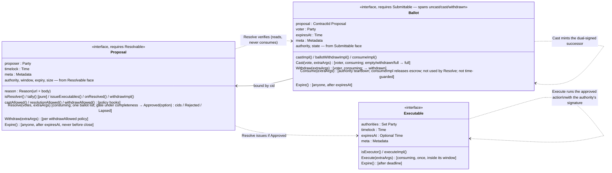

<!-- Copyright (c) 2026 Unlockit. All rights reserved. -->
<!-- SPDX-License-Identifier: Apache-2.0 -->

# cap-governance architecture

## What this is

An interface library (Daml 3.x, LF 2.1) for multi-party governance: proposals
are voted on with ballots, resolved by a rule, and approved outcomes execute
with on-ledger authority. It fixes the skeleton and leaves
everything that legitimately varies — electorate, tally, ballot
format, privacy — to implementing templates.

## The security skeleton

Two facts about security:

1. **A signature chain.** One authority — a set of parties, `authorities` on
   the Resolvable face — anchors validity: it signs the Proposal; a voting
   right is only honoured if every member signed it; a ballot must be signed
   by both the full authority and the voter; an Executable must be signed by
   the full authority. Daml authorization makes those signatures unforgeable —
   and the authority can be a single operator (a singleton), an app-level
   consortium (a real set), or a Canton decentralized party (threshold
   council) as the singleton; a registrar acts through delegation under any of
   them ([instantiating the
   authority](cap-core-architecture.md#instantiating-the-authority)). The
   interfaces never care which.

2. **Fixed choice bodies.** Every choice is written as integrity checks, then
   a timing-policy hook, then the implementation method — what the method
   produces is the trusted implementation's obligation, re-proved at
   resolution where third parties depend on it. The integrity checks — signatures, bindings,
   consume-once, and the shared cap-core checks (the window floor, the
   authority signature, the completeness gate under [completeness](#completeness))
   — are fixed: an implementation cannot dodge a signature assertion or bind a
   ballot to the wrong proposal. The timing rules (when to cast, resolve,
   withdraw) are policy hooks the body always invokes but the implementation
   defines, with named profiles in `Cap.Governance.Policies` — permissive is
   allowed, absent is not.
   Which guarantees are forced here and which are left as implementation
   obligations follows
   [cap-core's enforcement boundary](cap-core-architecture.md#the-enforcement-boundary).

Governance composes with cap-core by `requires`: `Proposal requires
Resolvable`, and `Ballot requires Submittable` — one artifact spanning the
whole ballot lifecycle (uncast → cast → withdrawn), an uncast ballot being the
voting right. The
Resolvable face carries the signature anchor, the voting window, the expiry,
and the completeness switch — `ProposalView` carries only what is governance's
alone, so the two faces of one fact cannot diverge. `Resolvable` has no
choices, so `Proposal_Resolve` is the one resolve door.

`authorities` is the signature anchor, not the tally: who votes and
what counts as approval live in the electorate and `tally`; how many nodes must be honest for
the authority party itself lives in topology. The three layers move
independently.

Three protocol limitations shape what the interfaces can and cannot promise:

- **No global reads (this is a design decision of not making Proposal a hot contract)** Daml choices cannot enumerate "all ballots for this
  proposal" — a transaction only sees contracts passed into it. `Resolve`
  verifies every ballot it is given but cannot force the resolver to include
  them all; an omitted ballot survives as signed evidence, and a broad
  `isResolver` set lets a censored voter resolve with their own ballot
  included. A quorate tally reduces the attack to stalling: every decided
  verdict needs a quorum of ballots actually present, so omitting ballots can
  push a vote into `Lapsed` but never flip an outcome (Splice's
  `requiredNumVotes` rule is quorate).
- **Confirmation is not approval.** A decentralized authority's hosting
  threshold (k of n participants must confirm) is a validation and custody
  parameter, not a vote: honest hosts confirm any valid transaction. The
  trade-off is real — k too low lets small host coalitions abuse the party's
  signature; k too high lets refusing hosts stall valid resolutions. Size k
  for an assumed fault bound (k ≥ f+1 and k ≤ n−f), independent of any quorum
  in `tally`.
- **Ledger time has skew.** Window and expiry guards are exact up to Canton's
  bounded ledger-time tolerance; don't design voting windows tighter than
  that bound.

## The interfaces, and how data flows between them

Solid arrows are data (unforgeable `ContractId` bindings in the views);
dotted arrows are lifecycle (one interface choice creating or consuming
contracts of another). The cap-core faces the `requires` add are drawn in
[cap-core's diagram](cap-core-architecture.md#the-interfaces-and-how-data-flows-between-them),
not repeated here.

## Walkthrough

For an engineer following their first cap-governance flow: the proposal
lifecycle walked end to end, from voting right to executed outcome — the
running example the surrounding sections concretize.

### Cast

The implementation mints an uncast ballot — the voting right — per eligible
voter (how is its business: council roster, delegation, token holding). `Cast`
consumes the uncast ballot — that consumption is the no-double-vote guarantee
— and mints its cast successor, bound to the proposal's contract id and signed
by authority and voter.

### Resolution

After the window closes, any party accepted by `isResolver` calls `Resolve`
with the ballot cids: the body rejects wrong-proposal and unsigned ballots and
any set that repeats a cid, then reads the rest — it never consumes them — and
asks `tally` — the social choice function, a pure
function of the ballots and the proposal's own fields — for a verdict:
Approved — optionally naming the winning option among several — Rejected, or
Lapsed (the vote never became definitive).
`onResolved` closes the resolution: the implementation's side effects — a
rejection record, a successor proposal after a lapse — run atomically with
the outcome.

### Execution

Approval issues Executables for the winning option — one per obligation, so
independent effects get independent lifecycles — each bound to the timelock
and the target commitments the voters approved
([the target binding](cap-core-architecture.md#the-target-binding)); because
each carries the authority's signature, `Execute` (consuming, so at most once
— no earlier than `timelock`, no later than `expiresAt`) can act on standing
state — move treasury holdings, amend rules — as the authority. The executor
presents the fresh targets as a choice argument; the fixed body checks each
against its commitment (identity, signature, and the pinned state where the
commitment pins one), routes drift to the format's declared policy, and hands
`executeImpl` the checked values. `extraArgs.context` delivers the rest —
allocation references and registry contexts — at execution time.

### Cleanup

Everything archives on its happy path (stragglers have time-guarded `Expire`
choices anyone can call), so the ACS stays small, and voting is
contention-free because each voter consumes only their own ballot.
Every choice returns a dedicated record type, so results can grow fields
across versions without breaking callers.

## Packages

To be defined.

## What implementations own

Signatory and observer sets — privacy is allowed, never required, and secret
ballots work because the vote is deliberately not an interface field.
Also: electorate and voting-right minting, the vote and option formats and
`tally` semantics (a verdict can select one option among several — it flows
from `tally` to `issueExecutable` as opaque text and is recorded in the
resolution result), vote-changing, proposal genesis, bounds on text-field sizes,
human-readable summaries of the proposal and the approved action (published
under `meta` keys — the typed view fields carry only `reason`, the structured
justification), and optional extras like
voter co-signed Executables. Implementing templates can also carry choices
beyond the interface — a guardian veto on the proposal or on the Executable,
vote-changing, escalation — because the interface checks tolerate extra roles
by construction. Deliberately absent from the interface: factories, a weight
field, early resolution, and an authority-controlled Executable cancellation
— each would reopen an attack or hardcode an authority model. A veto held by
a party the proposal named is not that: it is part of the approved terms,
and lives on the implementing template.

## Implementation considerations

- **`extraArgs` rides exactly where implementation code runs** — `Cast`,
  `Resolve`, `Withdraw`, `Retire`, `Execute` — delivering escrow references
  and registry contexts (targets travel as `Execute`'s own checked argument,
  never in context); the effect-free `Expire` and
  `Consume` choices carry none. Keys are DNS-prefixed (`cap-governance/`);
  nothing security-relevant may travel in `meta` — no fixed check
  reads it. A human-readable summary belongs in the proposal's view `meta`.
- **Declare the window on the Resolvable face.** The fixed submission window,
  the windowed policies, and `castImpl`'s expiry obligation all read
  `submissionClosesAt`, now a mandatory hard close on the shared face — so
  every proposal carries the close those bodies need.
- **Pick a timing profile first.** `Policies.windowed*` unless the workflow
  needs quorum-triggered execution; the confirmation profile is only sound
  with a tally whose verdict cannot flip as more ballots arrive: quorate,
  with quorums above half the electorate so the two verdicts are mutually
  exclusive, and no vote-changing.
- **Make the tally quorate**, over an electorate snapshotted in the template
  at proposal creation. This is what reduces ballot omission and destruction
  to stalling.
- **Expiries**: set a voting right's `expiresAt` to at least the declared
  close; set a ballot's past the close with a resolution grace,
  and resolve promptly — an unresolved ballot becomes expirable by anyone
  with visibility once its `expiresAt` passes.
- **Bound text sizes** in `castImpl` (the `vote`) and at proposal
  creation (the `reason`); the interface accepts unbounded `Text`.
- **Group-check every cid taken as a choice argument or from
  `extraArgs.context`.** A `ContractId` argument guarantees the template type,
  not the instance — a submitter can pass a look-alike from another authority.
  Fetch through `Cap.Core.ChecksV1`'s `fetchChecked` /
  `fetchCheckedInterface` with the expected `ForAuthority`. Targets need none
  of this by hand: `Execute` takes them as its own argument and its fixed
  body checks each against the voters' commitment. The two-step pattern —
  `executeImpl` creates an authority-signed, single-use pending-action
  contract whose template choice takes the leftover cids — is the fallback
  when execution must be staged.
- **Pin the state the voters saw.** A commitment's `stateToken` freezes, with
  the proposal, the target state the approval is about; wire `onTargetDrift`
  with a named profile from `Cap.Core.TargetPolicies` — `driftAborts` for
  treasuries and anything irreversible (and date the Executable: a
  permanently drifted target otherwise leaves it forever live and forever
  unexecutable), `driftReconciles` where concurrent governance must merge.
  An identity-only pin (`stateToken = None`) is legitimate — but it is
  visible on the proposal, so voters approve the absence of the check too.
- **Per-outcome side effects go in `onResolved`, never in `tally`.** `tally`
  is pure — the auditable social choice function. Rejection records,
  successor proposals, notifications run in `onResolved`, atomically with the
  resolution. A lapse is handled by a successor proposal, never an extension:
  `Resolve` consumes the proposal and its cid bindings with it.
- **Concurrent executables must patch, not replace.** Two approved proposals
  can execute against the same standing state in either order —
  `timelock` widens that window. Store `(base, new)` in the proposal's
  action payload and three-way merge at execution with
  `Cap.Core.Patchable`; replacing with a full snapshot
  silently reverts the earlier decision. A pinned `stateToken` surfaces the
  collision first — the second execution arrives at a drifted target and the
  declared drift policy, not an accident, decides.
- **Veto is a template choice, not an interface change.** At tally: a
  designated party's vote that `tally` maps to rejected. Before resolution: a
  consuming guardian choice on the proposal template. After approval: a
  consuming guardian choice on the Executable template, naturally scoped to
  the timelock window — the window exists so affected parties can react,
  and a veto is the strongest reaction. Consumers of an approval should read
  the implementing template: an Executable may legitimately carry a veto.
- **Asset settlement needs the receiver's signature at execution**, which the
  authority-signed Executable lacks. Three conforming patterns close it — a
  beneficiary-co-signed proposal, an authority-signed offer the beneficiary
  accepts, or a `TransferPreapproval` for plain transfers — each pinning the
  payout allocation with `settlementRef.cid` = the Executable's contract id.
- **Custody**: where authority bypass must be hard, hold governed state
  behind an execution board.
- **Declare your profile.** Clients pin five things per implementation: the
  timing profile, the vote and option encodings, the tally discipline (quorate
  or not), the expiry policy, and the package id — a look-alike proposal is not
  forgery ([implementation trust](#residual-risks)).
  Publish them under `cap-governance/` meta keys and in the implementation's
  documentation.
- **Secret ballots**: the vote is not an interface field, so commit-reveal
  works unchanged — the cid-as-commitment scheme and its must-be-on-ledger-
  before-close rule are
  [cap-core's](cap-core-architecture.md#content-opacity-and-commit-reveal),
  the voter's private contract holding the vote. Governance adds: give that
  contract its own expiry, count unrevealed ballots by a documented rule, and
  for identity privacy use pseudonymous voter parties with unlinkable right
  issuance.

## Cross-checked against production

The design was audited against `splice-dso-governance` (the DSO that runs the
Global Synchronizer). Adopted from it: the timelock (our `timelock`, their
`targetEffectiveAt`), record return types with extension constructors for
upgradeability, the three-way outcome, an `expiresAt` with a time-guarded
`Expire` choice on every artifact, the structured `Reason` (a
tamper-evident link to off-ledger justification), and the `(base, new)`
action shape with three-way merge at execution (their
`AmuletRules_SetConfig`; our `Cap.Core.Patchable`, generalised into a chosen
drift policy rather than the one hard-coded merge). Not adopted: votes stored
in a map on a mutating request contract — that shape forces the tracking-cid,
vote-cooldown, and roster-repair machinery Splice carries, all of which
ballots-as-contracts avoid.

## Threat model

For implementers and auditors: where each attack on a conforming governance
implementation dies, and what stays open. Three trust labels. "By
construction" marks a defense enforced by Daml authorization or a fixed
interface declaration — a signature assertion, a consuming choice, a
contract-id binding — with no participant's honesty assumed. "Per profile"
marks a timing rule enforced by the named policy the implementation wired
into the proposal's hooks: the interface body always invokes the hook, so the
rule holds exactly when the declared profile says it does. "Implementation
obligation" marks a check the standard mandates but a method body carries, so
a non-conforming implementation could omit it. A check stays a hook or an
obligation wherever some legitimate [electorate](glossary.md#electorate),
[tally](glossary.md#tally), or authority model could not satisfy it as a
fixed body — [cap-core's enforcement boundary](cap-core-architecture.md#the-enforcement-boundary):
a wrongly forced check locks that model out until an interface major. Every
per-profile and obligation row names its entry under
[Residual risks](#residual-risks).

### Killed threats

| # | Attack | Killed where | Label |
|---|---|---|---|
| 1 | Counterfeit voting right: a voter-made template naming the real authority | `Ballot_Cast` asserts every authority member is a signatory of the uncast ballot (the voting right), and only the members can authorize their own signatures | by construction |
| 2 | Counterfeit [ballot](glossary.md#ballot): one minted outside `Cast` | a ballot is honoured only when both the authority and the voter signed it — asserted in `Resolve` (admission proves the authority's signature, the tally the voter's); no party short of those two together can produce the pair, and that pair minting a ballot directly is the authority granting a vote it can already grant by minting a right | by construction |
| 3 | The authority inventing a voter's ballot | the voter-signature assertion at the same choke point | by construction |
| 4 | Ballot bound to the wrong proposal; a sibling proposal counting it | the cid binding in the ballot's view: `Resolve` accepts only ballots bound to the contract being resolved (the gate, on the Submittable face); the Ballot face agreeing with it is `castImpl`'s obligation | by construction |
| 5 | [Casting](glossary.md#cast) against a resolved or withdrawn proposal | `Cast` fetches the proposal by cid, and fetching a consumed cid aborts — impossible, not checked | by construction |
| 6 | Casting or resolving before the vote opens | the interface floor on ledger time, ahead of any policy | by construction |
| 7 | Casting after the close; resolving mid-vote; withdrawing a proposal once it is losing | the timing hooks — `castAllowed`, `resolutionAllowed`, `withdrawAllowed` — which the choice bodies always invoke and the implementation wires | per profile — declared profile |
| 8 | Double vote through one voting right | `Cast` is consuming: one right, one ballot | by construction |
| 9 | Double vote across voting rights: duplicate rights per voter, rights minted beyond the roster, the same holding backing two weighted ballots | rights minting and `tally`'s per-voter rule — implementation territory, because multiple ballots per voter can be legitimate (weights, [delegation](glossary.md#delegation)) | obligation — electorate integrity |
| 11 | A ballot counted twice in one resolution, or replayed into a later one | a repeated cid is rejected at the gate ([no double-count](cap-core-architecture.md#no-double-count)) — by exact-cover under completeness, by an explicit distinctness check without it — so a ballot cannot be counted twice, no consuming needed; and it cannot be replayed into a later resolution because `Resolve` consumes the proposal, and cids never recur | by construction |
| 12 | A foreign-template ballot — authority-signed, bound to this proposal — skewing the count or crashing the tally | `tally` downcasts every ballot to its own template and discards what fails, without aborting | obligation — ballot provenance |
| 13 | Double resolution | `Proposal_Resolve` is a consuming choice on a contract that exists exactly once | by construction |
| 14 | Forged Executable: one carrying the authority's signature without a resolution | creating an authority-signed contract needs the authority's authorization — the authority minting one itself is bypass ([row 27](#contained-threats)), and a look-alike without the signature is a spoof ([row 30](#contained-threats)) | by construction |
| 15 | An Executable diverging from the approved terms: wrong [timelock](glossary.md#timelock), expired at issuance, expiring inside its timelock, an approval issuing nothing | `issueExecutables` MUST match the approved terms — trusted like `tally`; the authority's signature on each Executable vouches for it | obligation — implementation trust |
| 16 | An Executable whose effect — or committed targets (identity or pinned state) — is not what the proposal put to the vote | `issueExecutables` and the action payload are the implementation's code, trusted like `tally`; the authority's signature on the Executable vouches for its `committedTargets` | obligation — implementation trust |
| 17 | Double execution | `Executable_Execute` is consuming | by construction |
| 18 | Executing before the timelock lifts or after the deadline | ledger-time guards in `Execute` | by construction |
| 19 | Stale execution: an undated Executable enacted long after its context changed | a pinned `stateToken` turns staleness of the target itself into drift, routed to the declared policy (row 33); for everything the pin cannot see, the deadline — optional in the view, so the kill is the implementation's: every issued Executable must carry one | obligation — expiry discipline |
| 20 | A look-alike contract injected through a cid argument: `extraArgs.context` at cast, resolution, or execution | group-checked fetches — every cid taken from arguments or context is fetched and checked against the expected authority (the targets `Execute` takes are checked in the fixed body — row 33) | obligation — checked fetches |
| 21 | A later Executable reverting an earlier one on shared standing state | execution merges `(base, new)` three-way instead of replacing the whole value (`Cap.Core.Patchable`); a pinned `stateToken` surfaces the collision to the drift policy first | obligation — concurrent execution |
| 22 | Early destruction of a ballot, voting right, proposal, or Executable through the cleanup choices; abandoned artifacts littering the ACS | every `Expire` choice is time-guarded and effect-free — anyone may call one, only after the artifact's expiry, and a proposal never expires before its close | by construction |
| 33 | Execution against the wrong target, or the right target in a state the voters never saw: a look-alike or forged target presented at `Execute`, or the target changed since approval | `Execute`'s fixed body checks every presented target against its commitment ([the target binding](cap-core-architecture.md#the-target-binding)): a wrong key fails the checked fetch, a missing authority signature fails outright, a concurrent replacement dies at conflict detection — and a pinned state that moved is always detected and routed to `onTargetDrift`, whose named profile decides | by construction — identity and signature; per profile — the drift consequence |

### Contained threats

These attacks have no on-ledger kill — no contract can force a resolver to
include a ballot, force a party to act, or keep a plain party from using its
own signature. Containment bounds the loss and makes the abuse detectable;
the entries say who must do what.

| # | Attack | Contained how | Label |
|---|---|---|---|
| 23 | Censorship by omission: the resolver leaves ballots out of `Resolve` | the [censorship framework threat](cap-core-architecture.md#framework-threats) — costs time, not integrity, and the omitted ballot survives as dual-signed proof of exclusion — sharpened by governance's [quorate tally](glossary.md#quorate-tally): omission stalls a vote into Lapsed but never flips it, and a broad resolver set lets the censored voter resolve with their own ballot included | obligation — quorate tally |
| 24 | Ballot destruction: the authority exercises `Ballot_Consume` outside any resolution | the same stalling bound — a destroyed ballot cannot lift any option to quorum — but broad resolver sets do not help, because no resolver can include a ballot that no longer exists; the voter's participant keeps the dual-signed create and the authority's consume exercise as non-repudiable history | obligation — quorate tally |
| 25 | Voter removal before the cast: an uncast voting right archived by its signatories — usually the minting side alone, since the voter rarely signs at mint | a quorate tally denominated in the electorate snapshotted at proposal creation turns removed voters into missing quorum — a stall, never a flip; the voter sees both the create and the archive | obligation — electorate integrity, quorate tally |
| 26 | Thinning a pending verdict: resolution delayed until opposing ballots pass their expiry and anyone may archive them; `Proposal_Expire` sniped while a resolution is pending; a voter retiring their own ballot after the close | uniform ballot expiries with a resolution grace and prompt resolution close the window; in whatever window remains, the quorate discipline turns a thinned ballot set into a lapse | obligation — expiry discipline, retire timing |
| 27 | Authority bypass: the authority acts on governed state directly, or mints an Executable no vote produced | for a plain-party authority, governance is advisory; where bypass must be hard, a decentralized authority plus governed state held behind a k-signed execution board make bypass a k-member, on-ledger ceremony | obligation — custody |
| 28 | Stalling: a proposal nobody resolves, an Executable nobody executes | the [abandonment framework threat](cap-core-architecture.md#framework-threats): broad `isResolver` and `isExecutor` sets let any counterparty drive both; the cost is time, never assets — governance moves nothing before execution, and weight locked at cast returns through an effectful teardown: the voter's own `Ballot_Withdraw` or the authority's `Ballot_Consume`, both carrying a release hook; `Ballot_Expire` frees the slot but, called by an arbitrary party, releases nothing; an unresolved proposal past its close is public evidence. Under [completeness](cap-core-architecture.md#completeness) this containment holds only because `size = Some ⇒ expiresAt = Some` (the `ResolvableView` invariant): a stalled completeness proposal loses cover as its slot-ballots expire and becomes permanently unresolvable, so it must stay expirable — `Proposal_Expire` then archives it and a successor runs; an undated completeness proposal would instead be unresolvable and uncleanable forever | obligation — authorisation breadth, completeness expiry |
| 29 | A mid-vote tally leak: a ballot signatory — the authority at minimum — reads [votes](glossary.md#vote) as they arrive and steers late voters | the vote is deliberately not an interface field, so commit-reveal formats leave nothing to read before the reveal, and `Cast` runs the submission-window check (rows 6–7) before storing a commitment, so each commitment is provably bound pre-close | obligation — vote privacy |
| 30 | A spoofed proposal or Executable: anyone creates one naming another party as authority, luring voters and consumers | the [look-alike-is-not-forgery framework threat](cap-core-architecture.md#framework-threats), on ballots: a fake carries neither the real authority's signature nor rights that do; clients check signatures and pin the package ids they trust | obligation — implementation trust |
| 31 | A summary that lies: `meta` and the reason read one way, the action payload does another | no fixed check reads `meta`, by design; voters' clients render the implementing template's typed action payload, never the summary alone | obligation — summary honesty |
| 32 | Vote buying, coercion, agenda control, turnout games | the [mechanism-design framework threat](cap-core-architecture.md#framework-threats), out of interface scope; governance formats mitigate in their electorate, ballot format, and windows — a dual-signed ballot hands a coercer a receipt unless the format hides the vote's content | out of scope |

### Residual risks

The attack the gap opens, who can mount it, what a conforming implementation
does, and how an auditor detects one that didn't.

- **Declared profile** ([row 7](#killed-threats)). The timing rules are
  policy, so whatever the wired profile leaves open, someone will use: a
  voter casting after the close, a proposer withdrawing once losing is
  visible — and sharpest, a resolver under a permissive resolution policy
  paired with a non-quorate tally resolving at the exact moment a favourable
  ballot subset exists, which flips the outcome rather than stalling it. A
  conforming implementation wires a named profile from the policies module
  on all three hooks, declares it, and takes the permissive resolution
  profile only under its stated soundness condition: a quorate tally with
  quorums above half the electorate and no vote-changing. Detect: read the
  wired hooks in the source; probe the boundaries — under the windowed
  profile a post-close cast and a pre-close resolution both fail.
- **Electorate integrity** ([row 9](#killed-threats),
  [row 25](#contained-threats)). The minting side — the authority, or a
  registrar acting through a [delegation](glossary.md#delegation) — shapes
  the electorate after the fact: rights minted beyond the roster, duplicate
  rights per voter, weighted rights whose weight the same holding backs
  twice, rights minted under a delegation revoked since, or the symmetric
  abuse, archiving the uncast rights of expected opponents. A conforming
  implementation snapshots the electorate in the proposal at creation,
  denominates quorum in that snapshot, mints one right per roster entry — or
  per verified holding, locking the holding at cast in weighted formats —
  scopes and time-bounds its delegations, and deduplicates per voter in
  `tally` wherever multiple ballots per voter are not legitimate. Detect:
  voting rights are on-ledger, authority-signed contracts — count them
  against the snapshot; probe a duplicate mint and a stale-delegation mint;
  check that a weighted cast rejects an unlocked holding.
- **Ballot provenance** ([row 12](#killed-threats)). The authority — the
  only party who can co-sign one — introduces a ballot from a different
  template bound to this proposal (a second governance app on the same
  party, or a crafted template): a tally that trusts the interface view
  counts it, and one that downcasts carelessly aborts, blocking resolution
  outright. A conforming `tally` downcasts every ballot to its own template
  and discards what fails, without aborting. Detect: resolve with an alien
  authority-signed ballot in the list — resolution succeeds and the ballot
  is not counted.
- **Implementation trust** ([row 16](#killed-threats),
  [row 30](#contained-threats)). `tally`, `issueExecutables`, `onResolved`,
  and the action payload are deployed code: a crooked or buggy package
  miscounts, or issues an Executable whose effect is not what was voted;
  and a spoofed proposal is
  [not forgery](cap-core-architecture.md#framework-threats).
  The guarantees hold within an implementation, not across all. A
  conforming consumer pins trusted package ids, audits `tally` as the pure
  function slot it is, and audits `issueExecutables` against the template's
  action payload; voters treat a proposal as real only under a pinned
  package and the expected authority party. Detect: the package-id
  allowlist; the audit.
- **Expiry discipline** ([row 19](#killed-threats),
  [row 26](#contained-threats)). Expiries are implementation-set, so a lazy
  implementation opens two doors: an undated Executable that someone
  executes years later, against context the voters never saw; and uneven
  ballot expiries that let a resolver wait until opposing ballots become
  archivable — or snipe the proposal's own expiry — before resolving. A
  conforming implementation dates every Executable it issues, gives ballots
  one uniform expiry with a resolution grace past the close, sets the
  proposal's expiry beyond that grace, and resolves promptly. Detect: an
  issued Executable without a deadline is non-conforming on sight; ballot
  expiries within one vote are equal, template-derived values.
- **Checked fetches** ([row 20](#killed-threats)). Whoever feeds
  implementation code a cid — the resolver's or executor's
  `extraArgs.context` — passes a
  look-alike contract of the right template but another authority, and the
  implementation acts as the authority on the wrong instance. A conforming
  implementation fetches every such cid through a group-checked fetch
  against the expected authority; targets never travel this path — `Execute`
  takes them as its checked argument. Detect: probe each injection point with a
  foreign-authority look-alike — every one aborts.
- **Declared drift policy** ([row 33](#killed-threats)). Detection is fixed
  — a pinned state that moved always reaches `onTargetDrift` — but the
  consequence is the wired profile, so whatever it permits, someone will
  use: under `driftReconciles`, an executor waits out a concurrent change
  and executes anyway, counting on the merge; under an identity-only pin
  there is no detection at all, and the action lands on whatever state the
  target reached. A conforming implementation wires a named profile from
  `Cap.Core.TargetPolicies`, pins the token wherever the action's safety
  depends on the state the voters read (a `driftReconciles` format owes the
  `(base, new)` payload and the `Patchable` merge in `executeImpl` —
  proceeding and overwriting is the silent last-write-wins the pin exists to
  kill), and leaves a pin off only where the proposal text makes that
  visible. Detect: read the wired hook and the commitment the proposal
  freezes; probe an execution after an out-of-band target change — strict
  formats abort, merge formats converge to the merged state in both orders.
- **Concurrent execution** ([row 21](#killed-threats)). Two approved
  proposals execute against the same standing state in either order — the
  timelock widens that window — and a later one that writes a full snapshot
  silently reverts the earlier decision; an attacker steers an innocuous
  proposal to land second. A conforming implementation stores `(base, new)`
  in the action payload and merges three-way at execution. Detect: execute
  two approvals in both orders in a test — the end states converge.
- **Quorate tally** ([rows 23, 24, and 25](#contained-threats)). Whoever
  controls what reaches the tally — the resolver by omission, the authority
  by ballot destruction or by archiving uncast rights — thins the input
  until a favourable verdict; under a turnout-[threshold](glossary.md#threshold)
  tally the thinning flips outcomes instead of stalling them. A conforming
  tally is
  quorate: every decided verdict needs a quorum of ballots actually
  present, denominated in the snapshotted electorate, with quorums above
  half so the two decided verdicts are mutually exclusive; every thinning
  attack then lands on Lapsed, and a lapse is handled by a successor
  proposal. Detect: unit-test the tally with adversarial subsets — no
  subset of a losing ballot set yields an approval.
- **Retire timing** ([row 26](#contained-threats)). A voter who dislikes a
  pending verdict retires their own ballot between the close and the
  resolution, dropping the winning option below quorum — a stall aimed at
  re-running the vote. A conforming format without vote-changing refuses
  retire between close and resolution in its retire method; a format with
  vote-changing documents its window. Detect: a post-close retire probe
  fails, or matches the documented window.
- **Custody** ([row 27](#contained-threats)). Execution acts as the
  authority, and so can the authority itself — any time, with no vote; a
  plain-party authority makes the whole governance layer advisory. Where
  bypass must be hard, a conforming deployment uses a decentralized
  authority party, sizes its hosting threshold to the assumed fault bound —
  a validation parameter independent of any tally quorum (the
  architecture's protocol limitations) — and holds governed state behind a
  k-signed execution board, so
  bypass needs a k-member, on-ledger ceremony. Detect: the governed state's
  signatories include the board members; a direct authority exercise fails
  authorization.
- **Authorisation breadth** ([row 28](#contained-threats)). Resolution or
  execution simply doesn't happen: the parties the predicates accept sit
  still, and an approved outcome dies at its deadline. Resolution and
  execution are safe by construction except for ballot selection and
  timing, so breadth costs little and buys liveness: a conforming
  implementation accepts broad resolver and executor sets, and its
  consumers monitor proposals past their close and Executables inside their
  window. Detect: the predicates in source; an unresolved proposal past its
  close is the stall, in public.
- **Vote privacy** ([row 29](#contained-threats)). Ballots require the
  authority's signature, so the authority sees them as they arrive: a
  plain-vote format leaks the running count to whoever the authority tells,
  steering late voters — and a dual-signed ballot doubles as the receipt a
  coercer demands. A conforming secret-ballot format commits at cast and
  reveals after the close — the cid-as-commitment scheme lets the ledger
  itself authenticate the reveal — and counts unrevealed ballots by a
  documented rule. Detect: the ballot template stores no plaintext vote; a
  mismatched reveal fails.
- **Summary honesty** ([row 31](#contained-threats)). The proposer
  publishes a summary and reason that read one way while the typed action
  payload does another, and voters approve what they never read. No
  on-ledger check can compare prose to intent, so the burden is the
  client's: render the implementing template's action payload, never the
  summary alone, and treat the reason's url as the tamper-evident link it
  is meant to be. Detect: diff the summary against the payload before
  casting; spot-check resolved proposals after.
