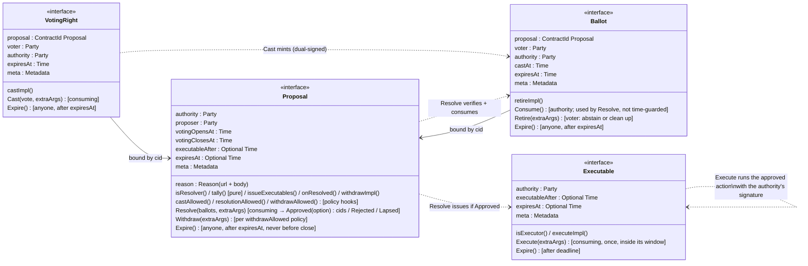

<!-- Copyright (c) 2026 Unlockit. All rights reserved. -->
<!-- SPDX-License-Identifier: Apache-2.0 -->

# cap-governance architecture

## What this is

An interface library (Daml 3.x, LF 2.1) for multi-party governance: proposals
are voted on with ballots, resolved by a rule, and approved outcomes execute
with on-ledger authority. It fixes the skeleton and leaves
everything that legitimately varies — electorate, tally, ballot
format, privacy — to implementing templates.

## The security skeleton

Two facts about security:

1. **A signature chain.** One `authority : Party` anchors validity: it signs
   the Proposal; a voting right is only honoured if the authority signed it;
   a ballot must be signed by both the authority and the voter; an Executable
   must be signed by the authority. Daml authorization makes those signatures
   unforgeable — and the authority can be a plain party, a Canton
   decentralized party (threshold council), or a party reached through
   delegation. The interfaces never care which.

2. **Interface choice bodies can't be overridden.** Every choice is written
   as integrity checks, then a timing-policy hook, then the implementation
   method, then post-conditions on what the method produced. Integrity checks
   (signatures, bindings, consume-once) are fixed: an implementation cannot
   dodge a signature assertion or bind a ballot to the wrong proposal. Timing
   rules (when to cast, resolve, withdraw) are policy hooks — methods the
   body always invokes but the implementation defines, with named profiles in
   `Cap.Governance.Policies`. A policy can be permissive, never absent, and
   two floors stay fixed: nothing casts or resolves before `votingOpensAt`,
   and nothing casts against a resolved proposal.

`authority` is the signature anchor, not the tally: who votes and
what counts as approval live in the electorate and `tally`; how many nodes must be honest for
the authority party itself lives in topology. The three layers move
independently.

Three protocol limitations shape what the interfaces can and cannot promise:

- **No global reads.** Daml choices cannot enumerate "all ballots for this
  proposal" — a transaction only sees contracts passed into it. `Resolve`
  verifies every ballot it is given but cannot force the resolver to include
  them all; an omitted ballot survives as signed evidence, and a broad
  `isResolver` set lets a censored voter resolve with their own ballot
  included. A quorate tally reduces the attack to stalling: every decided
  verdict needs a quorum of ballots actually present, so omitting ballots can
  push a vote into `Lapsed` but never flip an outcome (Splice's
  `requiredNumVotes` rule is quorate).
- **Confirmation is not approval.** A decentralized authority's hosting
  threshold (k of n participants must confirm) is a validation and custody
  parameter, not a vote: honest hosts confirm any valid transaction. The
  trade-off is real — k too low lets small host coalitions abuse the party's
  signature; k too high lets refusing hosts stall valid resolutions. Size k
  for an assumed fault bound (k ≥ f+1 and k ≤ n−f), independent of any quorum
  in `tally`.
- **Ledger time has skew.** Window and expiry guards are exact up to Canton's
  bounded ledger-time tolerance; don't design voting windows tighter than
  that bound.

## The interfaces, and how data flows between them

Solid arrows are data (unforgeable `ContractId` bindings in the views);
dotted arrows are lifecycle (one interface choice creating or consuming
contracts of another).

## Lifecycle

The implementation mints a voting right per eligible voter (how is its
business: council roster, delegation, token holding). `Cast` consumes the
voting right — that consumption is the no-double-vote guarantee — and mints a
ballot bound to the proposal's contract id, signed by authority and voter.
After the window closes, any party accepted by `isResolver` calls `Resolve`
with the ballot cids: the body rejects wrong-proposal and unsigned ballots,
consumes the rest, and asks `tally` — the social choice function, a pure
function of the ballots and the proposal's own fields — for a verdict:
Approved — optionally naming the winning option among several — Rejected, or
Lapsed (the vote never became definitive). Approval
issues Executables for the winning option — one per obligation, so
independent effects get independent lifecycles — each bound to the
timelock the voters approved; because each
carries the authority's signature, `Execute` (consuming, so at most once — no
earlier than `executableAfter`, no later than `expiresAt`) can act on
standing state — move treasury holdings, amend rules — as the authority,
with `extraArgs.context` delivering fresh target cids, allocation references,
and registry contexts at execution time.
`onResolved` closes the resolution: the implementation's side effects — a
rejection record, a successor proposal after a lapse — run atomically with
the outcome.
Everything archives on its happy path (stragglers have time-guarded `Expire`
choices anyone can call), so the ACS stays small, and voting is
contention-free because each voter consumes only their own voting right.
Every choice returns a dedicated record type, so results can grow fields
across versions without breaking callers.

## Packages

| Package | Contains | Depends on |
|---|---|---|
| `cap-governance-types-v1` | `Metadata`, `AnyValue`, `ChoiceContext`, `ExtraArgs` (Token Standard shapes, mirrored — no import, no version coupling) | — |
| `cap-governance-executable-v1` | `Executable` | types-v1 |
| `cap-governance-proposal-v1` | `Proposal`, `Ballot` | types-v1, executable-v1 |
| `cap-governance-voting-right-v1` | `VotingRight` | types-v1, proposal-v1 |
| `cap-governance-util-v1` (optional) | `Policies` (timing profiles), helpers, default method bodies | the four above |

`Proposal` and `Ballot` share a package deliberately: their views reference
each other's contract ids, Daml forbids circular package dependencies, and
splitting them would force an untyped (forgeable) binding — the one thing
this design refuses to do.

## Where each attack fails

Two trust tiers appear below. By construction: no honest-implementation
assumption — the interface bodies enforce it for every template. Per profile:
enforced by the named timing policy the implementation wired in, so it holds
exactly when the declared profile says it does.

| Attack | Killed by |
|---|---|
| Ballot against the wrong proposal | cid binding in `BallotView`, asserted in `Cast` and `Resolve` |
| Ineligible voter | ballots only mintable through an authority-signed voting right |
| Double vote | `Cast` is consuming — one voting right, one ballot; one vote per voter is minting + `tally` policy, because multiple ballots per voter can be legitimate (weights, delegation) |
| Replayed / stale ballot | ballots bind to a cid that `Resolve` consumes; cids never recur |
| Forged voting right / ballot / Executable | `authority elem signatory x` checks at every choke point |
| Authority inventing a voter's ballot | ballots also require the voter's signature |
| Acting outside the window | interface floor (nothing casts or resolves before `votingOpensAt`) + the proposal's timing policy — `Policies.windowed*` is the strict profile |
| Withdrawing a losing vote | the `withdrawAllowed` policy — `Policies.withdrawBeforeOpen` (standard profile) forbids it |
| Double / stale execution | `Execute` consuming; expiry guard + `Expire` cleanup |
| Approval silently voided by a born-dead Executable | `Resolve` post-checks issuance: expiry must fall after now and after `executableAfter` |
| Executing before affected parties can react | `executableAfter` (approved by the voters, checked at `Resolve`) guards `Execute` |
| Abandoned ballots / voting rights littering the ACS | `expiresAt` on both + anyone-can-expire choices, time-guarded — no third party can destroy them early; signatories keep their own consuming paths (`Ballot_Consume`, `Ballot_Retire`) |

Residual risks: a resolver can omit ballots — reduced to stalling by
a quorate tally (see above) and mitigated by broad resolver
sets and the voter's non-repudiable evidence. The authority can also archive
a ballot outright: `Ballot_Consume` is not time-guarded, because Daml cannot
restrict a choice to being called only from inside `Resolve` — and a time
guard would break quorum-triggered resolution, whose consumption legitimately
happens before the close. This is the
same stalling power as omission — a quorate tally still
prevents flips — but broad resolver sets don't mitigate it, since a destroyed
ballot cannot be included by any resolver. The voter's evidence survives:
their participant keeps the dual-signed create and the authority's
`Ballot_Consume` exercise as transaction history. `tally` correctness is trusted
like any package you deploy. A plain-party authority can always act directly
— where bypass must be hard, use a decentralized party and hold governed
state behind a k-signed execution board (see
`design-decisions/execution-custody.md`).

## What implementations own

Signatory and observer sets — privacy is allowed, never required, and secret
ballots work because the vote is deliberately not an interface field.
Also: electorate and voting-right minting, the vote and option formats and
`tally` semantics (a verdict can select one option among several — it flows
from `tally` to `issueExecutable` as opaque text and is recorded in the
resolution result), vote-changing, proposal genesis, bounds on text-field sizes,
human-readable summaries of the proposal and the approved action (published
under `meta` keys — the typed view fields carry only `reason`, the structured
justification), and optional extras like
voter co-signed Executables. Implementing templates can also carry choices
beyond the interface — a guardian veto on the proposal or on the Executable,
vote-changing, escalation — because the interface checks tolerate extra roles
by construction. Deliberately absent from the interface: factories, a weight
field, early resolution, and an authority-controlled Executable cancellation
— each would reopen an attack or hardcode an authority model. A veto held by
a party the proposal named is not that: it is part of the approved terms,
and lives on the implementing template.

## Implementation considerations

- **`extraArgs` rides exactly where implementation code runs** — `Cast`,
  `Resolve`, `Withdraw`, `Retire`, `Execute` — delivering escrow references,
  fresh target cids, and registry contexts; the effect-free `Expire` and
  `Consume` choices carry none. Keys are DNS-prefixed (`cap-governance/`);
  nothing security-relevant may travel in `meta` — no guard or post-condition
  reads it. A human-readable summary belongs in the proposal's view `meta`.
- **Pick a timing profile first.** `Policies.windowed*` unless the workflow
  needs quorum-triggered execution; the confirmation profile is only sound
  with a tally whose verdict cannot flip as more ballots arrive: quorate,
  with quorums above half the electorate so the two verdicts are mutually
  exclusive, and no vote-changing.
- **Make the tally quorate**, over an electorate snapshotted in the template
  at proposal creation. This is what reduces ballot omission and destruction
  to stalling.
- **Expiries**: set a voting right's `expiresAt` to at least
  `votingClosesAt`; set a ballot's past the close with a resolution grace,
  and resolve promptly — an unresolved ballot becomes expirable by anyone
  with visibility once its `expiresAt` passes.
- **Bound text sizes** in `castImpl` (the `vote`) and at proposal
  creation (the `reason`); the interface accepts unbounded `Text`.
- **Frequently-recreated targets: deliver current cids through `Execute`'s
  `extraArgs.context`** (coerce each `AV_ContractId` and group-check it —
  `Cap.Governance.Util`'s `fetchChecked` with the expected `ForAuthority`).
  The two-step pattern — `executeImpl` creates an authority-signed,
  single-use pending-action contract whose template choice takes the target
  cids — remains the fallback when execution must be staged.
- **Group-check every cid taken as a choice argument.** A `ContractId`
  argument guarantees the template type, not the instance — a submitter can
  pass a look-alike contract from another authority. Fetch through
  `Cap.Governance.Util`'s `fetchChecked` / `fetchCheckedInterface` with the
  expected `ForAuthority`; the board and pending-action patterns above need
  this on every target cid.
- **Per-outcome side effects go in `onResolved`, never in `tally`.** `tally`
  is pure — the auditable social choice function. Rejection records,
  successor proposals, notifications run in `onResolved`, atomically with the
  resolution. A lapse is handled by a successor proposal, never an extension:
  `Resolve` consumes the proposal and its cid bindings with it.
- **Concurrent executables must patch, not replace.** Two approved proposals
  can execute against the same standing state in either order —
  `executableAfter` widens that window. Store `(base, new)` in the proposal's
  action payload and three-way merge at execution with
  `Cap.Governance.Util`'s `Patchable`; replacing with a full snapshot
  silently reverts the earlier decision.
- **Veto is a template choice, not an interface change.** At tally: a
  designated party's vote that `tally` maps to rejected. Before resolution: a
  consuming guardian choice on the proposal template. After approval: a
  consuming guardian choice on the Executable template, naturally scoped to
  the timelock window — the window exists so affected parties can react,
  and a veto is the strongest reaction. Consumers of an approval should read
  the implementing template: an Executable may legitimately carry a veto.
- **Asset settlement needs the receiver's signature at execution.** Token
  Standard allocations are executed jointly by executor, sender, and
  receiver, and the Executable carries only the authority's signature. Three
  conforming patterns — beneficiary-co-signed proposals (the spine, atomic,
  beneficiary witnesses resolution), an authority-signed offer the
  beneficiary accepts (a second transaction, no privacy cost), or a
  `TransferPreapproval` for plain transfers. Pin payout allocations with
  `settlementRef.cid` = the Executable's cid. See
  `design-decisions/token-standard-composability.md`.
- **Custody**: where authority bypass must be hard, hold governed state
  behind an execution board (`design-decisions/execution-custody.md`).
- **Declare your profile.** Conforming clients pin five things per
  implementation: the timing profile, the vote and option encodings, the
  tally discipline (quorate or not), the expiry policy, and the package id.
  Publish them under `cap-governance/` meta keys and in the implementation's
  documentation.
- **Secret ballots**: the vote is not an interface field, so commit-reveal
  works unchanged. Recommended scheme: cid-as-commitment — the voter creates
  a private, voter-only contract holding the vote and casts its rendered cid;
  Canton cids are salted, authenticated hashes of contents, so reveal is
  explicit disclosure and the ledger itself verifies payload against
  commitment (no salt discipline, no canonical-encoding pitfalls; give the
  private contract its own expiry). A stored hash (`sha256 (salt <> vote)`)
  is the lighter fallback. Either way the commitment must be on-ledger before
  the close — a value handed over after close proves nothing about when it
  was created. Identity privacy needs pseudonymous voter parties with
  unlinkable right issuance.

## Cross-checked against production

The design was audited against `splice-dso-governance` (the DSO that runs the
Global Synchronizer). Adopted from it: the timelock (`executableAfter`, their
`targetEffectiveAt`), record return types with extension constructors for
upgradeability, the three-way outcome, an `expiresAt` with a time-guarded
`Expire` choice on every artifact, and the structured `Reason` (a
tamper-evident link to off-ledger justification). Not adopted: votes stored
in a map on a mutating request contract — that shape forces the tracking-cid,
vote-cooldown, and roster-repair machinery Splice carries, all of which
ballots-as-contracts avoid.
