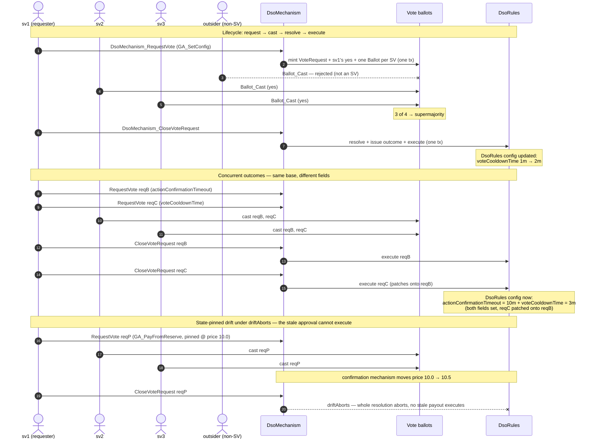
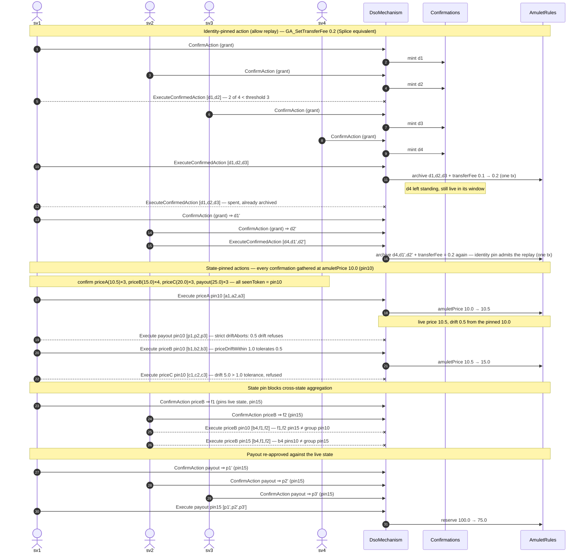
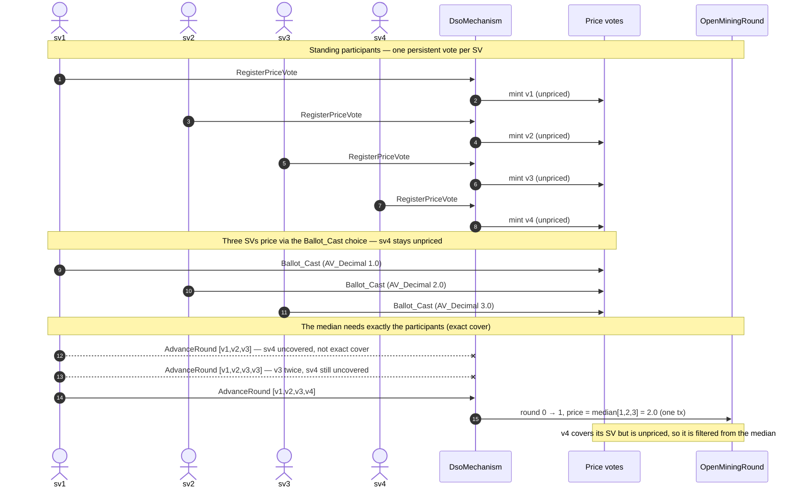
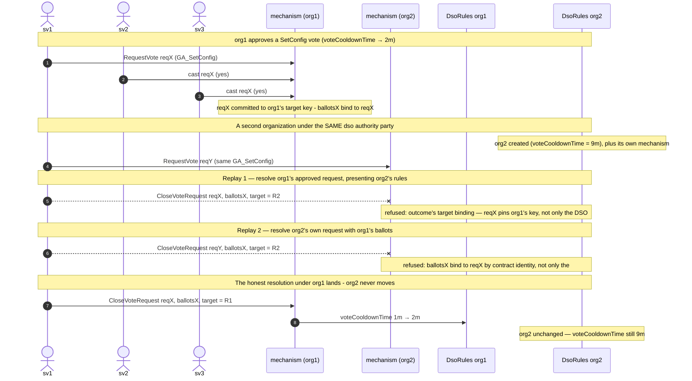
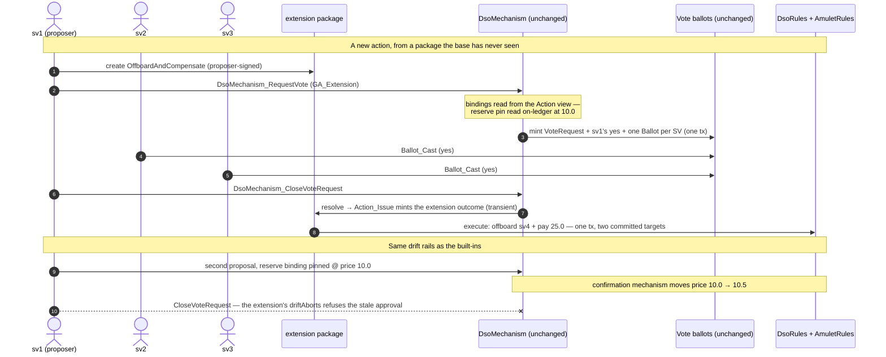

<!-- Copyright (c) 2026 Unlockit. All rights reserved. -->
<!-- SPDX-License-Identifier: Apache-2.0 -->

# BabyDso demos

BabyDso reproduces Splice's DSO governance twice: `original/` is an idiomatic
plain-Daml reproduction with no cap dependency, and `cap-version/` implements
the same [mechanisms](../../GLOSSARY.md#mechanism) on the cap interfaces. Every demo below runs in **both**
packages under the same name, with the same parties, action, and step order —
so the diff between the two scripts is exactly what the cap standard adds.
Demos 1–3 walk Splice's three different [mechanisms](../../GLOSSARY.md#mechanism) end to end. Demo 4 exercises
a scenario outside the scope Splice was designed for — a reasonable decision for
a single application on its own network, but that a reusable standard must
generalize. Demo 5 adds a new governance action **after deployment, in its own
package**. In Splice this change requires upgrading the deployed rules package;
here the deployed packages stay untouched.

| # | Demo | Splice [mechanisms](../../GLOSSARY.md#mechanism) | What it shows in one line |
|---|---|---|---|
| 0 | `demo_ballot_box` | (cap-version only) | The container [ballot](../../GLOSSARY.md#ballot) format: Splice's single-contract [vote](../../GLOSSARY.md#vote) map on the same choices |
| 1 | `demo_voting` | `VoteRequest` | Full lifecycle: request → [cast](../../GLOSSARY.md#cast) → [resolve](../../GLOSSARY.md#resolution) → [execute](../../GLOSSARY.md#execute), plus concurrent-outcome handling |
| 2 | `demo_confirmation` | `Confirmation` ([standing](../../GLOSSARY.md#standing), per-decision) | A [quorum](../../GLOSSARY.md#quorum) built asynchronously; [execution](../../GLOSSARY.md#execute) consumes it at [threshold](../../GLOSSARY.md#threshold) |
| 3 | `demo_median` | `AmuletPriceVote` ([standing](../../GLOSSARY.md#standing), persistent) | One [standing](../../GLOSSARY.md#standing) [vote](../../GLOSSARY.md#vote) per SV, re-read every round; the median needs exactly the [participants](../../GLOSSARY.md#participant) |
| 4 | `demo_two_organizations` | generalization | Two organizations sharing one [authority](../../GLOSSARY.md#authority) party: what keeps a decision inside its institution |
| 5 | `demo_extension` | extensibility (cap-version only) | An action added after deployment, in its own package |

## Background: 3 mechanisms of Splice DSO

Splice's DSO governance runs on three distinct approval [mechanisms](../../GLOSSARY.md#mechanism), each a
different shape of "collect SV approvals, then act":

1. **`VoteRequest`** — one request contract per decision. SVs [cast](../../GLOSSARY.md#cast)
   yes/no onto it, and once the [threshold](../../GLOSSARY.md#threshold) is met the request is *closed*: it
   [resolves](../../GLOSSARY.md#resolution), produces the [outcome](../../GLOSSARY.md#outcome), and [executes](../../GLOSSARY.md#execute), all in one transaction, then is
   consumed. A decision has a lifecycle: request → [cast](../../GLOSSARY.md#cast) → [resolve](../../GLOSSARY.md#resolution) → [execute](../../GLOSSARY.md#execute).
2. **`Confirmation` ([standing](../../GLOSSARY.md#standing), per-decision)** — each SV independently creates a
   `Confirmation` contract for a given action. There is no shared request; the
   [quorum](../../GLOSSARY.md#quorum) is assembled asynchronously and [execution](../../GLOSSARY.md#execute) consumes the confirmations
   once enough exist. Confirmations are [standing](../../GLOSSARY.md#standing) (valid for a time window) and
   per-decision.
3. **`AmuletPriceVote` ([standing](../../GLOSSARY.md#standing), persistent)** — each SV holds *one* persistent
   price [vote](../../GLOSSARY.md#vote) that is not consumed. Every round the [votes](../../GLOSSARY.md#vote) are re-read and the
   median sets the round's price. The [participants](../../GLOSSARY.md#participant) are [standing](../../GLOSSARY.md#standing) and the same [votes](../../GLOSSARY.md#vote)
   are reused round after round.

Demos 1–3 walk these three [mechanisms](../../GLOSSARY.md#mechanism) in order; demo 4 probes a scenario
outside Splice's single-application design scope.

## The actions

Every demo approves one `GovAction`; the diff between the two packages is what
the cap standard adds per action. All actions run through both [mechanisms](../../GLOSSARY.md#mechanism) (Splice
splits the action sets; here one set serves both). Each cap action's whole meaning
— [target](../../GLOSSARY.md#target), [pin](../../GLOSSARY.md#pin), [drift](../../GLOSSARY.md#drift) [policy](../../GLOSSARY.md#policy), effect — is one `ActionSpec` record.

| Action | Effect | `original` realizes it as | `cap-version` adds | Demos |
|---|---|---|---|---|
| `GA_SetConfig` | Whole-config amendment of `DsoRules` | `SetConfig` carrying an explicit `baseConfig`, [merged](../../GLOSSARY.md#merge) field-wise (`Patchable`) | `SetState` delta, same field-wise [merge](../../GLOSSARY.md#merge); [target](../../GLOSSARY.md#target) bound by key (one `DsoRules` per `org`), `driftAborts` | 0, 1, 4 |
| `GA_SetTransferFee` | Fee write on `AmuletRules` | grant stand-in `NoOp` (no state change) | identity-pinned — [drift](../../GLOSSARY.md#drift) ignored, write lands on fresh state; replays exactly | 2 |
| `GA_SetAmuletPrice` | Price write on `AmuletRules` | direct `ASetAmuletPrice` choice (median path), no [pin](../../GLOSSARY.md#pin) or [policy](../../GLOSSARY.md#policy) | state-pinned on the price token; [drift](../../GLOSSARY.md#drift) routed to `priceDriftWithin 1.0` | 1, 2 |
| `GA_PayFromReserve` | Payout from the `AmuletRules` reserve | no equivalent (non-idempotent, outside Splice's action set) | state-pinned; strict `driftAborts`, so any [drift](../../GLOSSARY.md#drift) since approval refuses | 1, 2 |
| `GA_Extension` | Carries an `Action` contract from a package deployed later | no equivalent — the action enum is closed inside the deployed rules template | the open case: [targets](../../GLOSSARY.md#target), [pins](../../GLOSSARY.md#pin), [drift](../../GLOSSARY.md#drift) [policy](../../GLOSSARY.md#policy), and effect all arrive from the new package | 5 |


## Demo 0 — `demo_ballot_box`

`cap-version` only, no `original` counterpart: it exists just to show that
cap-governance also supports one authority-signed
contract accumulating every SV's [vote](../../GLOSSARY.md#vote) in a map, recreated on each
[cast](../../GLOSSARY.md#cast). Three SVs [cast](../../GLOSSARY.md#cast) into the same contract through the same `Ballot_Cast`
choice the per-voter format uses, and the same close choice [resolves](../../GLOSSARY.md#resolution) it at the
same [threshold](../../GLOSSARY.md#threshold). The rest of the demos use the per-voter format, which is what
dissolves Splice's [cast](../../GLOSSARY.md#cast) cooldown and [contention](../../GLOSSARY.md#contention).

## Demo 1 — `demo_voting`

Four SVs bootstrap a DSO; one requests a `SetConfig` [vote](../../GLOSSARY.md#vote) — in `cap-version`
the request, the requester's yes, and every SV's [voting](../../GLOSSARY.md#vote) right mint in one
transaction, mirroring Splice's auto-accept — three accept, the [resolution](../../GLOSSARY.md#resolution) passes
the supermajority [threshold](../../GLOSSARY.md#threshold), and the new config lands on `DsoRules`. Negative
case: a non-SV cannot [cast](../../GLOSSARY.md#cast). Then two concurrent config
[votes](../../GLOSSARY.md#vote) prepared against the same base but touching different fields both [resolve](../../GLOSSARY.md#resolution),
and the second patches onto the first instead of reverting it — Splice's
field-wise `Patchable` [merge](../../GLOSSARY.md#merge) in `original`, the same [merge](../../GLOSSARY.md#merge) as cap's `SetState`
delta in `cap-version`. The cap version [resolves](../../GLOSSARY.md#resolution) with a state-pinned case: a
reserve payout is approved by [vote](../../GLOSSARY.md#vote) at price 10.0, the confirmation [mechanism](../../GLOSSARY.md#mechanism)
moves the price before [resolution](../../GLOSSARY.md#resolution), and the voteRequestClose [resolves](../../GLOSSARY.md#resolution),
the aborts according to `driftAborts` [policy](../../GLOSSARY.md#policy), if [policy](../../GLOSSARY.md#policy) was `driftMerges` 
the change would be applied.



## Demo 2 — `demo_confirmation`

A grant-shaped action through the confirmation [mechanism](../../GLOSSARY.md#mechanism): two of four SVs
confirm, [execution](../../GLOSSARY.md#execute) fails below the [threshold](../../GLOSSARY.md#threshold), the rest confirm, and [execution](../../GLOSSARY.md#execute)
consumes three confirmations and [executes](../../GLOSSARY.md#execute) the action. Negative case: a spent
confirmation cannot be presented again. A *live* confirmation, though, is valid
for its whole time window: the demo gathers one more confirmation than the
[threshold](../../GLOSSARY.md#threshold), [executes](../../GLOSSARY.md#execute) once, then combines the leftover — created for that first
decision — with fresh ones into a **second [execution](../../GLOSSARY.md#execute) of the same action**, one
its confirmer never intended. In `original` (grant stand-in `NoOp`) this second
[execution](../../GLOSSARY.md#execute) is admitted: nothing between the TTL and action equality scopes
*when* a confirmation may still be used, which is why Splice keeps
confirmable actions idempotent by convention. In `cap-version` that scope is
declared per action — each action's whole meaning ([target](../../GLOSSARY.md#target), [pin](../../GLOSSARY.md#pin), [drift](../../GLOSSARY.md#drift) [policy](../../GLOSSARY.md#policy),
effect) is one `ActionSpec` record. The `GA_SetTransferFee` action is
identity-pinned and replays exactly as in `original`. State-pinned actions
instead [pin](../../GLOSSARY.md#pin) the state their confirmers saw (the [target](../../GLOSSARY.md#target)'s [state token](../../GLOSSARY.md#state-token)) and
route [drift](../../GLOSSARY.md#drift) to their own declared [policy](../../GLOSSARY.md#policy) (in this case: "has the ground moved 
more than 1 since the confirmers approved ?"): the demo confirms three
`GA_SetAmuletPrice` actions and a `GA_PayFromReserve` payout against the same (initial)
state, [executes](../../GLOSSARY.md#execute) the first price, and shows the second can still [execute](../../GLOSSARY.md#execute), 
the third refused for [drifting](../../GLOSSARY.md#drift) beyond the bound, the
payout actionwith the `driftAborts` [policy](../../GLOSSARY.md#policy) is refused since the state changed,
until re-approved against the live state. Stale leftovers are
unable to aggregate with fresh confirmations



## Demo 3 — `demo_median`

The [standing](../../GLOSSARY.md#standing) [participants](../../GLOSSARY.md#participant): each SV holds one persistent price [vote](../../GLOSSARY.md#vote), re-read at
every round advance. Three of four SVs set a price, the round advances at the
median, and the unpriced SV [covers](../../GLOSSARY.md#cover) the [participant set](../../GLOSSARY.md#participant) without counting toward it.
Negative case: advancing with a cherry-picked subset of [votes](../../GLOSSARY.md#vote) fails — the
median is only sound over exactly the current [participants](../../GLOSSARY.md#participant), proven at the
advance choice by exact [cover](../../GLOSSARY.md#cover) against the live SV list (an unpriced [vote](../../GLOSSARY.md#vote) [covers](../../GLOSSARY.md#cover)
its SV without counting). In the cap version every [standing](../../GLOSSARY.md#standing) [vote](../../GLOSSARY.md#vote) is [admitted](../../GLOSSARY.md#admission)
under the [mechanism](../../GLOSSARY.md#mechanism)'s [binding](../../GLOSSARY.md#binding) group, and pricing runs through the same
`Ballot_Cast` choice the [voting](../../GLOSSARY.md#vote) [mechanism](../../GLOSSARY.md#mechanism) uses.



## Demo 4 — `demo_two_organizations`

Two `DsoRules` instances — different configs, different organizations — hosted
by the same `dso` [authority](../../GLOSSARY.md#authority) party. A `SetConfig` [vote](../../GLOSSARY.md#vote) is opened and approved
under institution 1, then [resolved](../../GLOSSARY.md#resolution) presenting institution 2's rules. Splice's
[admission](../../GLOSSARY.md#admission) is keyed by the [authority](../../GLOSSARY.md#authority) party, which both organizations share, so
in `original` the [resolution](../../GLOSSARY.md#resolution) passes and institution 1's action [executes](../../GLOSSARY.md#execute) on
institution 2's state — outside Splice's design scope, since it runs as the
sole instance on its own network. In `cap-version` each organization is its
own [target](../../GLOSSARY.md#target) `id` on `DsoRules`, and the same replay is refused twice, at named
checks: [resolving](../../GLOSSARY.md#resolution) org 1's approved request against org 2's rules dies at the
[outcome](../../GLOSSARY.md#outcome)'s [target](../../GLOSSARY.md#target) [binding](../../GLOSSARY.md#binding), and [resolving](../../GLOSSARY.md#resolution) org 2's own request with org 1's
[ballots](../../GLOSSARY.md#ballot) dies at the [ballots](../../GLOSSARY.md#ballot)' contract-identity [binding](../../GLOSSARY.md#binding). The honest [resolution](../../GLOSSARY.md#resolution) under
organization 1 then succeeds unchanged, and organization 2 never moves.



## Demo 5 — `demo_extension`

A new package, `cap-version/extension/`, adds an action the base package has
never seen: `OffboardAndCompensate` — offboard an SV and, in the same
transaction, pay them from the reserve. The package holds two templates. The
action is signed by the proposer and implements the `Action` interface. The
[outcome](../../GLOSSARY.md#outcome) implements `GovernanceOutcome` and carries the action's [drift](../../GLOSSARY.md#drift) [policy](../../GLOSSARY.md#policy) and
effect.

The demo then runs a normal [vote](../../GLOSSARY.md#vote). An SV creates the proposal and opens a [vote](../../GLOSSARY.md#vote)
on it, as `GA_Extension`. The request reads the action's [targets](../../GLOSSARY.md#target) and [pins](../../GLOSSARY.md#pin)
from the proposal's view. SVs [cast](../../GLOSSARY.md#cast) on the same `Vote` [ballots](../../GLOSSARY.md#ballot), and the same
close choice [resolves](../../GLOSSARY.md#resolution). On approval, `Action_Issue` mints the extension's
[outcome](../../GLOSSARY.md#outcome), and it [executes](../../GLOSSARY.md#execute) on **both** committed [targets](../../GLOSSARY.md#target) in the closing
transaction. The base `GovOutcome` supports only one committed [target](../../GLOSSARY.md#target) — the
new action does more than any built-in, and still changed nothing in the base.

Negative case: a second proposal is opened with the reserve [pinned](../../GLOSSARY.md#pin) at price
10.0. Before the close, the confirmation [mechanism](../../GLOSSARY.md#mechanism) moves the price. The close
aborts under the extension's own `driftAborts` [policy](../../GLOSSARY.md#policy) — the same [drift](../../GLOSSARY.md#drift)
protection as the built-ins ([DESIGN.md §4](../../DESIGN.md#4-what-is-enforced-and-what-is-trusted)
states where it is enforced).

In `original/`, the same addition needs a new variant in the action enum and a
new case in the rules template. That means upgrading and redeploying the
deployed governance package — itself a governance [vote](../../GLOSSARY.md#vote) — and migrating the
live contracts. We only describe that cost here; `original/` stays a pure
Splice reproduction.

Verify the claim itself:

```bash
# the extension links the base as a data-dependency only — it never rebuilds it
grep -A14 data-dependencies examples/BabyDso/cap-version/extension/daml.yaml

# the commit that adds the extension touches extension/, Test/, and this file —
# nothing under cap-version/impl
git log --stat -- examples/BabyDso/cap-version/extension

# demos 0–5, including the extension lifecycle
dpm test --package-root examples/BabyDso/cap-version/Test
```



## Running the demos

A simplified prototype of a typical `cap-core` workflow on
a Canton sandbox. These demos are that prototype: they run either in-memory for
a quick check, or against a live **Canton sandbox** over gRPC. Both packages'
demos live in
`examples/BabyDso/original/Test/daml/Cap/BabyDso/Test/Demos.daml`
and
`examples/BabyDso/cap-version/Test/daml/Cap/BabyDso/CapVersion/Test/Demos.daml`.

Prerequisite: **Daml SDK 3.4.11** via `dpm`

**Build** the DARs from the repository root — `--all` builds the whole
workspace, including both example `Test/` packages, in dependency order:

```bash
dpm build --all        # from the repo root (uses multi-package.yaml)
```

**Quick check** (in-memory script runner, no sandbox) — run each Test package
from the repo root with `--package-root`, so the whole path names which one you
are testing:

```bash
# cap version
dpm test --package-root examples/BabyDso/cap-version/Test

# original reference
dpm test --package-root examples/BabyDso/original/Test
```

**On a Canton sandbox** (the Milestone 1 deliverable) — two terminals. The
scripts drive time, so `--static-time` is required on both the sandbox and the
runner. DAR paths are given in full from the repo root:

```bash
# terminal 1 — a FRESH sandbox
dpm sandbox --static-time

# terminal 2 — uploads the DAR and runs every demo over gRPC (cap version)
dpm script --all --ledger-host localhost --ledger-port 6865 \
  --static-time --upload-dar true \
  --dar examples/BabyDso/cap-version/Test/.daml/dist/cap-version-test-0.1.0.dar

# the original reference, same shape
dpm script --all --ledger-host localhost --ledger-port 6865 \
  --static-time --upload-dar true \
  --dar examples/BabyDso/original/Test/.daml/dist/baby-dso-test-0.1.0.dar
```

Expected: every demo reports `SUCCESS` (per script on the sandbox; `ok` under
`dpm test`). Restart the sandbox between runs — party [allocations](../../GLOSSARY.md#allocation) persist, so a
second run on the same instance fails with "Party already exists".