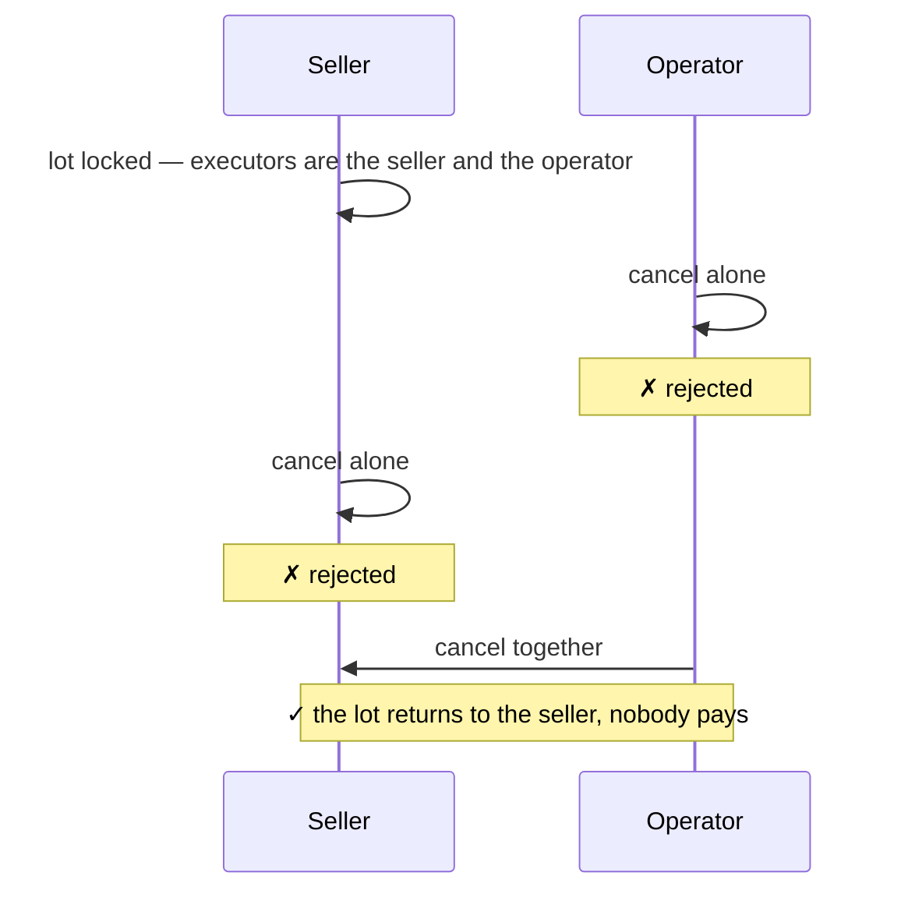
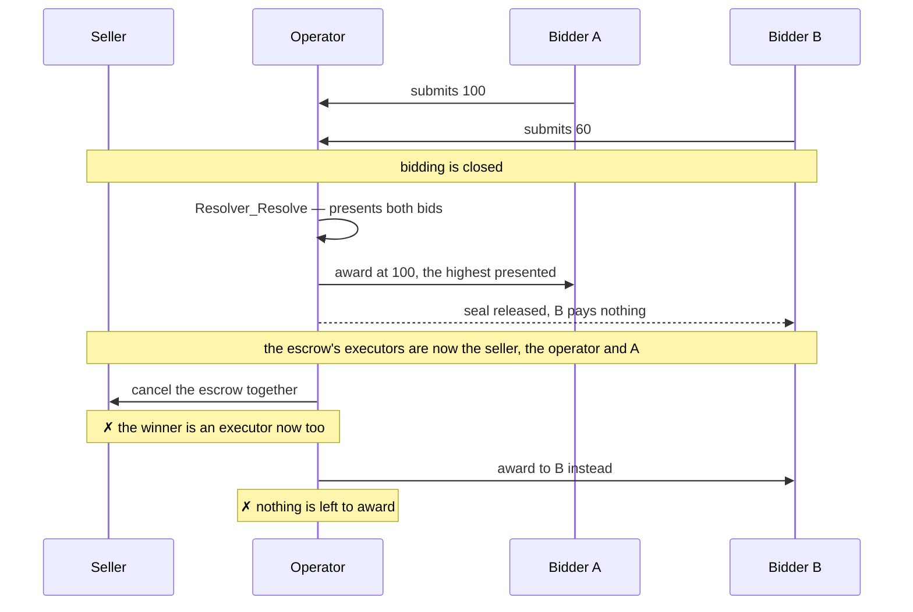
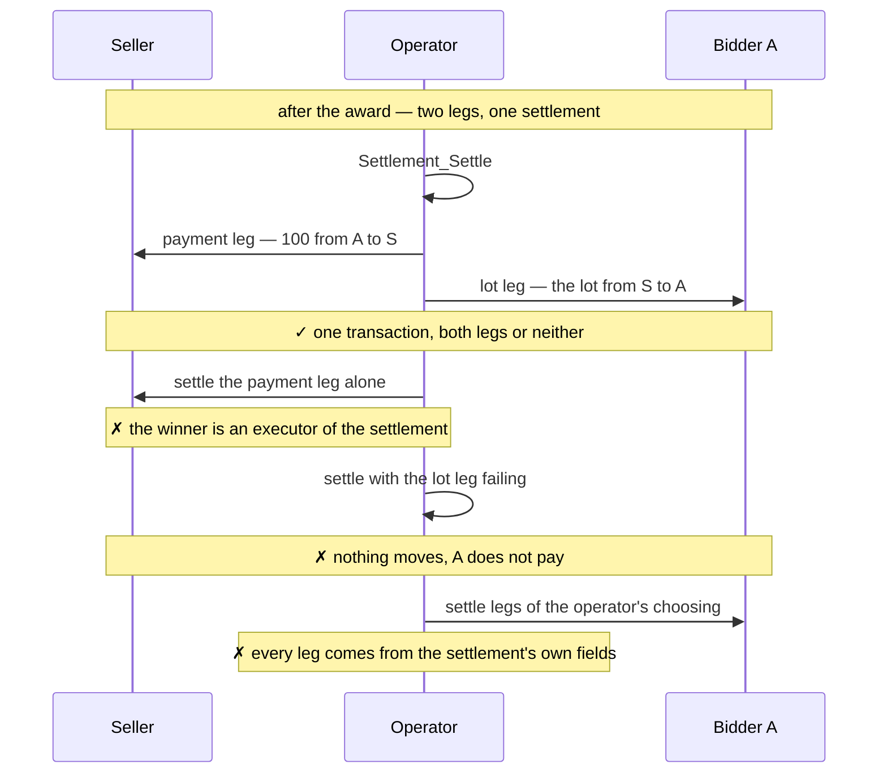
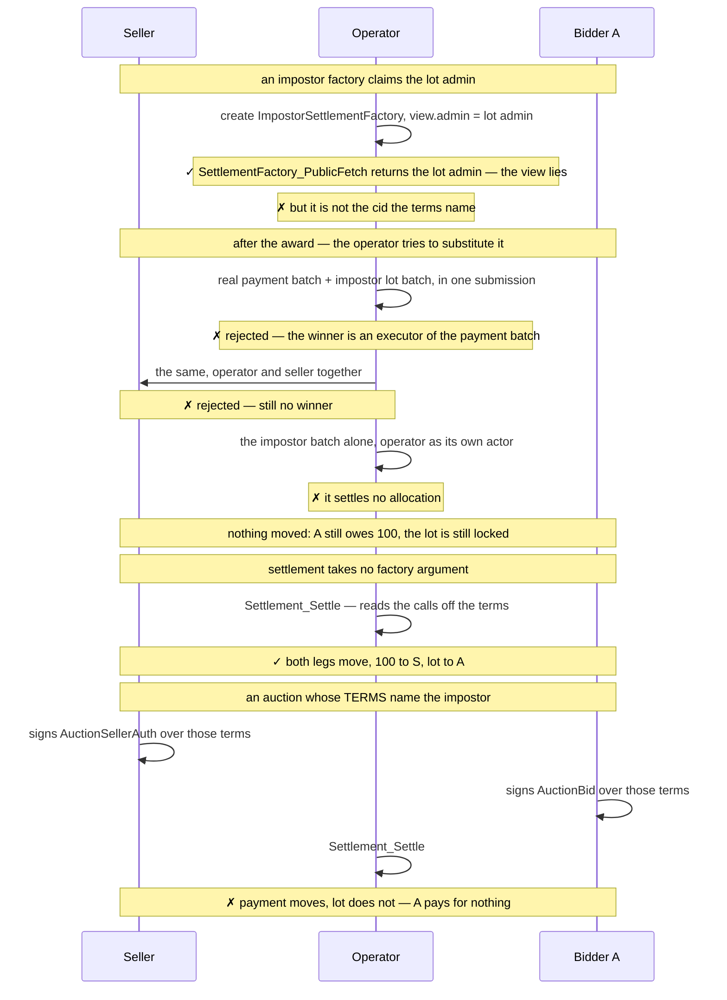
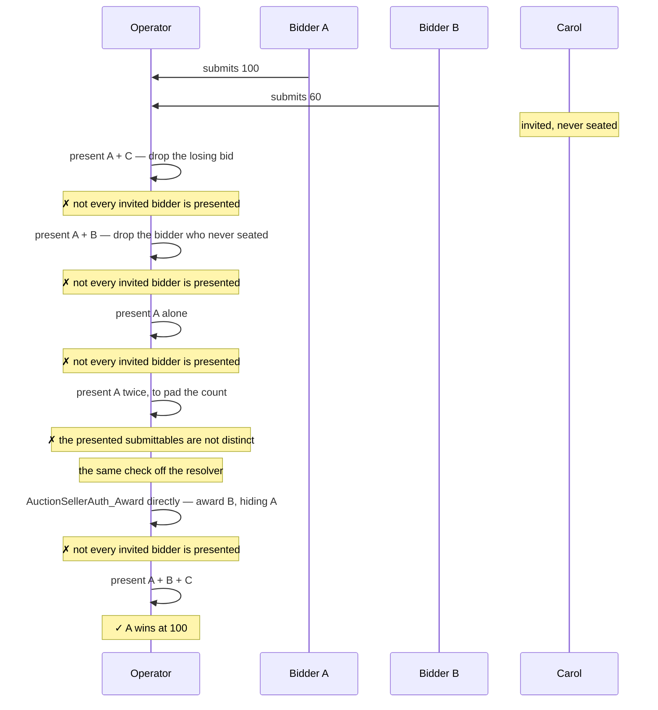

# Demos — `examples/experiments/first-price-high-trust`

7 demos showing the security and privacy guarantees of a sealed-bid first-price
auction with ex-post bid privacy using CAP.

The auction runs over a fixed set of invited bidders, named on the resolver
before the lot locks. Those bidders observe the resolver, so each is an informee
of `Resolver_Resolve` and reads the presentation — which is what lets the award
require that every invited bidder appears in it. Privacy after the outcome is
computed is kept: a loser reads the presentation and still reads no quote in it.

What is left of the operator's discretion is breaking exact ties, seeing every
quote while bidding is open, and declining to resolve at all. Its liveness role
is bounded by `expiresAt`; it cannot rig the outcome.

## Method

The demos are Daml Script tests exercised against two independent token
registries: Canton Coin (Amulet) settles the payment leg, and a simulated
registry built on `TestTokenV2` issues the lot. A single registry administering
both instruments would leave the cross-registry atomicity of demo 4 untested.

Assertions take two forms. Visibility claims are stated per contract, as
`sees` / `cannotSee` predicates over a party and a contract identifier, so that
each note in the diagrams below corresponds to one line of test code. The same
per-party views can be inspected interactively in Daml Studio. Stronger claims —
that a party learned *nothing* across a phase — are stated as an equality
between the complete set of contracts visible to that party before and after,
and so fail on any leak, anticipated or not.

One limit worth stating plainly. Daml Script reads the ACS, not transaction
trees, so a script can assert that an invited bidder **observes the resolver** —
the structural fact the informee relation follows from — but cannot assert the
informee relation itself. What it does assert directly is the other half: that
reading the presentation buys a loser nothing about the amounts in it.

The invited bidders are `alice`, `bob` and `carol`. Carol is invited and never
takes her seat; `dave` is never invited.

The test harness is taken from the Splice repository
(`github.com/canton-network/splice`, under `token-standard/`). Since Daml Script
cannot be distributed across SDK versions in a DAR, the harness is vendored
as source under `test/daml/Splice/`. `Testing.Utils`,
`Registries.AmuletRegistry.Parameters` and `TokenStandard.RegistryApiV2` are
copied verbatim; `Registries.AmuletRegistryV2` and
`Registries.TestTokenV2_RegistryV2` are reduced to their V2 surface, removing
a dependency on the wallet client and on the V1 API.

## 1. `WhoSeesWhat`

One happy-path auction over three invited bidders, two of whom bid. After every
phase the demo asserts each party's **complete** visible set. This demo covers
the whole privacy guarantee at once.

```mermaid
sequenceDiagram
    participant S as Seller
    participant O as Operator
    participant A as Bidder A
    participant B as Bidder B
    participant C as Carol

    Note over S,C: Phase 1 — the invited bidders, then the lot
    O->>O: AuctionResolver — invited = A, B, C
    Note over A,C: each observes the resolver; the seller does not
    O->>S: AuctionSellerAuthProposal
    S->>S: Accept — checks the pinned resolver, then locks the lot in escrow
    O->>A: AuctionInvitation
    O->>B: AuctionInvitation
    O->>C: AuctionInvitation
    A->>A: Accept — a typed fetch pins the resolver, takes a seat
    B->>B: Accept — takes a seat
    Note over C: never accepts; her invitation stays live
    Note over S: sees its own lot escrow, and nothing else

    Note over S,C: Phase 2 — bidding, after entryClosesAt
    A->>O: locks a seal, submits 100
    B->>O: locks a seal, submits 60
    Note over S: unchanged — no quote, no bidder, no amount
    Note over A,B: neither can see the other's seal or quote
    Note over O: sees both quotes in full — the one party trusted for confidentiality

    Note over S,C: Phase 3 — resolve, after biddingClosesAt
    O->>O: presents A's bid, B's bid, and C's unused invitation
    Note over A,C: each is an informee — each finds its own entry
    O->>S: settlement — winner is A, price is 100
    O-->>B: seal released
    Note over B: learns it did not win, and that all three were presented
    Note over B: learns no quote — the verdict carries no value

    Note over S,C: Phase 4 — settlement
    O->>O: Settlement_Settle — both legs, one transaction
    Note over S: lot out, 100 in
    Note over A: lot in, 100 out
    Note over B: still nothing about A's quote
```

The one observer outside this picture is the registry admin, who sees each
locked amount. Privacy here is structural, not bought with uniform allocations.

Quote privacy survives observation because projection in Daml is **per node**,
not inherited: the prices are reached by `fetch` on contracts whose only
stakeholders are the operator and one bidder, so an informee of the parent
exercise sees no part of those nodes. It holds only while the verdict stays
value-free — `V_Accepted (Optional AnyValue)` sits in the exercise *result*,
which every informee reads. `resolveFirstPrice` returns `V_Accepted None`, and
in this format that is a rule, not an incidental.

## 2. `LotCanOnlyBeReleasedBySellerAndOperatorJointly`

The lot sits in a committed Token Standard V2 allocation whose executors are
the seller and the operator. V2 requires the **full** executor set to cancel,
so neither can release it alone and the seller cannot spend it while it is
locked.



The guarantee is Token Standard V2's, not CAP's: a committed allocation is
only as unabortable as its executor set is hard to assemble.
Either the seller or the operator must want the resolution to happen.

## 3. `LotGoesToTheHighestPresentedBid`

Once the operator resolves, the lot goes to the highest bid presented, at that
bidder's own quoted price. Both halves are checked in `AuctionSellerAuth_Award`,
where the seller's delegation is spent — not in the procedure that calls it —
so they hold however the award is reached.



## 4. `NoPaymentWithoutTheLot`

The winner pays only in the transaction that delivers the lot.



Atomicity is Daml's: both settle-batch calls sit in one transaction, so a
failure in either moves nothing. The operator holds only the liveness role.

## 5. `TheOperatorCannotSwapTheRegistry`

Which registry contracts may touch the assets is fixed in
`OneLotAuctionTerms.registries` when the auction is constituted, not chosen by
the operator at settlement.

A `SettlementFactory` view is self-asserted: any party can create a template
whose `view.admin` names someone else. Checking that field proves nothing, so
the factory call — contract id and choice context both — is pinned in the terms
and `Settlement_Settle` takes no registry argument at all.



The substitution attempt is what closed. Reaching the payment factory outside
`Settlement_Settle` needs the winner's authority, and the winner only ever
delegates it to `AuctionSettlement`, whose body settles both legs off the terms.
The impostor is still callable — it is the operator's own contract — but on its
own it settles no allocation, so it moves nothing.

The last branch is the residual trust, stated rather than hidden. Binding the
calls does not make a hostile registry harmless; it moves the decision to a
document the seller and every bidder sign before anything locks, and off the
operator's settle-time call. The demo asserts that both `AuctionSellerAuth` and
`AuctionBid` carry the terms naming it, so nobody reached that state without
countersigning it.

## 6. `TheOperatorCannotDropABidder`

Omitting a bid is what a first-price operator would otherwise be free to do, and
it is the cheapest attack to hide: an absence looks like a bidder who simply did
not turn up. The award closes it by re-deriving the invited set from the pinned
resolver and requiring one entry per invited bidder — a bid that bidder signed,
or the invitation it never took up. `AuctionInvitation` is a `Submittable` for
exactly this reason, so an unused invitation is presented the way a bid is.
Neither can be forged: the bid carries the bidder's signature, the invitation is
checked against these terms.



The last two branches are the point. `AuctionSellerAuth` is signed by the
operator and the seller and its award is controlled by the operator alone — the
seller must not be able to abort after price discovery, so that cannot change.
The operator can therefore always reach the award without going through
`Resolver_Resolve`. Because the check lives in the body of the choice rather
than in who may call it, the direct call is not a bypass: it either produces the
outcome the procedure would have produced, or produces nothing.

The check is an equality against the invited set, not a subset test, so it
rejects an extra entry as well as a missing one. Demo 7 covers that direction.

What remains is that the operator may put a shill on the invited list *before*
anything locks — visible to the seller and to every bidder who signs those
terms. In a first-price auction it buys nothing: a shill that loses does
nothing, and a shill that wins has to pay its own quote.

## 7. `TheOperatorCannotAddABidder`

The mirror of demo 6. Adding a bidder is stopped twice over, and the first layer
means the second is never reached.

```mermaid
sequenceDiagram
    participant O as Operator
    participant D as Dave
    participant C as Carol

    Note over O,C: Dave was never invited; Carol was invited and never seated
    O->>O: create AuctionBid for Dave
    Note over O: ✗ a bid carries its bidder's signature
    O->>O: create AuctionBid for Carol
    Note over O: ✗ invited is not the same as seated

    O->>D: AuctionInvitation on the real mechanism
    D->>D: Accept
    Note over D: ✗ the invitation names a bidder the resolver invited

    Note over O,C: so no fabricated entry ever exists to present
    O->>O: Resolver_Resolve with the three real entries
    Note over O: ✓ A wins at 100
```

A bid is signed by the authorities **and** its bidder, so the operator — an
authority on every bid in the auction — still cannot bring one into existence
alone. That holds for Carol too: being invited is not being seated, and her
unused invitation is the only thing the operator may present for her.

The invited set itself is fixed before the lot locks and pinned by contract id
in the mechanism every seat is signed against, so it cannot be widened after
bidding opens without invalidating every seat already taken.
