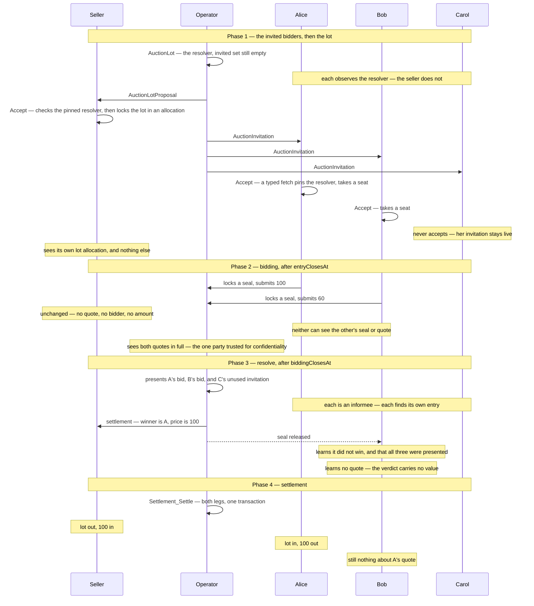
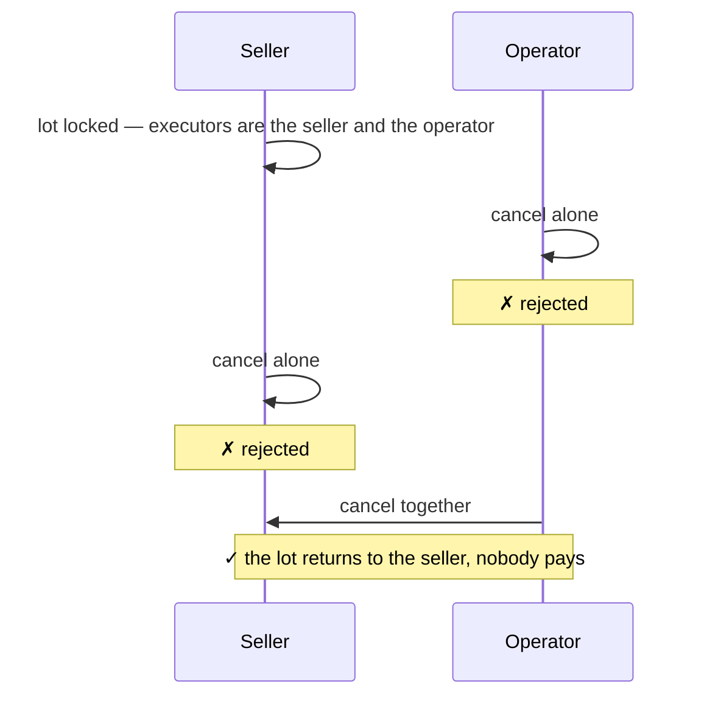
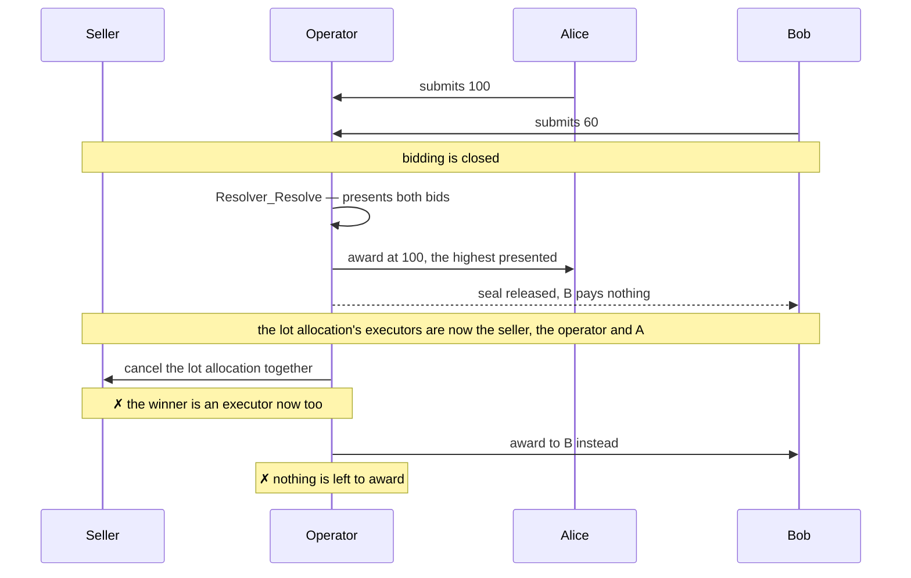
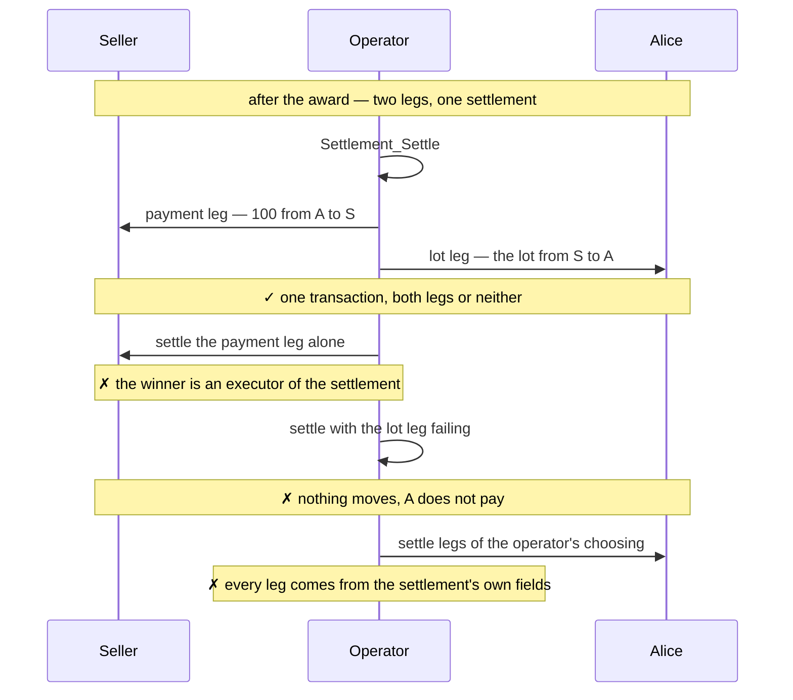
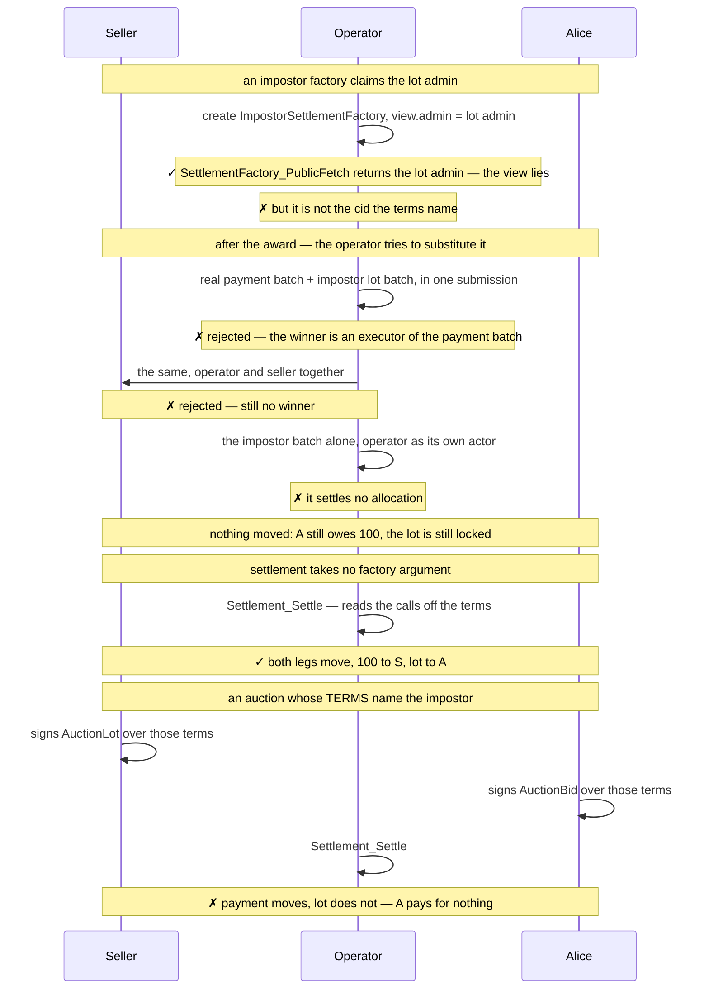
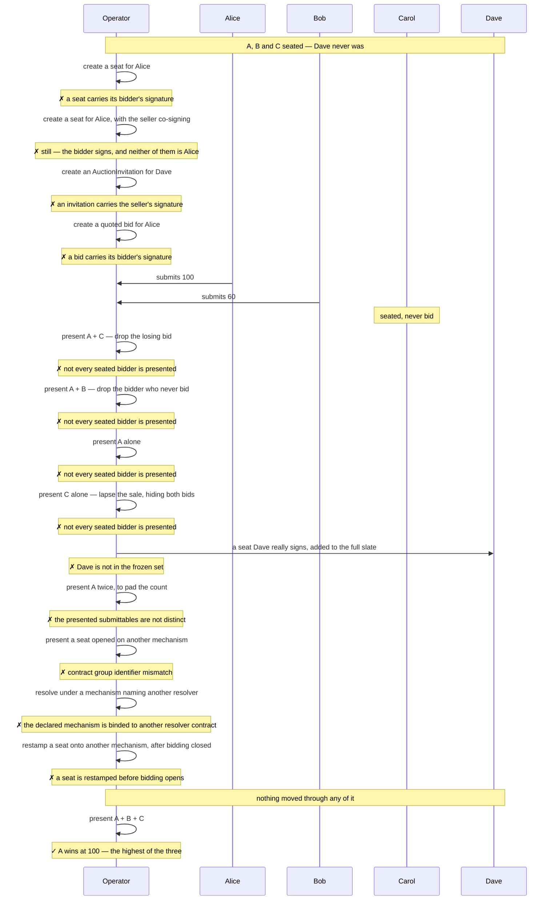

# Demos — `examples/auctions/sealed-bid-first-price-high-trust`

6 demos showing the security and privacy guarantees of a sealed-bid first-price
auction with ex-post bid privacy using CAP.

This is the stronger of the two auction examples. The smaller one,
[`../sealed-bid-first-price`](../sealed-bid-first-price/DEMOS.md), trusts the
operator with the assets and with the presentation; this one does not.

The auction runs over a fixed set of invited bidders, named on the resolver
before the lot locks. Those bidders observe the resolver, so each is an informee
of `Resolver_Resolve` and reads the presentation — which is what lets the award
require that every invited bidder appears in it. Privacy after the outcome is
computed is kept: a loser reads the presentation and still reads no quote in it.

What is left of the operator's discretion is breaking exact ties, seeing every
quote while bidding is open, and declining to resolve at all. Its liveness role
is bounded by `expiresAt`; it cannot rig the outcome.

## Method

The demos are Daml Script tests exercised against two independent token
registries: Canton Coin (Amulet) settles the payment leg, and a simulated
registry built on `TestTokenV2` issues the lot. A single registry administering
both instruments would leave the cross-registry atomicity of demo 4 untested —
the payment and lot batches move through different registries in one
`Settlement_Settle`.

Visibility claims take two forms. Single claims are `sees` / `cannotSee`
predicates over a party and one contract, so each note in the diagrams below is
one line of test code. These checks cannot catch is divulgence. 
That can be checked in Daml Studio. 

The test harness is taken from the Splice repository
(`github.com/canton-network/splice`, under `token-standard/`). Since Daml Script
cannot be distributed across SDK versions in a DAR, the harness is vendored
as source under `test/daml/Splice/`. `Testing.Utils`,
`Registries.AmuletRegistry.Parameters` and `TokenStandard.RegistryApiV2` are
copied verbatim; `Registries.AmuletRegistryV2` and
`Registries.TestTokenV2_RegistryV2` are reduced to their V2 surface, removing
a dependency on the wallet client and on the V1 API.

## Security claims

Each demo carries one claim. Dispatched here:

| Test | Security claim |
| --- | --- |
| [`whoSeesWhat`](#1-whoseeswhat) | No party learns a quote it is not entitled to: the seller learns nothing while bidding is open, and a loser reads the presentation without reading a quote in it |
| [`lotCanOnlyBeReleasedBySellerAndOperatorJointly`](#2-lotcanonlybereleasedbysellerandoperatorjointly) | The locked lot is released by the seller and the operator together or not at all — neither holds it alone |
| [`lotGoesToTheHighestPresentedBid`](#3-lotgoestothehighestpresentedbid) | The winner is computed from the presented quotes, not supplied: the lot goes to the highest bid at that bidder's own price, and every loser is made whole |
| [`noPaymentWithoutTheLot`](#4-nopaymentwithoutthelot) | The winner pays only in the transaction that delivers the lot — the two legs cannot be prised apart, across two independent registries |
| [`theOperatorCannotSwapTheRegistry`](#5-theoperatorcannotswaptheregistry) | Settlement cannot be redirected or repriced: the registry calls are pinned in the countersigned terms, and `Settlement_Settle` settles from the settlement's own view, ignoring whatever the caller passes |
| [`theAuctionResolvesOnTheInvitedSetAlone`](#6-theauctionresolvesontheinvitedsetalone) | The auction resolves only on the set of bidders who took their seats — none dropped, none added — and no entry in that set can be forged, by the operator alone or with the seller |

## 1. `whoSeesWhat`

One happy-path auction over three invited bidders, two of whom bid. After every
phase the demo asserts each party's **complete** visible set. This demo covers
the whole privacy guarantee at once.

The one observer outside this picture is the registry admin, who sees each
locked amount. Privacy here is structural, not bought with uniform allocations.

Quote privacy survives observation because projection in Daml is **per node**,
not inherited: the prices are reached by `fetch` on contracts whose only
stakeholders are the operator and one bidder, so an informee of the parent
exercise sees no part of those nodes. It holds only while the verdict stays
value-free — `V_Accepted (Optional AnyValue)` sits in the exercise *result*,
which every informee reads. `resolveFirstPrice` returns `V_Accepted None`, and
in this format that is a rule, not an incidental.

## 2. `lotCanOnlyBeReleasedBySellerAndOperatorJointly`

The lot sits in a committed Token Standard V2 allocation whose executors are
the seller and the operator. V2 requires the **full** executor set to cancel,
so neither can release it alone and the seller cannot spend it while it is
locked.

The guarantee is Token Standard V2's, not CAP's: a committed allocation is
only as unabortable as its executor set is hard to assemble.
Either the seller or the operator must want the resolution to happen.

## 3. `lotGoesToTheHighestPresentedBid`

Once the operator resolves, the lot goes to the highest bid presented, at that
bidder's own quoted price. The winner is **computed** in the resolve as the
maximum of the presented quotes rather than supplied by the operator, so there
is no proposed answer for the checks to disagree with.

## 4. `noPaymentWithoutTheLot`

The winner pays only in the transaction that delivers the lot.

Atomicity is Daml's: both settle-batch calls sit in one transaction, so a
failure in either moves nothing. The operator holds only the liveness role.

## 5. `theOperatorCannotSwapTheRegistry`

Which registry contracts may touch the assets is fixed in
`OneLotAuctionTerms.registries` when the auction is constituted, not chosen by
the operator at settlement.

A `SettlementFactory` view is self-asserted: any party can create a template
whose `view.admin` names someone else. Checking that field proves nothing, so
the factory call — contract id and choice context both — is pinned in the terms
and `Settlement_Settle` takes no registry argument at all.

The substitution attempt is what closed. Reaching the payment factory outside
`Settlement_Settle` needs the winner's authority, and the winner only ever
delegates it to `AuctionSettlement`, whose body settles both legs off the terms.
The impostor is still callable — it is the operator's own contract — but on its
own it settles no allocation, so it moves nothing.

The last branch is the residual trust, stated rather than hidden. Binding the
calls does not make a hostile registry harmless; it moves the decision to a
document the seller and every bidder sign before anything locks, and off the
operator's settle-time call — `Settlement_Settle` reads the factories off the
settlement's own view, so a repriced or redirected batch handed to it is simply
ignored. The demo asserts that both `AuctionLot` and `AuctionBid` carry the
terms naming the impostor, so nobody reached that state without countersigning
it.

## 6. `theAuctionResolvesOnTheInvitedSetAlone`

The count is an equality against the set of bidders who seated, so one line
refuses a missing entry and an extra one alike. Dropping is the cheaper attack —
an absence looks like a bidder who did not turn up — but both are the same
check, and the demo walks them together before showing that on the right set the
lot goes to the highest bid.

Every entry is unforgeable. A quoted `AuctionBid` carries its bidder's
signature; so does the unquoted seat, because a seat is only reachable by the
bidder accepting an `AuctionInvitation`, which the operator cannot mint alone —
it is signed by the operator *and* the seller. And the invited set itself is
frozen by `AuctionLot_FinalizeInvitation` **before bidding opens**, derived from
the seats it restamps rather than supplied alongside them.

The Dave branch is the sharp one. His seat is genuine — the operator, the seller
and Dave himself all signed it — and it still cannot be added, because `invited`
was derived from the seats present at finalization and Dave's was not among
them. Adding a bidder after the fact is not a matter of forging a signature; the
set is simply closed.

What remains is that the operator chooses which seats to finalize, so it can
leave a seated bidder out. That happens before bidding opens — no quote exists
yet — so the exclusion is blind, and the excluded bidder can see their seat was
never restamped. It reduces to refusing to seat someone, which no on-ledger rule
can prevent. The operator may also put a shill on the invited list before
anything locks, visible to the seller and to every bidder who signs those terms;
in a first-price auction it buys nothing, since a shill that wins pays its own
quote.
