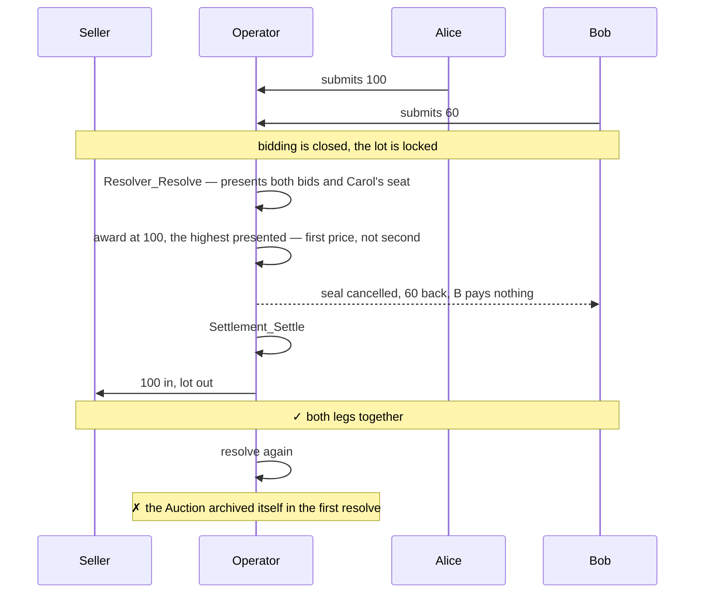
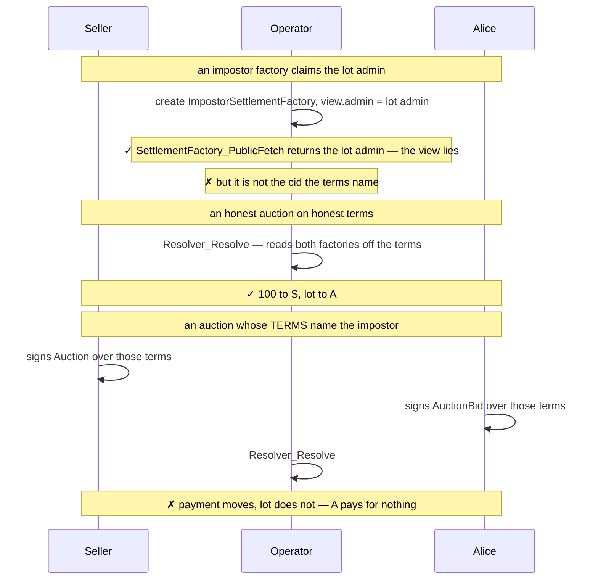
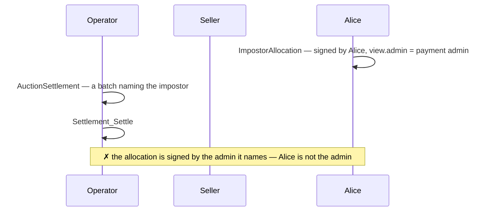

# Demos — `examples/auctions/sealed-bid-first-price`

Demos of a sealed-bid first-price auction with ex-post bid privacy. The operator
is trusted to resolve the auction correctly and to spend the allocations
correctly.

The auction runs over a fixed set of invited bidders, named in `Auction.invited`
before the seller accepts. Those bidders observe the `Auction`, so each is an
informee of `Resolver_Resolve` and reads the bid presentation. A bidder reads no
other bidder's quote, before or after settlement, and the losers read neither the
winner nor the winning price.


## Method

The demos are Daml Script tests exercised against two independent token
registries: Canton Coin (Amulet) settles the payment leg, and a simulated
registry built on `TestTokenV2` issues the lot. The payment and lot batches of a
`Settlement_Settle` therefore move through different registries in one
transaction. `Settlement_Settle` does not check that a batch moved the legs it
named, so transaction atomicity is all it gives —
`settlementRunsThroughTheFactoriesTheTermsName` shows one batch settling while
the other does nothing.

Visibility is checked two ways. `sees` and `cannotSee` query one party's active
contract set for one contract id, so most notes in the diagrams below are one
line of test code. `visibleTo` returns a party's complete visible set;
`whoSeesWhat` uses it to assert that the seller's set is unchanged across
bidding.

Both forms read the active contract set, so a `cannotSee` holds for every party
once the contract is archived. Each check is therefore placed while its contract
is still live: `whoSeesWhat` splits `runResolve` from `runSettle` because
`Settlement_Settle` archives the `AuctionSettlement` it settles. Neither form
catches divulgence, which is visible in Daml Studio.

The test harness is taken from the Splice repository
(`github.com/canton-network/splice`, under `token-standard/`). Since Daml Script
cannot be distributed across SDK versions in a DAR, the harness is vendored
as source under `demo/daml/Splice/`. `Testing.Utils`,
`Registries.AmuletRegistry.Parameters` and `TokenStandard.RegistryApiV2` are
copied verbatim; `Registries.AmuletRegistryV2` and
`Registries.TestTokenV2_RegistryV2` are reduced to their V2 surface, removing
a dependency on the wallet client and on the V1 API.

## Fixture

`setupAs` allocates the six parties, stands up both registries, and builds one
`OneLotAuctionTerms`: the operator as sole authority, `basicAccount seller` for
both seller legs, a single Widget as the lot, a `0.0` reserve, the two settlement
factories pinned, and a three-day timeline — `entryClosesAt` at day 1, `biddingClosesAt`
at day 2, `expiresAt` at day 3. Party names are namespaced per demo, so no two
demos share a ledger contract.

`openAuction` then opens one auction on those terms. The seller mints and
allocates its lot and payment allocations, the operator proposes
`AuctionProposal`, and the seller accepts it into an `Auction` — which is
the resolver, so the mechanism is pinned to that contract id. The operator
then creates one empty `AuctionBid` seat per invited bidder. Nothing has been
bid yet; the demos take it from there, opening bidding with
`setTime f.terms.entryClosesAt` and resolving after
`setTime f.terms.biddingClosesAt`. Resolving mints an `AuctionSettlement`; the
assets move in a **second** transaction, so each demo calls `runResolve` and
then `runSettle` on the `AuctionSettlement` the resolve minted.
`openAuctionWith` is the same as `openAuction`, with a hook to rewrite the terms
first — `settlementRunsThroughTheFactoriesTheTermsName` uses it to name an
impostor factory.

## Placing a bid

Every demo places bids through `fundBid`, which runs the three steps a bidder and
a wallet take between them.

- `OneLotBid_RequestAllocations` on the seat mints a
  `OneLotBidAllocationRequest`. It carries the two `AllocationSpecification`s the
  bid implies — the payment as sender, the lot as receiver — and is signed by the
  auction authorities and the bidder together.
- `walletFunds` stands in for the bidder's wallet. It reads the request through
  the `AllocationRequest` interface, asks each specification's registry for its
  factory and choice context, picks the bidder's own holdings, and submits one
  transaction exercising both `AllocationFactory_Allocate` and
  `AllocationRequest_Accept`.
- `OneLotBid_Finalize` puts the quotes and the two allocation contract ids on the
  seat. It fetches each allocation and asserts `AllocationSpecification` are correct.

The wallet reads nothing the auction wrote into `OneLotAuctionTerms`. Everything
it needs — the settlement, the deadline, the instruments, the amounts, who may
accept — comes from the request's view, and the rest from the registries.


## Security claims

Each demo carries one claim. Dispatched here:

| Test | Security claim |
| --- | --- |
| [`whoSeesWhat`](#1-whoseeswhat) | A losing bidder cannot see another bidder's bid, nor the settlement that names the winner and price |
| [`lotGoesToTheHighestPresentedBid`](#2-lotgoestothehighestpresentedbid) | The lot goes to the highest presented bid at that bidder's own quoted price, and every loser's allocation is cancelled in the resolve that awards it |
| [`settlementRunsThroughTheFactoriesTheTermsName`](#3-settlementrunsthroughthefactoriesthetermsname) | The award reads both settlement factories off `OneLotAuctionTerms`; it is not passed at settlement time |
| [`aBidderCannotBlockTheSale`](#4-abiddercannotblockthesale) | Neither the winner nor a loser holds a veto at settlement time |
| [`settlementRejectsAnImpostorAllocation`](#5-settlementrejectsanimpostorallocation) | An impostor allocation whose view names the admin but which the admin did not sign cannot be settled | 


## 1. `whoSeesWhat`

One happy-path auction over three invited bidders, two of whom bid. The demo
checks each contract against the parties that should and should not read it,
asserts that the seller's complete visible set is unchanged across bidding, and
follows the sale through to settlement.

```mermaid
sequenceDiagram
    participant S as Seller
    participant O as Operator
    participant A as Alice
    participant B as Bob
    participant C as Carol

    Note over S,C: Phase 1 — the lot is locked, then the auction
    S->>S: allocates the lot and the payment leg, executors = [O]
    O->>S: AuctionProposal — invited = A, B, C
    S->>S: Accept — checks both allocations, creates Auction
    Note over A,C: each observes the Auction; the seller signs it
    Note over S: reads the Auction and its own two allocations

    Note over S,C: Phase 2 — bidding, after entryClosesAt
    A->>A: RequestAllocations at 100 — the request names the amount to lock
    A->>A: wallet allocates at both registries and accepts, 100 locked
    A->>O: Finalize — the quote and the two allocations
    B->>B: the same at 60
    B->>O: Finalize
    Note over S: unchanged — no quote, no bidder, no amount
    Note over A,B: neither can see the other's seal or quote
    Note over O: sees both quotes in full 
    Note over C: her empty seat stays live

    Note over S,C: Phase 3 — resolve, after biddingClosesAt
    O->>O: presents A's bid, B's bid, and C's empty seat
    Note over A,C: each is an informee — each finds its own entry
    O->>O: mints AuctionSettlement — the two batches, off the terms
    Note over A,B: A (winner) sees the AuctionSettlement; B cannot — it names the winner and price
    O-->>B: seal cancelled, 60 back to B
    Note over S,C: nothing has moved yet

    Note over S,C: Phase 4 — Settlement_Settle
    O->>S: payment batch — 100 from A to S
    O->>A: lot batch — the lot from S to A
    Note over S,C: ✓ both legs, one transaction, two registries
    Note over B: learns it did not win, and that all three were presented
    Note over B: learns no winner and no quote
```

The last two notes are read off the resolve transaction tree in Daml Studio.
Daml Script asserts contract visibility, not which nodes a party is an informee
of.


## 2. `lotGoesToTheHighestPresentedBid`

The lot goes to the highest bid presented, at that bidder's own quoted price,
and every loser is made whole. The winner is **computed** in the resolve as the
maximum of the presented quotes, not supplied by the operator.




## 3. `settlementRunsThroughTheFactoriesTheTermsName`

A `SettlementFactory` view is self-asserted: any party can create a template
whose `view.admin` names someone else, and `SettlementFactory_PublicFetch`
returns that claim unchecked. `OneLotAuctionTerms` pins both factories by
contract id in `paymentSettleFactory` and `lotSettleFactory`, and
`resolveFirstPrice` reads them from there, so the operator names no factory at
resolve or settle time.

The seller and the bidder must therefore check the factories the terms name. The
second half of the demo opens an auction whose terms name the impostor: the
seller signs those terms in `AuctionProposal_Accept`, the bidder signs them in
`OneLotBid_Finalize`, the payment batch settles, the lot batch does nothing, and
the winner pays for nothing.





## 4. `aBidderCannotBlockTheSale`

Alice bids 100 and wins, Bob bids 60 and loses. Each tries the same five ways out
of its own seat and allocation once bidding has closed, and Alice tries four more
in the window between `Resolver_Resolve` and `Settlement_Settle`, where the
`AuctionSettlement` exists and her two allocations are still live.

`OneLotBid_Expire` is the one choice on the seat with no entitlement check, so
any party may exercise it. It is bounded by `requireExpired` against
`terms.expiresAt`, and `Settlement_Settle` is bounded by `requireOpen` against
the same instant. The two windows do not overlap, so a bidder can only expire its
seat once the sale can no longer settle.

```mermaid
sequenceDiagram
    participant O as Operator
    participant A as Alice
    participant B as Bob

    A->>O: bid 100 — A signs AuctionBid, 100 committed
    B->>O: bid 60 — B signs AuctionBid, 60 committed
    Note over A,B: bidding is closed

    Note over A,B: each tries five paths on its own seat and allocation
    A->>A: archive AuctionBid alone
    Note over A,B: ✗ Archive needs every signatory, and the operator is one
    A->>A: OneLotBid_Withdraw
    Note over A,B: ✗ the seat lists no BA_Withdraw in availableActions
    A->>A: OneLotBid_Expire
    Note over A,B: ✗ expiresAt has not passed
    A->>A: Allocation_Cancel
    Note over A,B: ✗ cancel is for the executors, not the authorizer
    A->>A: Allocation_Withdraw
    Note over A,B: ✗ the allocation is committed and its deadline has not passed

    O->>O: Resolver_Resolve — A wins, B's allocation is cancelled
    Note over B: 60 back; B holds nothing left to take back

    Note over A: the settlement exists, A's allocations are still live
    A->>A: Allocation_Cancel, then Allocation_Withdraw
    Note over A: ✗ the same two refusals
    A->>A: archive AuctionSettlement
    Note over A: ✗ A is observer winner, not a signatory
    A->>A: Settlement_Cancel
    Note over A: ✗ availableActions holds only EA_Execute
    A->>A: Settlement_Expire
    Note over A: ✗ expiresAt has not passed

    O->>O: Settlement_Settle
    Note over O,A: ✓ 100 to the seller, the lot to A
```


## 5. `settlementRejectsAnImpostorAllocation`

An allocation is authenticated by whoever signed it, not by the `admin` field on
its view. This demo places an impostor allocation — signed by the bidder, its
view claiming the payment admin — in a settlement batch and tries to settle it.
`Settlement_Settle` fetches each allocation and requires the instrument admin to
be a signatory, so it refuses the batch. The auction cannot be made to settle an
allocation the admin did not sign, even one whose view names the admin correctly.


