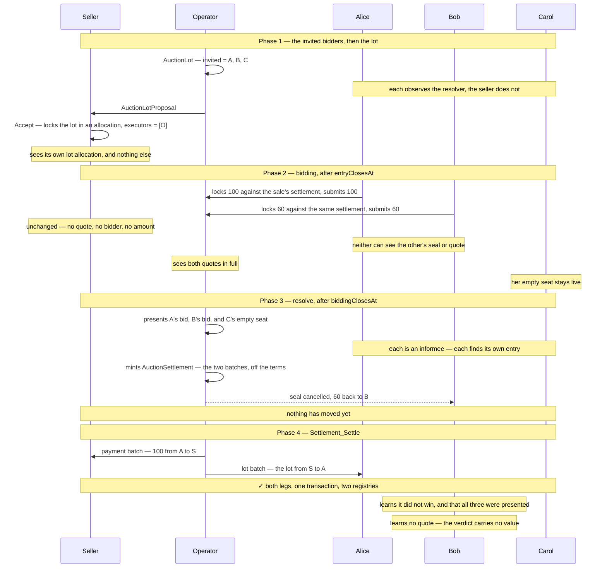
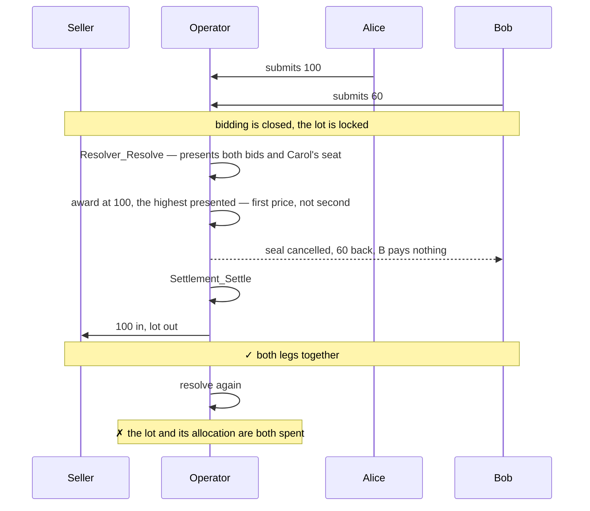
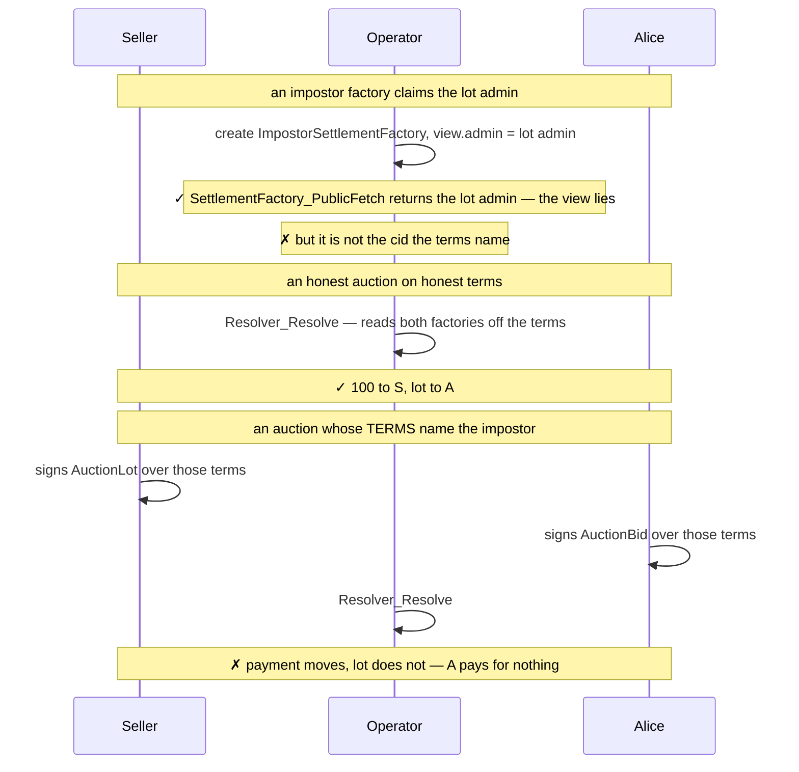
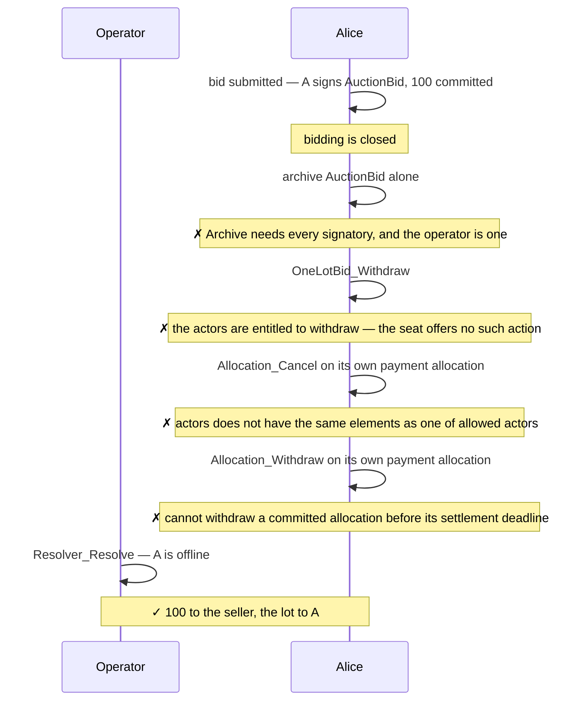

# Demos — `examples/auctions/sealed-bid-first-price`

Demos showing what a sealed-bid first-price auction with ex-post bid privacy
when the operator is trusted with correctly spending the allocation. 
In this example the operator is trusted to correctly resolve the auction and to correctly spend the allocations. 

The auction runs over a fixed set of invited bidders, named on the lot before it
locks. Those bidders observe the lot, so each is an informee of
`Resolver_Resolve` and reads the bid presentation. Bid privacy *among bidders*
is guaranteed after settelment and the winner and higher bid are also kept private.

## Method

The demos are Daml Script tests exercised against two independent token
registries: Canton Coin (Amulet) settles the payment leg, and a simulated
registry built on `TestTokenV2` issues the lot. A single registry administering
both instruments would leave the cross-registry atomicity of `Settlement_Settle`
untested — the payment and lot batches move through different registries in one
transaction.

Visibility claims take two forms. Single claims are `sees` / `cannotSee`
predicates over a party and one contract, so each note in the diagrams below is
one line of test code. These checks cannot catch is divulgence. 
That can be checked in Daml Studio. The other two claims are proved with assertions.

The test harness is taken from the Splice repository
(`github.com/canton-network/splice`, under `token-standard/`). Since Daml Script
cannot be distributed across SDK versions in a DAR, the harness is vendored
as source under `test/daml/Splice/`. `Testing.Utils`,
`Registries.AmuletRegistry.Parameters` and `TokenStandard.RegistryApiV2` are
copied verbatim; `Registries.AmuletRegistryV2` and
`Registries.TestTokenV2_RegistryV2` are reduced to their V2 surface, removing
a dependency on the wallet client and on the V1 API.

## Fixture

`setupAs` allocates the six parties, stands up both registries, and builds one
`OneLotAuctionTerms`: the operator as sole authority, `basicAccount seller` for
both seller legs, a single Widget as the lot, no reserve, the four registry calls
pinned, and a three-day timeline — `entryClosesAt` at day 1, `biddingClosesAt`
at day 2, `expiresAt` at day 3. Party names are namespaced per demo, so no two
demos share a ledger contract.

`openAuction` then opens one auction on those terms. The seller mints and
allocates its lot and payment allocations, the operator proposes
`AuctionLotProposal`, and the seller accepts it into an `AuctionLot` — which is
the resolver, so the mechanism is pinned to that contract id. The operator
then creates one empty `AuctionBid` seat per invited bidder. Nothing has been
bid yet; the demos take it from there, opening bidding with
`setTime f.terms.entryClosesAt` and resolving after
`setTime f.terms.biddingClosesAt`. Resolving mints an `AuctionSettlement`; the
assets move in a **second** transaction, so the demos use `resolveAndSettle`,
which runs the resolve and then `Settlement_Settle` on what it minted.
`openAuctionWith` is the same as `openAuction`, with a hook to rewrite the terms
first — `theOperatorCannotSwapTheRegistry` uses it to name a hostile factory.

## Security claims

Each demo carries one claim. Dispatched here:

| Test | Security claim |
| --- | --- |
| [`whoSeesWhat`](#1-whoseeswhat) | A losing bidder reads the bid presentation but cannot read the quote in it — bid privacy survives the outcome |
| [`lotGoesToTheHighestPresentedBid`](#2-lotgoestothehighestpresentedbid) | The lot goes to the highest presented bid at that bidder's own quoted price, and every loser is made whole in the same transaction |
| [`theOperatorCannotSwapTheRegistry`](#3-theoperatorcannotswaptheregistry) | Settlement cannot be redirected: the registry calls are pinned in the terms when the auction is constituted, not chosen at settlement |
| [`theBidderCannotBlockTheSale`](#4-thebiddercannotblockthesale) | Neither the winner nor a loser holds a veto at settlement time |

A version whose contracts carry higher guarantees: the operator can
neither drop a bidder nor incorrectly spend allocations the settlement can be found in
[`../sealed-bid-first-price-high-trust`](../sealed-bid-first-price-high-trust/DEMOS.md).

## 1. `whoSeesWhat`

One happy-path auction over three invited bidders, two of whom bid. After every
phase the demo asserts each party's **complete** visible set. This demo covers
the whole privacy guarantee at once, and follows the sale through to settlement.

## 2. `lotGoesToTheHighestPresentedBid`

The lot goes to the highest bid presented, at that bidder's own quoted price,
and every loser is made whole. The winner is **computed** in the resolve as the
maximum of the presented quotes, not supplied by the operator.

## 3. `theOperatorCannotSwapTheRegistry`

A `SettlementFactory` view is self-asserted: any party can create a template
whose `view.admin` names someone else. The factory call contract id and choice context both are pinned in the auction terms,
and the award reads it from there.

## 4. `theBidderCannotBlockTheSale`

Alice tries to abort the sale trough all possible choices and it fails in all of them.

