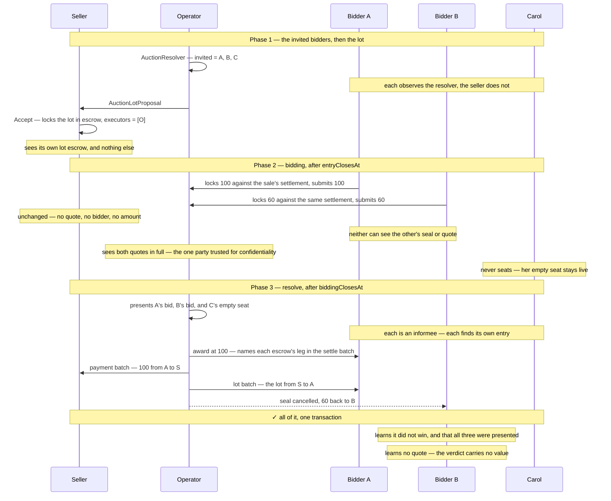
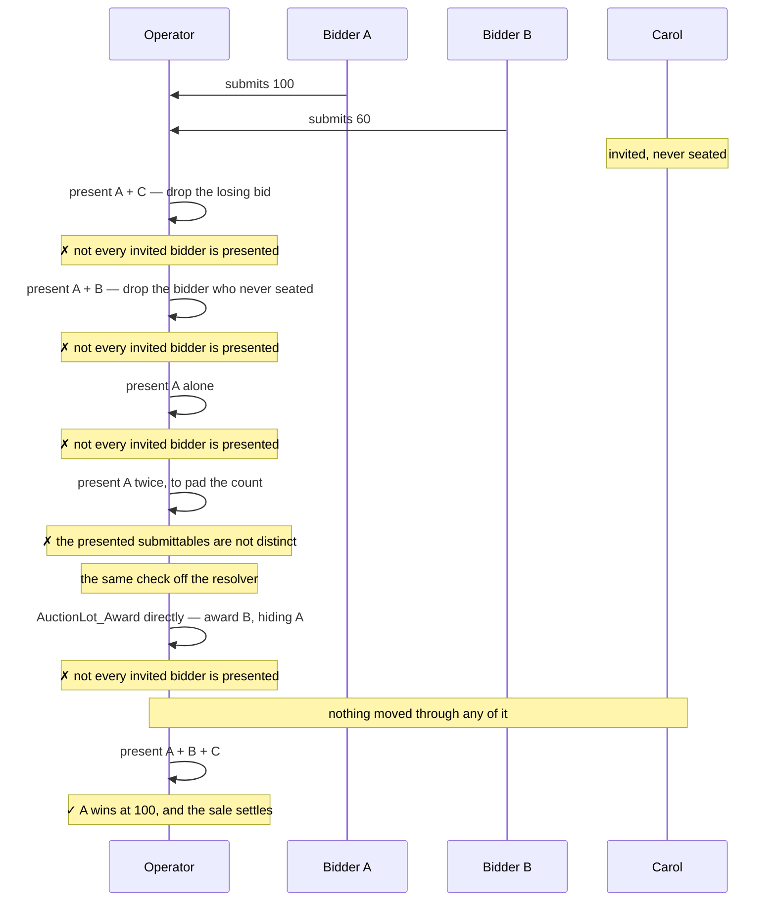
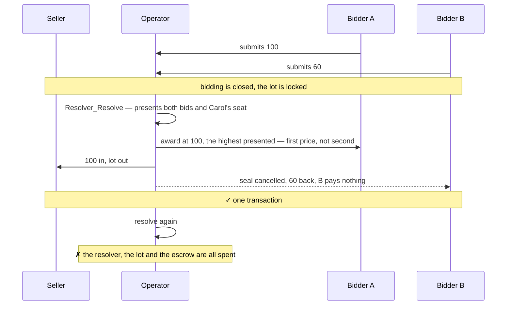
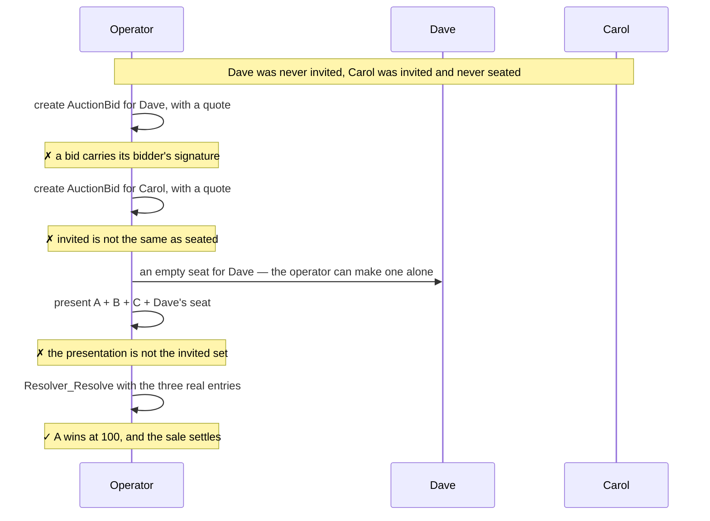
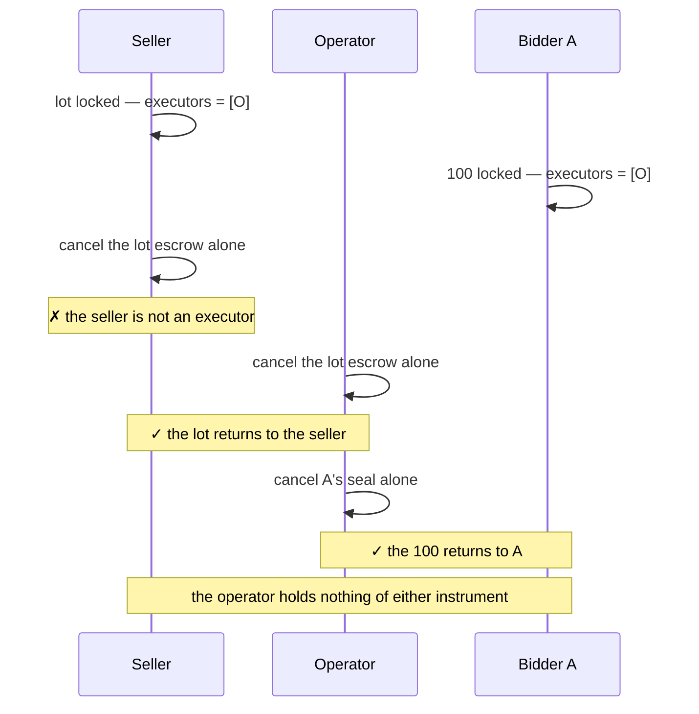
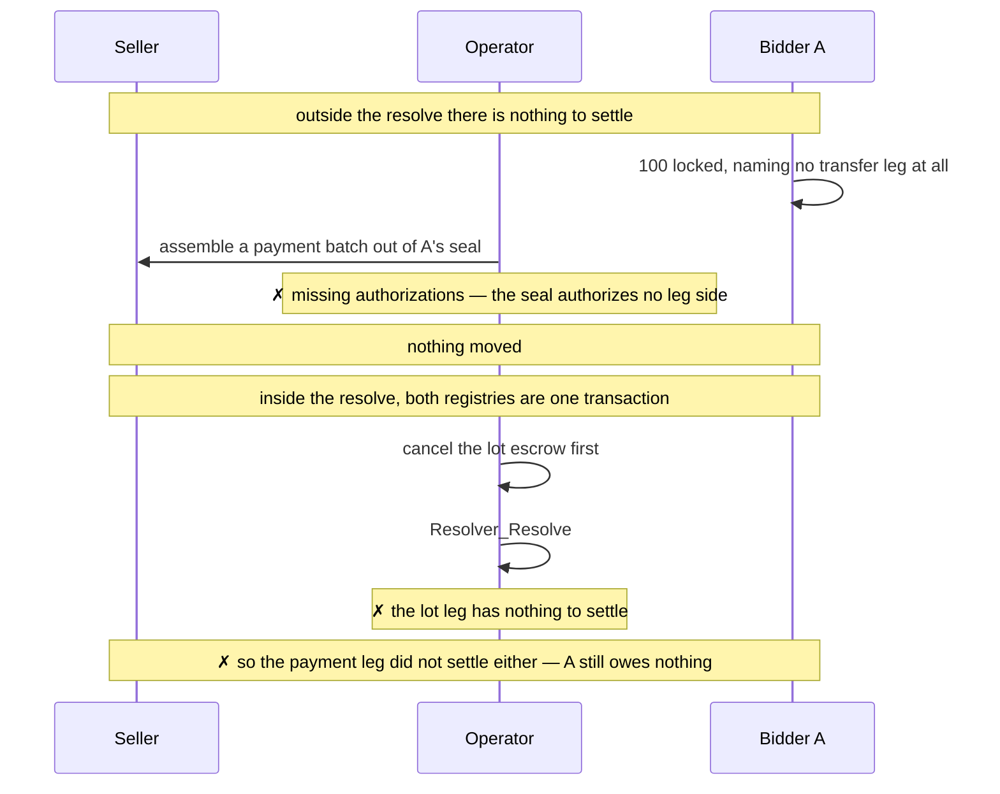
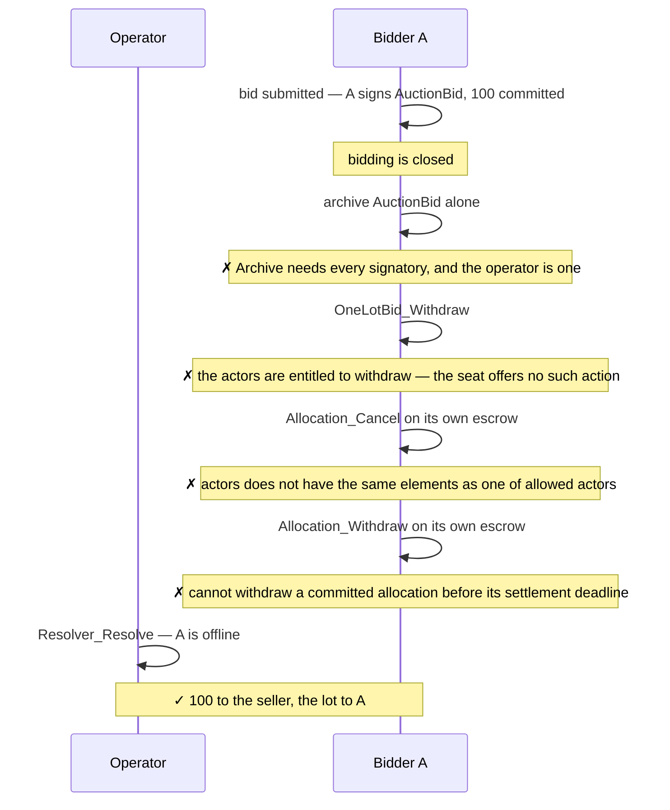

# Demos — `examples/auctions/sealed-bid-first-price`

8 demos showing the security and privacy guarantees of a sealed-bid first-price
auction with ex-post bid privacy using CAP, where the operator is trusted to
execute the sale.

The auction runs over a fixed set of invited bidders, named on the resolver
before the lot locks. Those bidders observe the resolver, so each is an informee
of `Resolver_Resolve` and reads the presentation — which is what lets the award
require that every invited bidder appears in it. Privacy after the outcome is
computed is kept: a loser reads the presentation and still reads no quote in it.

## Security claims

Each demo carries one claim. This table is the dispatcher: what is claimed, and
the script that states it.

| Test | Security claim |
| --- | --- |
| [`whoSeesWhat`](#1-whoseeswhat) | A losing bidder reads the presentation and still reads no quote in it — bid privacy survives the outcome |
| [`theOperatorCannotDropABidder`](#2-theoperatorcannotdropabidder) | An invited bidder cannot be omitted from the award: one entry per invited bidder, and neither a bid nor an empty seat can be forged |
| [`lotGoesToTheHighestPresentedBid`](#3-lotgoestothehighestpresentedbid) | The lot goes to the highest presented bid at that bidder's own quoted price, and every loser is made whole in the same transaction |
| [`theOperatorCannotAddABidder`](#4-theoperatorcannotaddabidder) | A party who was never invited cannot be made to appear in the award |
| [`whatTheOperatorIsTrustedWith`](#5-whattheoperatoristrustedwith) | The residual trust in the operator, stated as a test rather than as prose: sole executor, so it can cancel any allocation |
| [`noPaymentWithoutTheLot`](#6-nopaymentwithoutthelot) | The winner pays only in the transaction that delivers the lot — across two independent registries |
| [`theOperatorCannotSwapTheRegistry`](#7-theoperatorcannotswaptheregistry) | Settlement cannot be redirected: the registry calls are pinned in the terms when the auction is constituted, not chosen at settlement |
| [`theBidderCannotBlockTheSale`](#8-thebiddercannotblockthesale) | Neither the winner nor a loser holds a veto at settlement time |
| [`aSeatLeavesNoAllocationBehind`](test/daml/Cap/Examples/SealedFirstPrice/Test/Invariants.daml) | A seat that never bids leaves no allocation locked behind it |

## Method

The demos are Daml Script tests exercised against two independent token
registries: Canton Coin (Amulet) settles the payment leg, and a simulated
registry built on `TestTokenV2` issues the lot. A single registry administering
both instruments would leave the cross-registry atomicity of demo 6 untested.

Assertions take two forms. Visibility claims are stated per contract, as
`sees` / `cannotSee` predicates over a party and a contract identifier, so that
each note in the diagrams below corresponds to one line of test code. The same
per-party views can be inspected interactively in Daml Studio. Stronger claims —
that a party learned *nothing* across a phase — are stated as an equality
between the complete set of contracts visible to that party before and after,
and so fail on any leak, anticipated or not.

One limit worth stating plainly. Daml Script reads the ACS, not transaction
trees, so a script can assert that an invited bidder **observes the resolver** —
the structural fact the informee relation follows from — but cannot assert the
informee relation itself. What it does assert directly is the other half: that
reading the presentation buys a loser nothing about the amounts in it.

The invited bidders are `alice`, `bob` and `carol`. Carol is invited and never
takes her seat; `dave` is never invited.

The test harness is taken from the Splice repository
(`github.com/canton-network/splice`, under `token-standard/`). Since Daml Script
cannot be distributed across SDK versions in a DAR, the harness is vendored
as source under `test/daml/Splice/`. `Testing.Utils`,
`Registries.AmuletRegistry.Parameters` and `TokenStandard.RegistryApiV2` are
copied verbatim; `Registries.AmuletRegistryV2` and
`Registries.TestTokenV2_RegistryV2` are reduced to their V2 surface, removing
a dependency on the wallet client and on the V1 API.

## 1. `whoSeesWhat`

One happy-path auction over three invited bidders, two of whom bid. After every
phase the demo asserts each party's **complete** visible set. This demo covers
the whole privacy guarantee at once, and shows the sale completing in the
resolve.

The demo asserts, immediately after the resolve, that the seller holds 100 and
no lot, that A holds the lot and no locked funds, that B is whole again, and
that the operator holds neither instrument. It also asserts that B's entire
visible set is now one contract: his own refunded money.

The one observer outside this picture is the registry admin, who sees each
locked amount. Privacy here is structural, not bought with uniform allocations.

Quote privacy survives observation because projection in Daml is **per node**,
not inherited: the prices are reached by `fetch` on contracts whose only
stakeholders are the operator and one bidder, so an informee of the parent
exercise sees no part of those nodes. It holds only while the verdict stays
value-free — `V_Accepted (Optional AnyValue)` sits in the exercise *result*,
which every informee reads. `resolveFirstPrice` returns `V_Accepted None`, and
in this format that is a rule, not an incidental.

## 2. `theOperatorCannotDropABidder`

Omitting a bid is what a first-price operator would otherwise be free to do, and
it is the cheapest attack to hide: an absence looks like a bidder who simply did
not turn up. The award closes it by requiring one entry per invited bidder — a
bid that bidder signed, or the empty seat it never used. Neither can be forged:
the bid carries the bidder's signature, and the seat is checked against these
terms and this mechanism.

Trusting the operator to execute buys it nothing here. The check is in the body
of `AuctionLot_Award`, where the seller's delegation is spent, not in who may
call it.

The direct call is the point. `AuctionLot` is signed by the operator and the
seller and its award is controlled by the operator alone — the seller must not
be able to abort after price discovery, so that cannot change. The operator can
therefore always reach the award without going through `Resolver_Resolve`.
Because the check lives in the body of the choice rather than in who may call
it, that is not a bypass: it either produces the outcome the procedure would
have produced, or produces nothing.

The check is an equality against the invited set, not a subset test, so it
rejects an extra entry as well as a missing one. Demo 4 covers that direction.

What remains is that the operator may put a shill on the invited list *before*
anything locks — visible to the seller and to every bidder who signs those
terms. In a first-price auction it buys nothing: a shill that loses does
nothing, and a shill that wins has to pay its own quote.

## 3. `lotGoesToTheHighestPresentedBid`

The lot goes to the highest bid presented, at that bidder's own quoted price,
and every loser is made whole in the same transaction. Both halves are checked
in `AuctionLot_Award`, where the seller's delegation is spent — not in the
procedure that calls it — so they hold however the award is reached.

The demo asserts the winner paid exactly her own quote (100, not the runner-up's
60), that the runner-up holds nothing locked and cannot see his own cancelled
allocation any more, and that the resolver, the lot and the escrow are gone.

## 4. `theOperatorCannotAddABidder`

The mirror of demo 2. Adding a bidder is stopped twice over, and the first layer
means the second is never reached.

A bid is signed by the authorities **and** its bidder, so the operator — an
authority on every bid in the auction — still cannot bring one into existence
alone. That holds for Carol too: being invited is not being seated, and her
empty seat is the only thing the operator may present for her.

The invited set itself is fixed before the lot locks and pinned by contract id
in the mechanism every seat is signed against, so it cannot be widened after
bidding opens without invalidating every seat already taken.

## 5. `whatTheOperatorIsTrustedWith`

The demo that exists because of the trust assumption, rather than in spite of
it. The operator is the sole executor of every allocation in the auction, so
Token Standard V2 lets it cancel any of them on its own — the seller's lot and
any bidder's funds alike. In the lower-trust variant the seller is an executor
too and the same cancel needs both signatures.

This is the whole of what the trust buys, and it buys the operator nothing: an
allocation's cancel returns holdings to the party who funded it, never to the
executor. The operator can deny the sale until `expiresAt`; it cannot take from
it. The demo asserts both — the assets are back with the seller and the bidder,
unlocked, and the operator's balance in both instruments is zero.

The guarantee that remains is Token Standard V2's, not CAP's: a committed
allocation is only as unabortable as its executor set is hard to assemble. This
format chose an executor set of one. The variant under `experiments/` chose one
that needs the seller too, and pays for it in the machinery demos 1 and 6 no
longer need.

## 6. `noPaymentWithoutTheLot`

The winner pays only in the transaction that delivers the lot. Two separate
things carry that, and the demo exercises both.

The first half is the shape of the escrows. Both the seller's lot and every
bidder's funds are committed with `transferLegSides = []`: until the envelopes
are opened, neither the price nor the winner's account is known, so there is no
leg to name. The registry rejects any batch assembled out of them, because the
allocations authorize none of the leg sides the batch claims — the demo pins
that failure by message. The award supplies exactly those missing leg sides
through `extraTransferLegSides`, which is the one thing an escrow cannot be made
to settle without.

The second half is Daml's. Both `SettlementFactory_SettleBatch` calls sit in the
same transaction as the award, so a failure on either moves nothing. The demo
removes the lot leg (the operator cancels the escrow, which demo 5 established
it can do alone) and shows the resolve failing whole: the seller has its lot
back, unlocked, and A's 100 is untouched.

## 7. `theOperatorCannotSwapTheRegistry`

Which registry contracts may touch the assets is fixed in
`OneLotAuctionTerms.registries` when the auction is constituted, not chosen by
the operator when it settles.

A `SettlementFactory` view is self-asserted: any party can create a template
whose `view.admin` names someone else. Checking that field proves nothing, so
the factory call — contract id and choice context both — is pinned in the terms,
and the award reads it from there.

Collapsing execution into the resolve makes this stronger than in the
lower-trust variant rather than weaker. There, the operator held a settle-time
call it could aim at a factory of its own; here there is no settle-time call to
aim. `oneLotBid_awardImpl` takes no registry argument: it reads
`terms.registries.paymentSettle` and `terms.registries.lotSettle` off the terms
the seller and the bidder both signed, and checks each one's admin before using
it.

The last branch is the residual trust, stated rather than hidden — and it is not
the operator's to exploit. Binding the calls to the terms does not make a
hostile registry harmless; it moves the decision to a document the seller and
every bidder sign before anything locks. The demo asserts that both
`AuctionLot` and `AuctionBid` carry the terms naming it, so nobody reached that
state without countersigning it.

It also marks the edge of what "one transaction" buys. Atomicity holds between
the two batch calls; it cannot make a call that only *claims* to move an asset
actually move one. The impostor's `SettleBatch` settles no allocation and
returns success, so the payment leg commits beside a lot leg that did nothing.
Atomicity is a property of the transaction, not a substitute for knowing whose
registry you are settling through.

## 8. `theBidderCannotBlockTheSale`

A bidder is a signatory of its own `AuctionBid`, and both its escrow and the
seller's are unwound at the award. It is worth showing that none of that gives
the bidder a veto, because a format where the loser — or the winner — could
refuse at settlement time would be worthless.

The authority a bidder contributes to the resolve is not its presence. It is
the signature it left on `AuctionBid` when it bid, and an exercise on that
contract delegates it. The bidder is offline when the operator resolves: the
demo's `runResolve` acts as the operator and nobody else.

The last branch is the one that carries it, and the guarantee is the Token
Standard's. The registry's own `availableActions` does list
`AA_Withdraw -> [[A]]`: the bidder is the party who may withdraw. But the
allocation is `committed = True` with `settlementDeadline = Some expiresAt`, and
a committed allocation cannot be withdrawn before its deadline. The advertised
action names *who*, not *when*.

`OneLotBid_Submit` requires exactly those two properties of every bid allocation
(`bidAllocationFunding`, in `cap-auctions`): committed, and expiring with the
bid. That check is what makes a sealed bid binding rather than an offer.

So the liveness picture is one-sided and stays that way until `expiresAt`. Up to
that point only the operator can stop the sale, by declining to resolve or by
cancelling an escrow. After it, the commitment lapses for everyone: the escrows
become withdrawable by the parties who funded them, `Resolver_Expire` and
`OneLotBid_Expire` open, and nobody is left holding anything.
