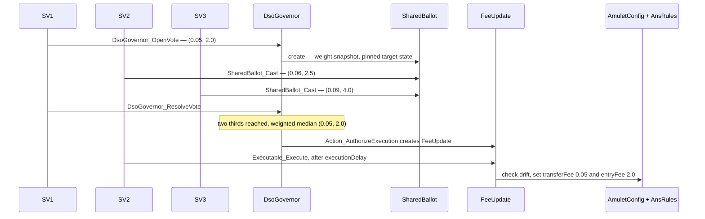
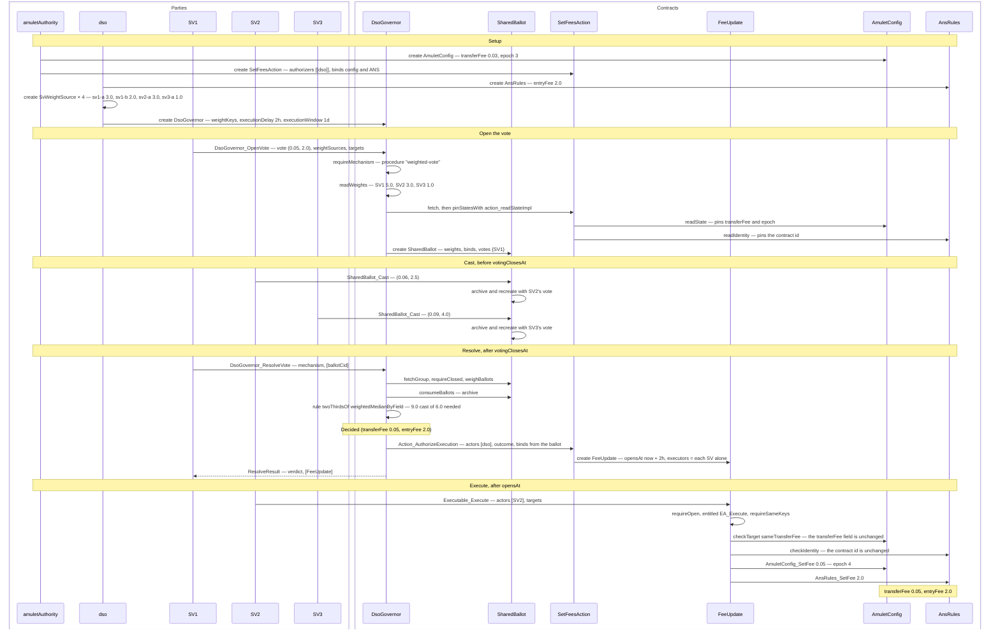
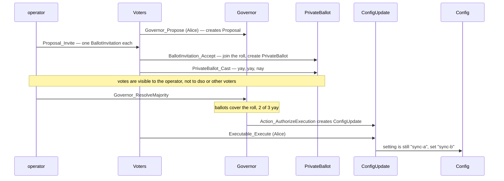
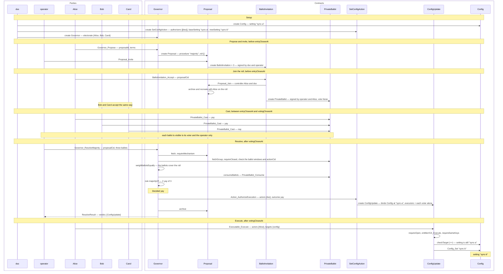

# Sequence diagrams — `examples/governance`

These diagrams show the happy path of the two governance examples: `babydso` and
`private-majority-vote`. Each example has a short version with the main steps
and a long version that follows the setup in `Demo/Fixture.daml` and one
successful demo choice by choice. Failure paths and the checks that reject them
are not shown.

Parties and contracts are both drawn as participants. An arrow from a party is a
command that party submits. An arrow from a contract is a choice exercised or a
contract created inside that command's transaction.

## BabyDso

`babydso` models a small DSO that changes two fees in one execution. The
transfer fee lives on `AmuletConfig`, signed by `amuletAuthority`, and the entry
fee lives on `AnsRules`, signed by `dso`. `SetFeesAction` binds both contracts,
so an execution updates both fees or neither.

The SVs vote on one `SharedBallot` with weights read from `SvWeightSource`
contracts. `DsoGovernor_OpenVote` snapshots the weights and pins the state of
both targets when the vote opens. `DsoGovernor_ResolveVote` requires two thirds
of the snapshot weight and takes the weighted median of each fee field. The
governor then calls `Action_AuthorizeExecution`, which creates a `FeeUpdate`
that any single SV can execute after `executionDelay`.

SVs submit with `readAs dso` because the `DsoGovernor`, `AnsRules` and the
weight sources are signed by `dso`.

In the fixture SV1 holds two weight sources (`sv1-a` = 3.0, `sv1-b` = 2.0), SV2
holds `sv2-a` = 3.0 and SV3 holds `sv3-a` = 1.0. The total weight is 9.0, so the
quorum is 6.0. The opening fees are a transfer fee of 0.03 and an entry fee of
2.0.

### Short version

The short version covers the four steps of the vote: open, cast, resolve and execute.

### Long version

The long version adds the setup, the weight snapshot and target pinning, the quorum and median rule, and the drift checks at execution.

## Private majority vote

`private-majority-vote` changes one `Config` setting from `"sync-a"` to
`"sync-b"` by a simple majority of a fixed electorate: Alice, Bob and Carol. It
keeps each vote private from `dso` and from the other voters. The `operator`
runs the round and is trusted to see every vote.

A member of the electorate opens a `Proposal` through `Governor_Propose`.
The operator invites each voter, and each voter accepts the invitation, which
adds the voter to the proposal's `roll` and creates a `PrivateBallot` signed by
the operator and the voter. No other party observes a `PrivateBallot`.

After the voting window closes, the operator presents every ballot on the roll
to `Governor_ResolveMajority`. A `yay` wins when its weight is more than half
of the electorate. On a `yay` the governor calls `Action_AuthorizeExecution` on
`SetConfigAction`, which creates a `ConfigUpdate` that any single voter can
execute. The execution requires the setting to still be `"sync-a"`.

### Short version

The short version covers the steps of the round: propose, invite and join, cast, resolve and execute.

### Long version

The long version adds the setup, the per-voter invitation and roll entry, the ballot checks at resolution, and the state check at execution.

