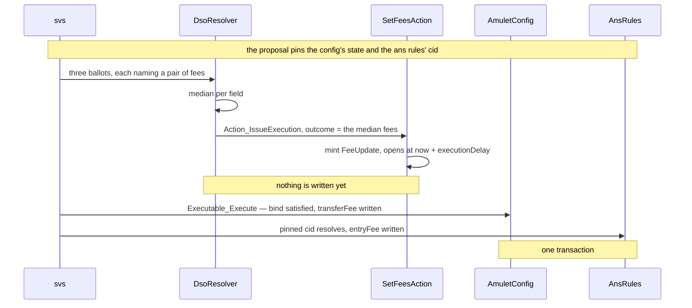
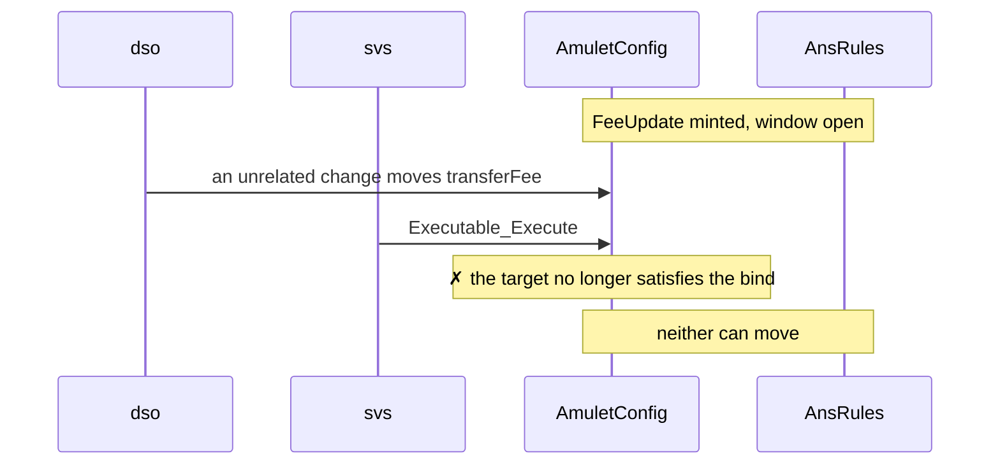
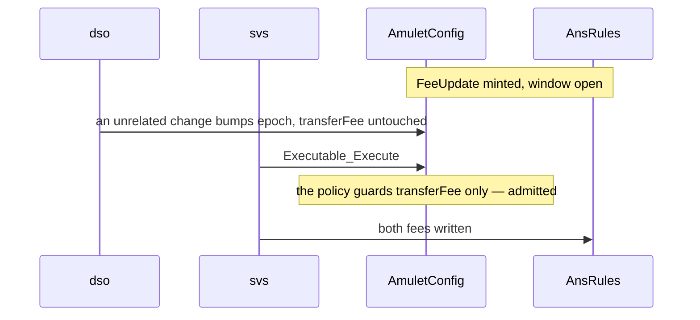
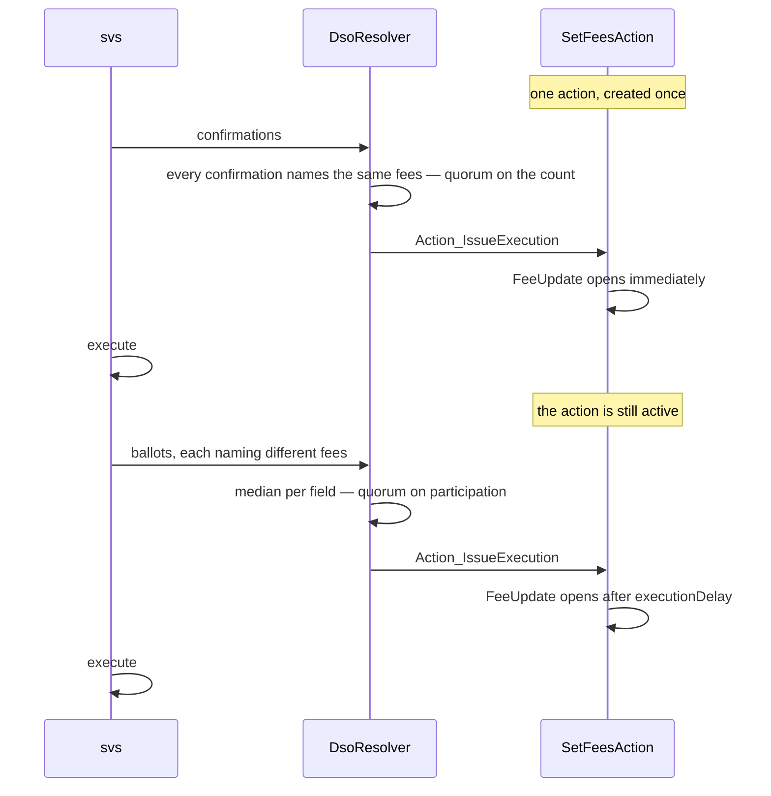

# Demos — `examples/governance/baby-dso`


## Method

The demos are Daml Script tests. Each states its claim as assertions on the final
contracts, not on the transcript. Where a demo claims *nothing moved*, it asserts
the complete final state of every target, so a partial application fails the demo
rather than passing quietly.

The electorate is three SVs and the quorum is two, matching `plain`'s
`requiredNumVotes` at `n = 3`. All five demos run one proposal through one
`Resolver_Resolve`, so what differs between them is only the bindings and the
state the targets are in at execution.

## Layout

```
baby-dso/
├── plain/     the reduced DsoRules/AmuletRules — the shape being argued against
└── cap/
    ├── impl/     the DSO: resolver, ballot, its own DsoConfig
    ├── registry/ a CAP-aware app: AuthenticTarget + Action + Executable for itself,
    │             plus the bridge that governs `legacy/`. Never imported by impl/.
    ├── legacy/   a template that implements nothing and knows nothing about CAP
    └── test/     the demos below
```

The load-bearing fact is a `daml.yaml`, not a script: **`cap/impl` lists neither
`registry` nor `legacy` in its `data-dependencies`.** The dependency arrow points
the other way. Adding a fourth governed app requires no change to `cap/impl` and
no new DSO release.

## Demo Use Case

**Raise the network's fees.**

Two contracts hold one. `AmuletRules` holds `transferConfig.createFee`, what it costs to
move Canton Coin. [`AnsRules`](https://github.com/canton-network/splice/blob/a4ea43aa55db83a028a30e95ace45e1350edde9a/daml/splice-amulet-name-service/daml/Splice/Ans.daml#L60) holds
[`AnsRulesConfig.entryFee`](https://github.com/canton-network/splice/blob/a4ea43aa55db83a028a30e95ace45e1350edde9a/daml/splice-amulet-name-service/daml/Splice/Ans.daml#L210), what it costs to register a name.

The second one cannot be changed. Not "is awkward to change" — there is no path:

- `AnsRules` has no `SetConfig` choice, only four nonconsuming payment choices;
- [`ActionRequiringConfirmation`](https://github.com/canton-network/splice/blob/a4ea43aa55db83a028a30e95ace45e1350edde9a/daml/splice-dso-governance/daml/Splice/DsoRules.daml#L68) has no variant for it;
- `DsoRules.daml` imports `Splice.Ans` but names only `AnsEntryContext` — it never
  mentions `AnsRules`.

It is [created once at bootstrap](https://github.com/canton-network/splice/blob/a4ea43aa55db83a028a30e95ace45e1350edde9a/daml/splice-dso-governance/daml/Splice/DsoBootstrap.daml#L54) from a parameter, and the module says as
much itself: *"It is accepted to have a single config for now for simplification. We can
extend it to be effectively dated schedule config like what we have in AmuletRules when
needed."* That comment is the closed governable set in the authors' own words —
extending governance to one more contract is a coordinated change across packages, so it
was deferred, and the fee is still whatever bootstrap set.

**A stipulation.** The two fees are independent. Nothing in Splice couples them, and
raising one without the other breaks nothing. Suppose, for the demo, that the SVs want
to vote a single set of fees covering both — one decision, two contracts. That is not
forced by the domain; it is what gives us two bindings to look at.

**Two kinds of bind, one target of each.** The amulet-side config implements
`AuthenticTarget` and publishes its state, so it is pinned by *what it says* and judged
by a policy. `AnsRules` is bound as an `OpaqueBind`, pinned by *which contract it is*.

`AnsRules` could perfectly well be an `AuthenticTarget` — it is DSO-signed and lives in a
package the same project maintains. It is opaque here for the purpose of the demo: to
show the two kinds of bind side by side, and what a target gives up by not publishing
state.

```daml
bindings =
  [ AuthenticBind with
      target = amuletRulesKey dso
      state  = AsOf with
        stage = Submission
        seen  = Some (AV_Map [("transferFee", AV_Decimal 0.03), ("epoch", AV_Int 3)])
      cid    = AsOf with stage = Execution; seen = None
  , OpaqueBind with
      opaqueTarget = OpaqueTargetKey "ans-rules"
      opaqueCid    = pinnedAnsRulesCid
  ]
```

The asymmetry in what each pins follows from that choice. A config that is archived and
re-created on every write gets a new contract id each time, so its *state* is the stable
thing
to name. A target that publishes no state leaves its contract id as the only thing there
is to name.

**The decision is a number, not a choice.** Each SV names the fees it wants and
the resolver takes the median of each field. What the proposal offers is not a set of
candidate values but the set of quantities under decision:

```daml
options = [AV_Text "transferFee", AV_Text "entryFee"]
```

```
sv1 casts   { transferFee: 0.05, entryFee: 2.0 }
sv2 casts   { transferFee: 0.06, entryFee: 2.5 }
sv3 casts   { transferFee: 0.09, entryFee: 4.0 }

outcome     { transferFee: 0.06, entryFee: 2.5 }
```

Both are `AV_Map`s of `AV_Decimal`s, which is why `outcome` is `AnyValue` and not `Text`:
a governance decision is often structured, and here it is a value nobody voted for
exactly — the component-wise median. A single outlier moves the result by nothing.

This works because `Ballot_Cast`'s fixed body checks only *who may cast* and *when*. It
does not require a vote to name an offered option, so `options` is declarative and its
reading is the procedure's: for a counting tally the entries are the candidate values a
vote may name; for a median tally they are the fields a vote must supply. Neither is
enforced by the library. The final word on what can actually be applied belongs to the
action, which decodes `outcome` and aborts on anything it does not recognise.

It is a third `Procedure` beside `confirmation` and `vote`, and nothing else changes.
The action decodes `outcome` and cannot tell whether the number arrived by counting or
by median, which is the resolution rule and the effect being genuinely independent.

**Quorum becomes participation, not agreement.** A median exists as soon as anyone
votes, so a median proposal is accepted when enough SVs submitted and `V_Lapsed` when
too few. There is no rejection — that is a menu concept, needing an option that means
*no*. Splice's [`Vote { accept : Bool }`](https://github.com/canton-network/splice/blob/a4ea43aa55db83a028a30e95ace45e1350edde9a/daml/splice-dso-governance/daml/Splice/DsoRules.daml#L458) is that menu at its smallest, and it
cannot express this vote at all: the value is fixed by the proposer and the SVs may only
agree or refuse.

**A policy for the target that has one.** The field the proposal writes is guarded;
everything else may drift:

```daml
unchangedAt ["transferFee"]
```

An `epoch` bump from an unrelated config change is admitted. A `transferFee` that moved
since the vote is not. The opaque bind has no policy — cid equality is total by
construction, which is exactly the trade a target makes by not publishing state.

**One channel for every target.** `Executable_Execute` takes
`currentTargets : Map TargetKey AnyContractId`. Two targets, one parameter, and a third
would need no new parameter. Splice needs a different transport per governed type:
[`self`](https://github.com/canton-network/splice/blob/a4ea43aa55db83a028a30e95ace45e1350edde9a/daml/splice-dso-governance/daml/Splice/DsoRules.daml#L1806) for `DsoRules`, a hardcoded
[`amuletRulesCid : Optional (ContractId AmuletRules)`](https://github.com/canton-network/splice/blob/a4ea43aa55db83a028a30e95ace45e1350edde9a/daml/splice-dso-governance/daml/Splice/DsoRules.daml#L730) on the execute choice
for `AmuletRules`, and a [cid inside the variant](https://github.com/canton-network/splice/blob/a4ea43aa55db83a028a30e95ace45e1350edde9a/daml/splice-dso-governance/daml/Splice/DsoRules.daml#L74) for
[`AnsEntryContext`](https://github.com/canton-network/splice/blob/a4ea43aa55db83a028a30e95ace45e1350edde9a/daml/splice-dso-governance/daml/Splice/DsoRules.daml#L1821).

**One transaction.** Every bind is checked and every target written inside a single
`Executable_Execute`, so either both fees move or neither does.


## 1. `bothFeesMoveTogether`

The fee Splice cannot govern, changed — and changed alongside one it can, in a single
transaction. `governance/` has never heard of either target; the whole coupling lives in
`action/`. This is the demo to read first, and the rest are its failure modes.



## 2. `aDriftedFeeStopsBoth`

An unrelated proposal moves `transferFee` after the vote closes. Execution is refused,
and **neither** fee moves — including the ANS fee, whose own target never changed. The
approval was made against a config that no longer exists, so none of it applies.

This is the question Splice has no way to ask: `patch` would have written the voted fee
over the newer one without a word.



## 3. `anUnrelatedChangeIsAdmitted`

The same shape, except the intervening change bumps `epoch` and leaves `transferFee`
alone. Execution succeeds and both fees move.

The contrast with demo 2 is the point. A whole-state pin would refuse this too, and every
proposal would be blocked by unrelated activity — which is why the policy is
`unchangedAt ["transferFee"]` and not `unchanged`.



## 4. `twoPathsOneAction`

One `SetFeesAction`, created once, used by two proposals resolved through different
procedures. The confirmation path has every SV name the same fees and executes at
once; the vote path takes the median and opens after a delay. The action is
`nonconsuming`, so it is still live at the end and could serve a third.

What this shows is that the resolution rule and the effect are independent: the action
decodes `outcome` and cannot tell whether the number arrived by agreement or by median.


