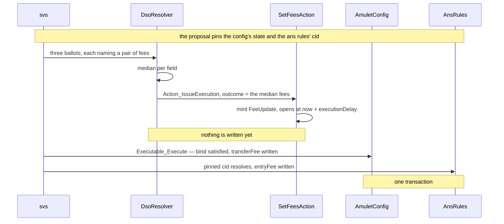
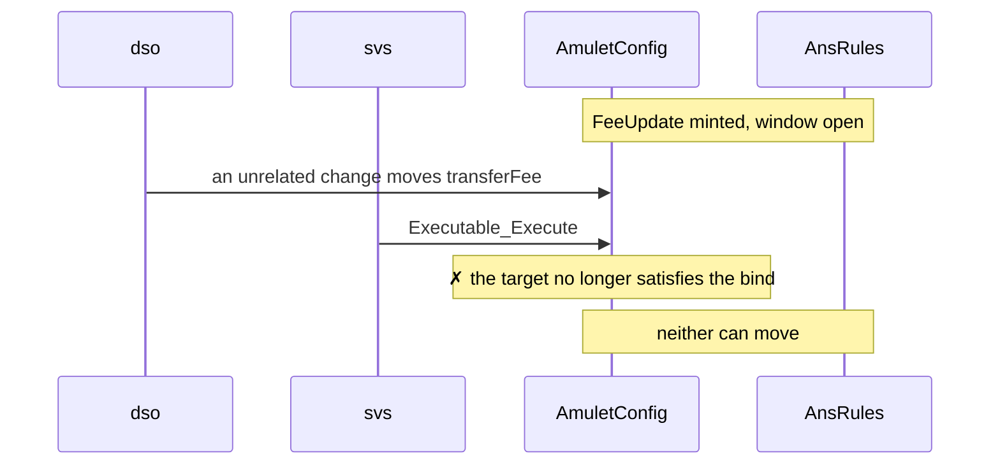
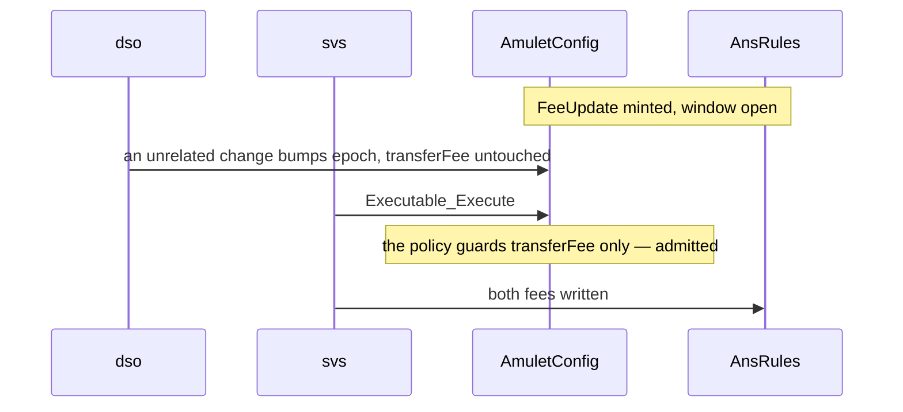
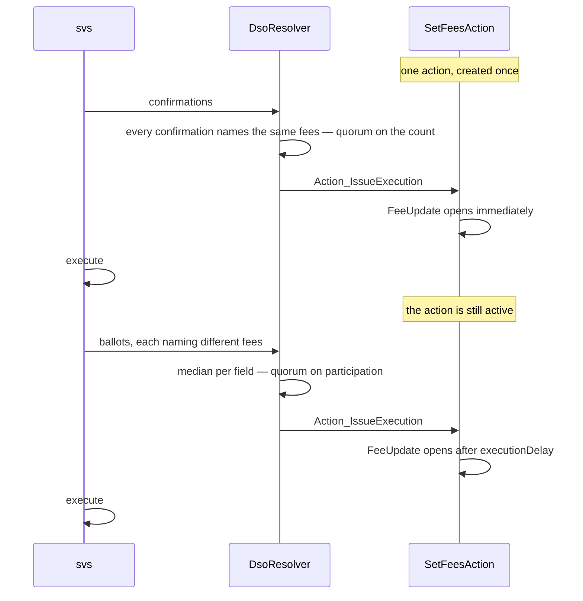

# Demos — `examples/governance/baby-dso`


## Security claims

Each demo carries one claim. This table is the dispatcher: what is claimed, and
the script that states it.

| Test | Security claim |
| --- | --- |
| [`bothFeesMoveTogether`](#1-bothfeesmovetogether) | One decision writes a fee Splice cannot govern alongside one it can, in a single transaction — either both move or neither does |
| [`aDriftedFeeStopsBoth`](#2-adriftedfeestopsboth) | An approval whose pinned field moved after the vote is refused, and no target moves — including the one that never changed |
| [`anUnrelatedChangeIsAdmitted`](#3-anunrelatedchangeisadmitted) | Drift outside the guarded field is admitted, so unrelated activity does not block a proposal |
| [`twoPathsOneAction`](#4-twopathsoneaction) | One action serves two procedures: the resolution rule and the effect are independent |

## Method

The demos are Daml Script tests. Each states its claim as assertions on the final
contracts, not on the transcript. 

The electorate is three SVs and the quorum is two. All five demos run one proposal through one
`Resolver_Resolve`, so what differs between them is only the bindings and the
state the targets are in at execution.

## Layout

```
baby-dso/
├── plain/           the reduced DsoRules/AmuletRules — the shape being argued against
└── cap/
    ├── ans/         AnsRules — implements nothing, knows nothing about CAP
    ├── config/      AmuletConfig — the DSO's own config, as an AuthenticTarget
    ├── governance/  the DSO: DsoResolver, SvBallot, SvConfirmation
    ├── action/      a CAP-aware app: Action + Executable over `config/`, plus the
    │                bridge that governs `ans/`. Never imported by `governance/`.
    └── test/        the demos below
```

The load-bearing fact is a `daml.yaml`, not a script: **`cap/governance` lists
none of `ans`, `config` or `action` in its `data-dependencies`.** The dependency
arrow points the other way. Adding another governed app requires no change to
`cap/governance` and no new DSO release.

## Demo Use Case

**Raise the network's fees.**

Two contracts hold one. `AmuletRules` holds `transferConfig.createFee`, what it costs to
move Canton Coin. [`AnsRules`](https://github.com/canton-network/splice/blob/a4ea43aa55db83a028a30e95ace45e1350edde9a/daml/splice-amulet-name-service/daml/Splice/Ans.daml#L60) holds
[`AnsRulesConfig.entryFee`](https://github.com/canton-network/splice/blob/a4ea43aa55db83a028a30e95ace45e1350edde9a/daml/splice-amulet-name-service/daml/Splice/Ans.daml#L210), what it costs to register a name.

Suppose, for the demo, that the SVs want to vote a single set of fees covering both. 

**Two kinds of bind, one target of each.** The amulet-side config implements
`AuthenticTarget` and publishes its state, so it is pinned by *what it says* and judged
by a policy. `AnsRules` is bound as an `OpaqueBind`, pinned by *which contract it is*.

`AnsRules` could perfectly well be an `AuthenticTarget`, it is DSO-signed and lives in a
package the same project maintains. It is opaque here for the purpose of the demo: to
show the two kinds of bind side by side, and what a target gives up by not publishing
state.

```daml
bindings =
  [ AuthenticBind with
      target = amuletRulesKey dso
      state  = AsOf with
        stage = Submission
        seen  = Some (AV_Map [("transferFee", AV_Decimal 0.03), ("epoch", AV_Int 3)])
      cid    = AsOf with stage = Execution; seen = None
  , OpaqueBind with
      opaqueTarget = OpaqueTargetKey "ans-rules"
      opaqueCid    = pinnedAnsRulesCid
  ]
```

The asymmetry in what each pins follows from that choice. A config that is archived and
re-created on every write gets a new contract id each time, so its *state* is the stable
thing to name. A target that publishes no state leaves its contract id as the only thing there
is to name.

Each SV names the fees it wants and the resolver takes the median of each field. 

```daml
options = [AV_Text "transferFee", AV_Text "entryFee"]
```

```
sv1 casts   { transferFee: 0.05, entryFee: 2.0 }
sv2 casts   { transferFee: 0.06, entryFee: 2.5 }
sv3 casts   { transferFee: 0.09, entryFee: 4.0 }

outcome     { transferFee: 0.06, entryFee: 2.5 }
```

**A policy for the target that has one.** The field the proposal writes is guarded;
everything else may drift. For example, the `epoch` bump from an unrelated config change is admitted. A `transferFee` that moved
since the vote is not. The opaque bind cannot have a policy, since the changes are checked by cid.


## 1. `bothFeesMoveTogether`

The fee Splice cannot govern, changed — and changed alongside one it can, in a single
transaction. `governance/` has never heard of either target; the whole coupling lives in
`action/`. This is the demo to read first, and the rest are its failure modes.



## 2. `aDriftedFeeStopsBoth`

An unrelated proposal moves `transferFee` after the vote closes. Execution is refused,
and **neither** fee moves — including the ANS fee, whose own target never changed. The
approval was made against a config that no longer exists, so none of it applies.

This is the question Splice has no way to ask: `patch` would have written the voted fee
over the newer one without a word.



## 3. `anUnrelatedChangeIsAdmitted`

The same shape, except the intervening change bumps `epoch` and leaves `transferFee`
alone. Execution succeeds and both fees move.

The contrast with demo 2 is the point. A whole-state pin would refuse this too, and every
proposal would be blocked by unrelated activity — which is why the policy is
`unchangedAt ["transferFee"]` and not `unchanged`.



## 4. `twoPathsOneAction`

One `SetFeesAction`, created once, used by two proposals resolved through different
procedures. The confirmation path has every SV name the same fees and executes at
once; the vote path takes the median and opens after a delay. The action is
`nonconsuming`, so it is still live at the end and could serve a third.

What this shows is that the resolution rule and the effect are independent: the action
decodes `outcome` and cannot tell whether the number arrived by agreement or by median.


