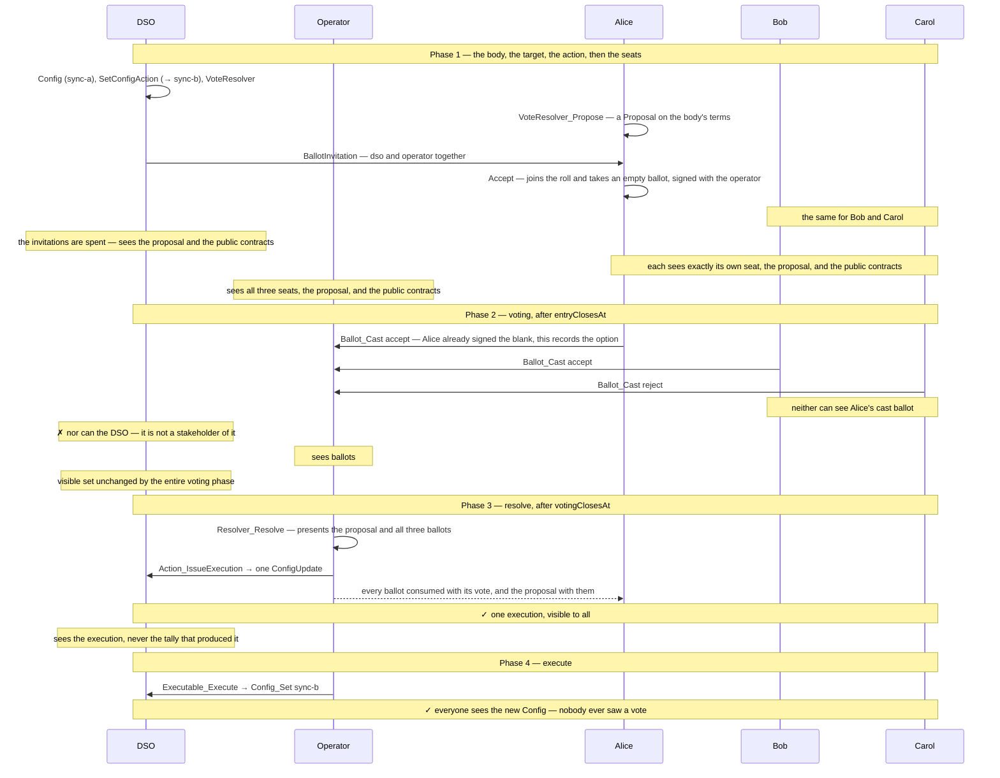
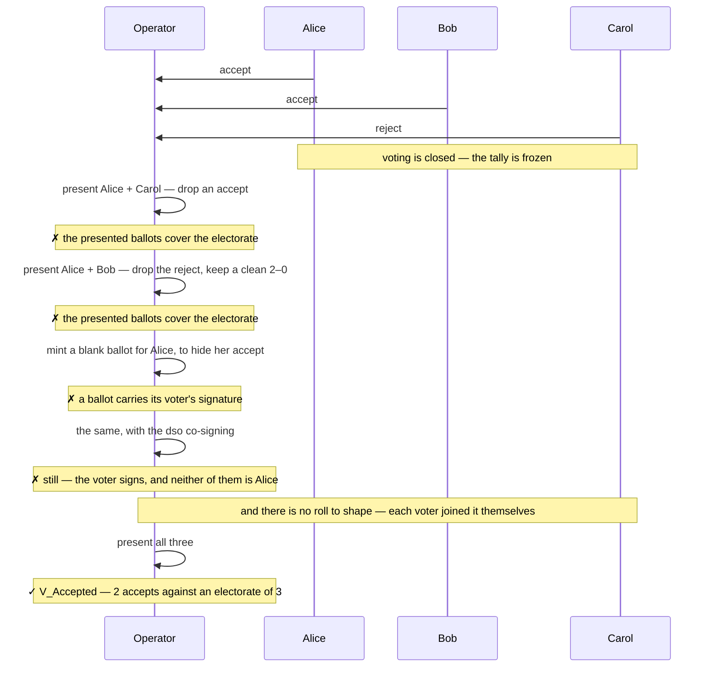
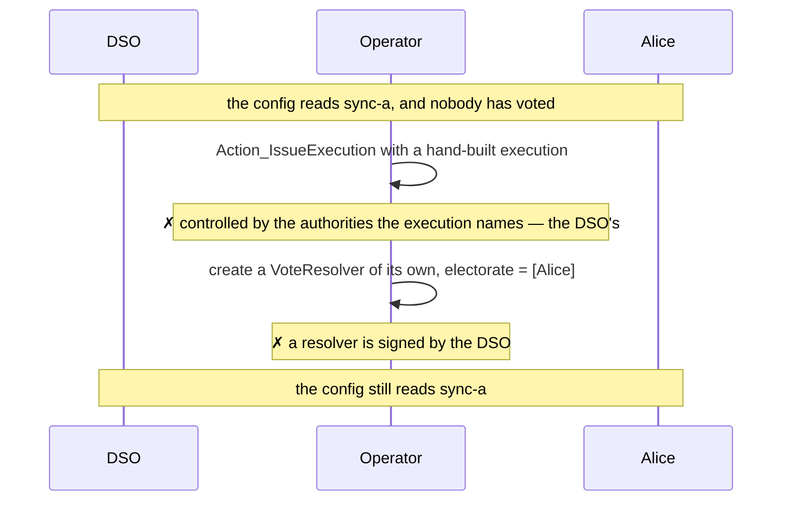

# Demos — `examples/governance/private-majority-vote`

Demos showing a majority vote where votes remain private until 
the end of resolution. The action is authorized by a decentrlized party, hosted by all voters.
An operator is trusted with confidentiality of the votes. 


## The format


`VoteResolver` is signed by the `dso`,
observed by the operator and the electorate, publishing one
procedure, `"majority"`, resolvable by `[[operator]]`. Any member raises a proposal
on it with `VoteResolver_Propose`. A`Proposal` is `dso`-signed, observed by the operator and the whole
electorate, it carries the `ProposalTerms` it decides under, the `electorate`, and
the `roll` of voters taking part. 

The `dso` and the operator jointly issue one `BallotInvitation` per entitled voter. 
The voter commits against the live proposal, wiht a
transaction that puts them on the roll, through `Proposal_Join`, and creates
their empty `PrivateBallot`, signed by the operator and themselves. 

Ballots name the body by its `ResolverKey` — `{dso, resolverId}` — not by
contract id. Only the `dso` can create a `VoteResolver`, so the key identifies
the body on its own.
The `dso`is not a signatory of an empty ballot or of a cast one, so it never reads a vote.

The presented ballots must cover the roll, so the
operator has to produce every ballot that exists and cannot mint a replacement
for one becasue it needs the voter's signature binded to this proposal. 
The outcome is issued against the action pinned in the `dso`-signed terms, and every
ballot must carry those same terms.

`Config`, `SetConfigAction`, `ConfigUpdate` are
the governed target and its action. `Config` is signed by the `dso` and
publishes its `setting` as `AuthenticTarget` state, opening at `"sync-a"`.
`SetConfigAction` mints the execution. `ConfigUpdate` re-checks that
bind under the `unchanged` drift policy before exercising `Config_Set`
to `"sync-b"`.

### The flow

1. A member raises a `Proposal` on the Resolver's contract (signed by the dso), fixing the terms and the
   action to be decided.
2. The `dso` and the operator jointly invite each entitled voter.
3. Each voter accepts their invitation, which in one transaction joins them to
   the proposal's **roll** and hands them an empty ballot signed by operator and voter (dso is not an observer). 
4. When voting opens. Each voter casts an option on their own ballot; only the
   operator can read it.
5. After `votingClosesAt` the operator resolves, presenting the proposal and
   every ballot on its roll. The resolve goes through only if every ballot carries that proposal's mechanism and its terms and the voters presented must be exactly the same that joined Proposal.
6. The execution applies the action, moving the config to `sync-b`.


## Security claims

Each demo carries one claim. This table is the dispatcher: what is claimed, and
the script that states it.

| Test | Security claim |
| --- | --- |
| [`whoSeesWhat`](#1-whoseeswhat) | No voter learns another voter's vote before resolution. Asserted as each party's complete visible set after every phase, so an unanticipated leak fails it |
| [`theCountCoversTheElectorate`](#2-thecountcoverstheelectorate) | The resolution cannot omit a voter who took a ballot — not by presenting a subset, and not by fabricating a ballot to stand in for one that was cast |
| [`theOperatorCannotSkipResolve`](#3-theoperatorcannotskipresolve) | The operator cannot create the outcome without resolution |


## Method

The demos are Daml Script tests over five parties: the `dso`, the `operator`,
and an electorate of `alice`, `bob` and `carol`. Each demo allocates its own
party namespace through `setupAs`, so no state crosses between scripts.

Visibility claims take two forms. Single claims are `sees` / `cannotSee`
predicates over a party and one contract, so each note in the diagrams below is
one line of test code. These checks cannot catch is divulgence. 
That can be checked in Daml Studio. The other two claims are proved with assertions.


```bash
dpm test --package-root examples/governance/private-majority-vote/test
```

## Fixture

`setupAs` allocates the five parties and creates three contracts as the `dso`: a
`Config` opening at `"sync-a"`, a `SetConfigAction` proposing `"sync-b"`, and a
`VoteResolver` for body `"body-1"` that expires in ten days. It then builds the
`ProposalTerms` every ballot carries — `{dso}` as authority, accept and reject as
the options, that action, one binding pinning the config's setting as seen at
submission, and a three-day timeline: `entryClosesAt` at day 1,
`votingClosesAt` at day 2, `expiresAt` at day 3. Alice then raises the round on
those terms with `VoteResolver_Propose`, and the `dso` and the operator together
issue one `BallotInvitation` per entitled voter. The `mechanism` names proposal
`"proposal-1"` under the `"majority"` procedure and names the body by key.

No ballot exists yet, only the proposal and the invitations. `seat` is a voter
accepting their invitation, which joins them to the roll and hands them an empty ballot in
one transaction. A demo calls `cast` to record an option and `runResolve` to resolve,
which presents the proposal beside the ballots; `executionOf` takes the single
`Executable` the resolve mints, and `runExecute` applies it to the config.


## 1. `whoSeesWhat`

One proposal carried end to end, three seats, two accepts and one reject, an
execution, and the config moved from `sync-a` to `sync-b`. 




## 2. `theCountCoversTheElectorate`

The demo drops one voter at a time and shows the resolve failing, then presents everyone and
shows it passing.




## 3. `theOperatorCannotSkipResolve`

The operator submits every transaction in this format. It seats the voters, it
resolves, and tries to executes. The demo shows the two ways it could reach the outcome
without a vote, and that both are closed by the Daml Ledger Model.


