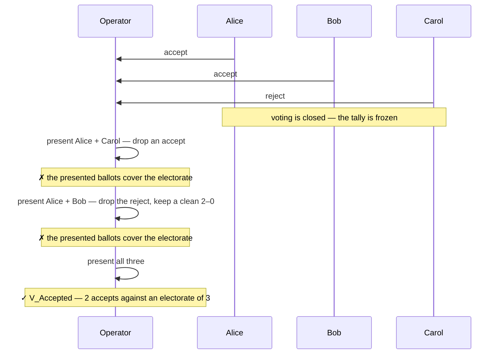
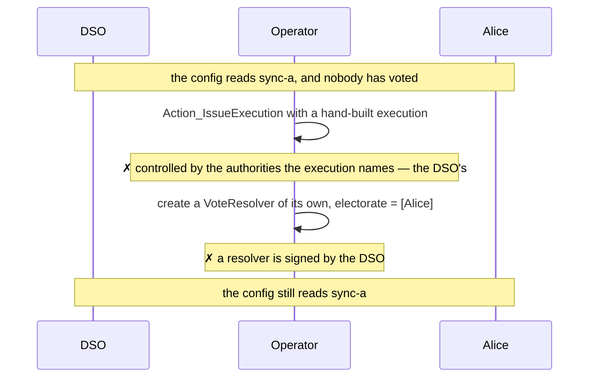

# Demos — `examples/governance/private-majority-vote`

3 demos showing a majority vote where **no voter ever learns another voter's
vote**, the count covers the whole electorate, and the decentralized party's
authority is spent on exactly one node.

One demo per clause. Demo 1 states the privacy guarantee, as the complete
visible set of every party after every phase. Demo 2 states that a count is
only a count if it covers everyone entitled to vote. Demo 3 states that the
operator, who drives every transaction here, cannot reach the outcome without
going through the count.

## The format

Three pieces, none of which the core knows anything about.

**`PrivateBallot`** (`impl/.../BallotV1.daml`) implements `Submittable` and
`Ballot`. Its signatory list is the whole privacy mechanism:

```daml
signatory if null votes then [operator] else [operator, voter]
observer voter
```

The operator seats every voter with an empty ballot it signs alone. Casting
archives that ballot and creates one carrying the option, now signed by the
voter too — so the stakeholders of a cast ballot are exactly the operator and
the one voter who cast it. The DSO is not among them, and neither is any other
voter. `ballot_castImpl` also re-reads every `Bind` in the terms against the
target presented with the vote, so an option is cast against a config state the
voter actually saw, not one it is told about later.

**`VoteResolver`** (`impl/.../ResolverV1.daml`) is signed by the `dso` and
observed by the operator and the electorate. It publishes one procedure,
`"majority"`, resolvable by `[[operator]]`. The procedure fetches the presented
submittables as ballots and requires, in order: every one closed for voting
(`requireClosed` against `closesAt`), one and the same `ProposalTerms` across
all of them (`oneProposal`), and a presented voter list that is duplicate-free
and equal to the electorate (`coverElectorate`). Only then does it count:

```daml
verdict
  | null voted = V_Lapsed None
  | 2 * accepts > Set.size body.electorate = V_Accepted (Some acceptOption)
  | otherwise = V_Rejected
```

The denominator is the whole electorate, not the turnout, so an abstention
counts against the majority. On acceptance the procedure exercises
`Action_IssueExecution` on the action the terms name; either way it finishes by
consuming every ballot with `Ballot_Consume with actors = [dso]`. Count, issue
and consume are one exercise node.

**`Config`, `SetConfigAction`, `ConfigUpdate`** (`impl/.../ConfigV1.daml`) are
the governed target and its action. `Config` is signed by the `dso` and
publishes its `setting` as `AuthenticTarget` state, opening at `"sync-a"`.
`SetConfigAction` mints the execution, checking that it names `{dso}` as
authorities, that the outcome written on it is `acceptOption`, and that its
bindings are exactly this config and nothing else. `ConfigUpdate` re-checks that
bind under the `unchanged` drift policy before exercising `Config_Set`
to `"sync-b"`.

The timeline is three instants on the terms every ballot is signed against:
seating happens before `entryClosesAt`, voting is open on
`[entryClosesAt, votingClosesAt]`, and the whole proposal expires at
`expiresAt`.

## Method

The demos are Daml Script tests over five parties: the `dso`, the `operator`,
and an electorate of `alice`, `bob` and `carol`. Each demo allocates its own
party namespace through `setupAs`, so no state crosses between scripts.

Visibility claims take two forms. Single claims are `sees` / `cannotSee`
predicates over a party and one contract, so each note in the diagrams below is
one line of test code. Stronger claims — that a party learned *nothing* across a
phase — are `seesExactly`, an equality between the complete set of contracts
visible to that party and an expected list. Those fail on any leak, anticipated
or not, and they are what demo 1 is built out of.

One limit, stated plainly. Daml Script reads the ACS, not transaction trees, so
these demos assert what a party can *read* after a phase, not the informee
relation itself. What they assert directly is the half that matters here: the
DSO and the other voters observe the resolver, take part in the outcome, and
still read no vote.

```bash
dpm test --package-root examples/governance/private-majority-vote/test
```

## 1. `whoSeesWhat`

One proposal carried end to end — three seats, two accepts and one reject, an
execution, and the config moved from `sync-a` to `sync-b`. After every phase the
demo asserts each party's **complete** visible set, which is what makes it the
whole privacy guarantee rather than a sample of it.

```mermaid
sequenceDiagram
    participant D as DSO
    participant O as Operator
    participant A as Alice
    participant B as Bob
    participant C as Carol

    Note over D,C: Phase 1 — the body, the target, the action, then the seats
    D->>D: Config (sync-a), SetConfigAction (→ sync-b), VoteResolver
    O->>A: PrivateBallot — empty, operator-signed
    O->>B: PrivateBallot — empty
    O->>C: PrivateBallot — empty
    Note over D: sees exactly the three public contracts — not one seat
    Note over A,C: each sees exactly its own seat, and the three public contracts
    Note over O: sees all three seats

    Note over D,C: Phase 2 — voting, after entryClosesAt
    A->>O: Ballot_Cast accept — re-created with Alice signing
    B->>O: Ballot_Cast accept
    C->>O: Ballot_Cast reject
    Note over B,C: neither can see Alice's cast ballot
    Note over D: ✗ nor can the DSO — it is not a stakeholder of it
    Note over O: sees it — the one party trusted with confidentiality
    Note over D: visible set unchanged by the entire voting phase

    Note over D,C: Phase 3 — resolve, after votingClosesAt
    O->>O: Resolver_Resolve — presents all three ballots
    O->>D: Action_IssueExecution → one ConfigUpdate
    O-->>A: every ballot consumed, votes archived with them
    Note over D,C: ✓ one execution, visible to all
    Note over D: sees the execution, never the tally that produced it

    Note over D,C: Phase 4 — execute
    O->>D: Executable_Execute → Config_Set sync-b
    Note over D,C: ✓ everyone sees the new Config; nobody ever saw a vote
```

The assertions are exact sets, not memberships. Before voting, `alice` sees her
own seat plus the config, the action and the resolver — and nothing else; the
`dso` sees those three public contracts and no seat at all. After the casts,
`bob`, `carol` and the `dso` are each checked against Alice's ballot with
`cannotSee`, the operator with `sees`, and the DSO's whole visible set is
re-asserted unchanged. After the resolve, all three of `dso`, `alice` and
`operator` see the same thing: the execution and the three public contracts.
After the execute, the same three see the new `Config`, and the demo reads
`setting === proposedSetting` off the DSO's own view.

The privacy survives the count because projection in Daml is per node. The
options are reached by `fetch` on ballots whose only stakeholders are the
operator and one voter, so an informee of the parent `Resolver_Resolve` sees no
part of those nodes. It holds only while the verdict stays free of anything
identifying — `V_Accepted (Some acceptOption)` carries the winning option, which
is public by construction, and never a breakdown.

What the operator learns is the whole of the trust assumption: it is a
stakeholder of every cast ballot and so reads every vote. It cannot alter one —
a cast ballot carries its voter's signature — and demos 2 and 3 close what it
could otherwise do with what it reads.

## 2. `theCountCoversTheElectorate`

A count over a subset is the cheapest attack in a private vote, because the
parties who could contradict it cannot see each other's ballots. The demo drops
one voter at a time and shows the resolve failing, then presents everyone and
shows it passing.



Both omissions are refused by the same line, and the two directions are chosen
to show it is not a threshold check: dropping a vote that would have *helped*
the proposal fails exactly as dropping one that opposed it does. The check
(`coverElectorate`, in `ResolverV1.daml`) is an equality against the electorate
over a duplicate-free list, so it rejects an extra or repeated entry as well —
the demo exercises the dropping direction only.

The electorate it compares against is on the `VoteResolver`, which the DSO
signs and every ballot names by contract id through its `Mechanism`. Widening it
after seating means a different resolver contract, which every seat already
taken would fail to name.

## 3. `theOperatorCannotSkipTheCount`

The operator submits every transaction in this format — it seats the voters, it
resolves, it executes. The demo shows the two ways it could reach the outcome
without a vote, and that both are closed by signature rather than by convention.



The first branch forges the outcome: an `ExecutableView` naming the real
bindings and `acceptOption`, handed straight to the action that mints
`ConfigUpdate`. `Action_IssueExecution` is controlled by
`execution.core.authorities`, so the operator is submitting a choice it does not
control. Renaming itself as the authority would make it the controller and buy
nothing — `action_issueExecutionImpl` requires `core.authorities == {dso}` and
rejects with *"the execution names another authority"*. The controller check and
the body check close each other's gap; the demo exercises the first, and the
second is why the alternative is not worth a script.

The second branch forges the body instead: a `VoteResolver` with an electorate
of one, which would make Alice alone a majority. `VoteResolver` is signed by the
`dso`, so the operator cannot bring one into existence. The count it must go
through is fixed by whoever signs the body, not by whoever runs the vote.

The demo closes by reading the config: still `sync-a`. That is the "one node"
claim in concrete form — the only path from votes to a changed config runs
through `Resolver_Resolve` on a DSO-signed resolver, where the count, the issue
and the consume are one exercise, and the DSO's authority is spent once.

## Not covered

Three pieces of the format carry no script. `ballot_withdrawImpl` supports
withdrawing and re-casting while voting is open; the `V_Rejected` and
`V_Lapsed None` branches of the count are reachable but unexercised; and
`ConfigUpdate` re-checks its bind under the `unchanged` drift policy at execute
time, which no demo drives to failure. They are live surface in `impl/`, tested
only by the happy path that runs past them.
